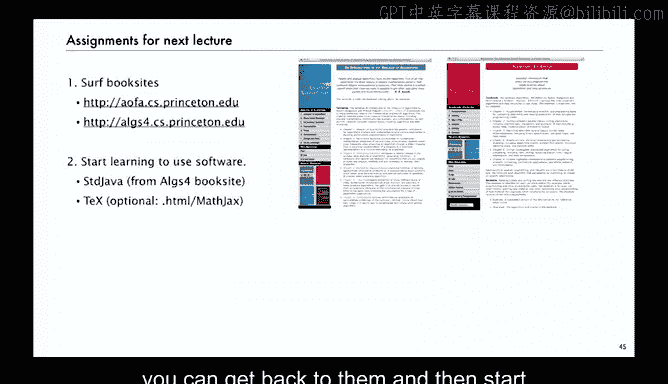

# 004：资源 📚

在本节课中，我们将介绍学习算法分析与解析组合学时所需的各种资源。我们将涵盖经典教材、在线资源、研究文献以及课程的学习方法，帮助你高效地掌握这门课程。

---

## 书籍资源 📖

上一节我们介绍了算法分析的基本概念，本节中我们来看看核心的学习资源。对于数学和算法这类领域，书籍仍然是不可或缺的长期资源。本课程配套了一本教材。

*   **《算法分析》教材**：这是我们在20世纪90年代所著书籍的第二版，于2013年出版。我与Philippe为这本书付出了大量努力，它系统地阐述了我将在课程中呈现的内容。
*   **《解析组合学》专著**：课程的第二部分关于解析组合学。Philippe为此领域耕耘了25年，我也投入了大量时间。这本书定义了该领域，并包含了深入理解所需的所有信息。
*   **《算法（第四版）》**：对于算法学习，你可以参考我们的《算法（第四版）》。书中包含了海量信息，是获取知识最高效的途径。
*   **Java编程书籍**：这是一本由Kevin Wayne和我合著的Java入门书籍。所有这些参考资料都假设你对其中的内容有一定了解，或者它们是巩固你理解的最佳方式。

虽然不依赖这些书籍也可能理解课程的许多内容，但深入参与教材学习仍然是最佳途径。我认为教材会长期存在，并且我们为此付出了巨大努力。

---

## 网络资源与课程网站 🌐

除了传统书籍，我们也有称为“书籍站点”的网络资源。本课程有一个专门的网站：`AofA.cs.princeton.edu`。

网站并非书籍的电子版，而是旨在作为一个在线资源库，提供书籍无法涵盖或需要动态更新的内容。

以下是网站通常包含的内容：

*   **文本摘要**：包含书籍内容的浓缩版本，突出要点但不深入细节。
*   **数据与程序**：提供相关数据、可下载的程序或模拟演示。
*   **外部链接**：链接到其他有价值的网络资源。

这些网络资源是鲜活的，会经常更新，而书籍的更新频率则较低。我展示的每本书都有对应的书籍站点，并且它们之间相互链接。我们在这方面已经探索了近十年，证明这是一种能同时获得传统书籍的深度和网络灵活性的成功方式。即使无法获取实体书，你也能从书籍站点获得大量信息。

因此，我经常会在课程中提及“去书籍站点下载程序”或查阅相关信息。我希望大家能将使用书籍站点作为学习本课程的一部分。

---

## 研究文献与原始资料 📄

本课程内容建立在大量原创研究之上。了解这些原始资料对于深入理解至关重要。

*   **高德纳的著作**：真正的奠基性工作来自高德纳。他的成果收录于多卷本的《计算机程序设计艺术》以及一些精选论文集中。这些著作每本都厚达千页，充满了有趣的信息。
*   **菲利普·弗拉若莱的论文集**：除了书籍，还有数百篇研究论文。我们正努力在2014年通过剑桥大学出版社将其结集出版（约七卷）。许多论文也可以在网络上找到。
*   **其他研究者的成果**：我们还借鉴了数百位其他研究者的论文和书籍。我会在课程中适时提及。我的主要目标之一就是让这些浩如烟海的工作（总计至少两万页）能够被更多人理解和获取。我无法覆盖所有内容，但希望能打好基础，让大家有能力去探索这些宝贵的资料。

---

## 其他实用工具与资源 🛠️

还有许多其他资源，我无法在此详细讨论，但相信它们会在讨论组或其他场合被覆盖。

*   **数学排版工具**：如今我已不再使用黑板或纸笔进行数学工作。数字资源如此强大，使我们能够以过去需要一年才能出版的方式创建数学内容。我准备这些讲义幻灯片时，大量使用了数字资源。
*   **符号数学软件**：虽然本课程不主要关于符号计算，但存在功能强大的软件包，许多数学家日常都会使用。偶尔在验证计算时，我可能会用到它们。理解基础定理和基本计算方法是有效使用这些工具的前提。
*   **常用网络资源**：
    *   **整数序列在线百科全书**：我确信会在多个场合提及它。
    *   **维基百科**：对于数学内容，如今的维基百科是一个相当不错的资源。
    *   **MathWorld**：一个与Mathematica相关的数学资源网站。
    *   **NIST数学函数手册**：它取代了旧的Abramowitz和Stegun手册，是研究算法分析中出现的许多特殊函数的重要资源。

我只是想列出我在准备课程材料时使用的资源类型，并让大家意识到，在当今的网络和数学世界中，一切皆有可能。

---

## 课程运作方式与学习建议 🎯

关于课程如何进行，我不会过于强调评估。我的基本模式是：在讲座中引入主题（通常是大家未曾见过或思考过的内容），而书籍或书籍站点上则有更深入的阐述，然后布置一些练习来巩固我所讲的观点或探索我来不及覆盖的方向。

我认为大多数学生会在讲座后阅读书籍中的相关材料，并尝试在下一次讲座前完成部分作业。

例如，**练习1.14**是关于求解一个类似于快速排序递归式但又不完全相同的题目。我相信在讨论组中，会有大量关于作业和阅读材料的在线讨论。我们不会设置严格的层级评估。如果你理解得足够好，能够完成练习或理解他人的解答，那就足够了。书籍和网络上还有许多未指定的练习可供自我测试。

**本课程的主要资源是你自己**。与许多优秀课程一样，你投入多少，就会收获多少。目标是让你学会许多目前未知的知识。这里有很多有趣的材料，足以吸引很多人，这才是真正的目标，而不是评判谁更擅长。

以下是两个我认为有助于巩固今天所学内容的练习：

*   **快速排序的递归调用次数**：我们刚刚讨论了比较次数，那么快速排序中的递归调用次数是多少？或者数据移动次数、交换次数呢？
*   **快速排序的优化参数**：在实践中，我们认识到快速排序对于非常小的数组并不快，因此应该切换到更简单的方法（如插入排序）。那么，我们应该使用什么阈值？这个练习展示了一种参数化该阈值的方法：进行数学建模，然后找出参数的最佳值。这正是算法分析中经常出现的核心概念：我们有一定的自由度，用数学捕捉它，然后通过数学模型找出最优值，并直接应用于实践。

---

## 课前准备与总结 📝

**总结一下**，为了下一讲，建议大家：

1.  **浏览书籍站点**：熟悉其中的内容并添加书签，以便随时返回。
2.  **准备编程环境**：如果你对自己的编程环境不太熟悉，可以开始学习使用一些软件。我们有一个相当简单易用的编程模型，我将基于此模型描述代码。这不是绝对要求，但许多人可能会发现，运行我展示的代码进行实验会很有趣。这一切在《算法（第四版）》的书籍站点上都有描述，下载我们的模型和使用代码非常容易。
3.  **掌握数学排版**：如今，交流数学的最佳方式是使用TeX。有大量工具可供你使用TeX（如TeXShop）或类似工具来完成作业，甚至可以像我为书籍站点所做的那样用HTML编写。
4.  **动手实践**：如果你感兴趣，下载快速排序程序，用我提到的方式预测其性能，验证“问题规模增加10倍，运行时间增加约10倍”的观点。有时你需要亲身经历才能深信不疑。
5.  **预习教材**：我今天所讲的一切都包含在教材的前40页中。希望有书的人能提前阅读这些内容并完成相关练习，为下一讲做好准备。
6.  **认真完成练习**：即使你认为自己会做，实际动手写出来是另一回事。大多数学生发现，无论是否有人评分，实际写下证明过程并尝试解决那些练习都是一个好主意。

本节课中我们一起学习了算法分析课程所需的各种核心资源与工具，并了解了课程的学习方法。正如我所提到的，算法分析的需求是推动解析组合学领域发展和出现的主要动力之一。

在下一讲中，我们将真正开始旅程，深入理解我今天在课堂上演示的各类数学操作，以便能够将其应用于更广泛的问题类别。这最终将演变成我们称之为“解析组合学”的现代工具。