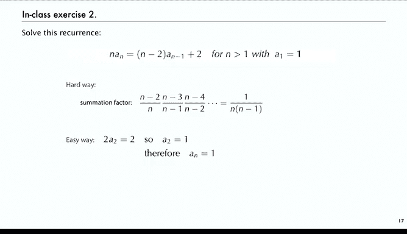

# 006：裂项法

在本节课中，我们将学习一种解决递归关系的基本技术——裂项法。我们将看到，对于一类特定的线性一阶递归，通过巧妙的代数变换，可以将其转化为一个简单的求和问题，从而轻松求解。

---

## 线性一阶递归的裂项

上一节我们介绍了递归关系的基本概念。本节中，我们来看看如何通过裂项法求解最简单的线性一阶递归。

这类递归的形式非常简单，右侧只有一个项。其一般形式为：
`A_n = A_{n-1} + f(n)`

我们可以通过反复代入来“裂开”这个递归。具体做法是，将 `n` 替换为 `n-1`、`n-2`，依此类推，直到达到初始条件 `A_0`。

以下是裂项过程的步骤：
1.  写出原始方程：`A_n = A_{n-1} + f(n)`
2.  写出 `n-1` 时的方程：`A_{n-1} = A_{n-2} + f(n-1)`
3.  写出 `n-2` 时的方程：`A_{n-2} = A_{n-3} + f(n-2)`
4.  继续此过程，直到 `A_1 = A_0 + f(1)`

将所有等式左右两边分别相加，左侧的 `A_{n-1}, A_{n-2}, ..., A_1` 项会与右侧的对应项相互抵消，最终得到：
`A_n = A_0 + Σ_{k=1}^{n} f(k)`

这样，求解递归 `A_n = A_{n-1} + n` 的问题，就转化为了计算求和 `Σ_{k=1}^{n} k` 的问题。这个和的结果是著名的公式：
`Σ_{k=1}^{n} k = n(n+1)/2`

因此，该递归的解为 `A_n = A_0 + n(n+1)/2`。我们可以通过代入原方程来验证这个解。

---

## 常见的离散求和公式

上一节我们将递归求解转化为了求和计算。本节中，我们来看看在算法分析中经常遇到的一些基本求和公式。掌握这些公式对于求解递归至关重要。

以下是几个核心的求和公式：
*   **几何级数求和**：`Σ_{k=0}^{n-1} x^k = (1 - x^n) / (1 - x)`
*   **算术级数求和**：`Σ_{k=1}^{n} k = n(n+1)/2`，也写作 `C(n+1, 2)`（组合数）。
*   **广义算术级数**：`Σ_{k=0}^{n} C(k, m) = C(n+1, m+1)`。当 `m=0` 时，即退化为 `Σ_{k=0}^{n} 1 = n+1`。
*   **二项式定理**：`(x + y)^n = Σ_{k=0}^{n} C(n, k) * x^k * y^{n-k}`
*   **调和数**：`H_n = Σ_{k=1}^{n} 1/k`。这个和在快速排序等算法的分析中极为常见。
*   **范德蒙德卷积**：`Σ_{k} C(n, k) * C(m, t-k) = C(n+m, t)`

熟悉这些公式能帮助我们快速求解裂项后得到的和式。更多复杂的求和技巧可以参考相关的离散数学教材。

---

## 使用求和因子处理更一般的递归

前面我们处理的递归中，`A_{n-1}` 的系数是 1。本节中，我们来看看当这个系数不是 1 时，如何通过引入“求和因子”来应用裂项法。

考虑递归：`A_n = 2 * A_{n-1} + 2^n`，其中 `A_0 = 0`。
直接代入无法裂项，因为系数 2 会导致复杂的嵌套。技巧在于两边同时除以 `2^n`。

令 `B_n = A_n / 2^n`，则原方程变为：
`B_n = B_{n-1} + 1`
这正是一个可以裂项的简单递归。裂项后得到 `B_n = n`，因此原递归的解为 `A_n = n * 2^n`。

这里的 `1/2^n` 就是一个“求和因子”。对于更一般的形式：
`A_n = f(n) * A_{n-1} + g(n)`
我们可以构造求和因子 `s_n = 1 / (f(n) * f(n-1) * ... * f(1))`。

将原方程两边同时乘以 `s_n`，即可得到：
`s_n * A_n = s_{n-1} * A_{n-1} + s_n * g(n)`
此时，新序列 `B_n = s_n * A_n` 满足 `B_n = B_{n-1} + s_n * g(n)`，从而可以裂项求解。

---

## 应用示例：快速排序平均比较次数递归

上一节我们介绍了求和因子的通用形式。本节中，我们通过一个具体例子来巩固理解，这正是分析快速排序平均性能时遇到的递归。

考虑递归：
`C_n = (1 + 1/n) * C_{n-1} + 2`，其中 `C_0 = 0`。
这里 `f(n) = (n+1)/n`。

首先计算求和因子 `s_n`：
`s_n = 1 / [((n+1)/n) * (n/(n-1)) * ... * (2/1)] = 1/(n+1)`

将原方程两边乘以 `s_n = 1/(n+1)`：
`C_n / (n+1) = C_{n-1} / n + 2/(n+1)`

现在令 `B_n = C_n / (n+1)`，则递归变为：
`B_n = B_{n-1} + 2/(n+1)`

这是一个可以裂项的递归。裂项后得到：
`B_n = 2 * Σ_{k=1}^{n} 1/(k+1) = 2 * (H_{n+1} - 1)`，其中 `H_n` 是第 `n` 个调和数。

因此，原递归的解为：
`C_n = 2(n+1) * (H_{n+1} - 1) ≈ 2n ln n`

我们可以通过计算前几项（如 `C_1`, `C_2`）或直接代入原方程来验证这个解。

---

## 练习与验证

学习任何求解方法后，进行练习和验证都至关重要。以下是两个巩固裂项法理解的练习。

**练习1：验证解**
对于递归 `A_n = (1 + 1/n) * A_{n-1} + 2`，我们得到了解 `A_n = 2(n+1)(H_{n+1} - 1)`。
验证方法：
1.  计算小数值：`A_1 = 2`, `A_2 = 5`。用解公式计算 `A_1`, `A_2`，看是否匹配。
2.  代数验证：将 `A_n` 和 `A_{n-1}` 的表达式代入原递归方程，利用调和数的性质 `H_{n+1} = H_n + 1/(n+1)` 进行化简，检查等式是否成立。

**练习2：巧解递归**
尝试求解递归：`A_n = (1 - 1/n) * A_{n-1} + 2/n`，其中 `A_1 = 1`。
*   **方法一（裂项法）**：计算求和因子并裂项，最终会发现所有项都抵消得很巧妙。
*   **方法二（观察法）**：直接计算前几项：`A_1=1`, `A_2=1`, `A_3=1`... 可以猜想并证明 `A_n = 1` 对于所有 `n` 成立。有时直接观察比机械应用公式更高效。

这个练习提醒我们，在应用通用方法前，先尝试计算初始值和观察规律，可能事半功倍。

---

本节课中我们一起学习了裂项法，这是一种求解线性一阶递归的强大工具。核心步骤是：首先识别递归形式，然后通过直接迭代或引入求和因子将其转化为可裂项的格式，最后利用已知的求和公式得到封闭解。记住，求出解后，永远不要忘记通过代入验证或计算小数值来检查其正确性。