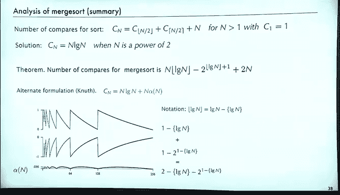
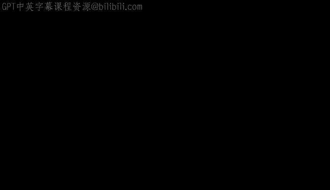

# 008：归并排序分析


## 概述
在本节课中，我们将要学习如何分析归并排序算法。归并排序是分治算法的典型代表，我们将通过分析其比较次数来理解其性能。我们将从简单的二分查找分析开始，逐步深入到归并排序的详细分析，并探讨其中出现的数学特性。

## 二分查找分析：一个热身

上一节我们介绍了算法分析的基本概念，本节中我们来看看一个简单的分治算法：二分查找。二分查找是许多人学习的第一个分治算法。

以下是二分查找的基本思想：
*   我们有一个已排序的数组。
*   我们通过查看中间元素来寻找特定值。
*   如果目标值小于中间元素，则在左半部分继续查找。
*   如果目标值大于中间元素，则在右半部分继续查找。
*   无论哪种情况，数组的大小都大约减少一半。

二分查找的代码可以在算法书籍或相关网站上找到。其最坏情况下的比较次数由以下递推关系描述：
```
C(N) = C(⌊N/2⌋) + 1
```
其中，`C(N)` 表示在大小为 `N` 的数组中确定一个元素不存在所需的最坏情况比较次数。`⌊N/2⌋` 表示小于等于 `N/2` 的最大整数。

### 简单情况：N 是 2 的幂
为了获得近似解或了解比较次数的大致规模，我们先分析一个简单情况：当文件大小 `N` 恰好是 2 的幂时。

如果 `N = 2^n`，那么每次划分后子数组的大小也总是 2 的幂。递推关系可以简化为：
```
C(2^n) = C(2^{n-1}) + 1
```
这是一个可以“套叠”的简单递推关系。通过代入 `a_n = C(2^n)`，我们得到：
```
a_n = a_{n-1} + 1
```
这个递推关系直接套叠 `n` 次后得到 `a_n = n`。由于 `n = log₂ N`，这意味着当 `N` 是 2 的幂时，二分查找的最坏情况比较次数是 `log₂ N`。

### 一般情况：N 不一定是 2 的幂
那么，当 `N` 不一定是 2 的幂时，情况如何呢？研究这种情况有一个简单的方法，即建立与二进制数的对应关系。

我们定义 `B(N)` 为数字 `N` 的二进制表示中的位数。例如，`N=107` 的二进制表示有 7 位。

可以很容易地验证以下关系：如果去掉 `N` 二进制表示的最右边一位，就得到了 `⌊N/2⌋`。你移除了 1 位，这意味着：
```
B(N) = B(⌊N/2⌋) + 1
```
这与二分查找的递推关系完全相同。有时，思考 `N` 的二进制位数比直接思考二分查找算法更容易。这是一个简单的模型，并且可以很容易地证明，`N` 的二进制位数等于 `⌊log₂ N⌋ + 1`。

通过检查数学公式和示例表格，可以确保理解这个结论。实际上，`log₂ N` 的首位数字在 2 的幂次处发生变化，忽略其余部分就得到了 `⌊log₂ N⌋`，然后我们再加 1。

因此，我们有一个算法（二分查找）和一个概念（数字的二进制位数），它们通过相同的递推关系联系起来。

## 归并排序分析

上一节我们以二分查找作为热身，本节中我们来看看更重要的例子：归并排序。归并排序是分治算法的原型。

归并排序的步骤是：
1.  将数组分成两半。
2.  递归地对两半进行排序。
3.  合并两个已排序的半部分。

为了简化分析，我们假设合并过程总是恰好使用 `N` 次比较。基于此，我们可以得到排序所需比较次数的递推关系：
```
C(N) = C(⌊N/2⌋) + C(⌈N/2⌉) + N
```
其中，`⌊N/2⌋` 是下取整，`⌈N/2⌉` 是上取整。

这种递推关系比我们之前看过的更复杂，因为右边出现了取整函数。它们不容易直接处理，并且如果我们要得出答案的公式，会导致一些有趣的现象。

### 简单情况：N 是 2 的幂
和二分查找一样，我们先分析简单情况：当 `N` 是 2 的幂时。此时，下取整和上取整消失，`⌊N/2⌋` 和 `⌈N/2⌉` 都等于 `N/2`。

令 `a_n = C(2^n)`，我们得到递推关系：
```
a_n = 2 * a_{n-1} + 2^n
```
这是我们之前用套叠求和法解决过的递推类型之一。求和因子是 `2^n / 2^n = 1`，最终我们得到结果 `a_n = n * 2^n`。转换回原变量，这意味着当 `N` 是 2 的幂时，`C(N) = N log₂ N`。

### 一般情况：N 不是 2 的幂
一个自然的问题是：我们能否为归并排序的比较次数得到一个比 `N log N` 更精确的估计？例如，比较次数是否与 `N log N + αN` 成比例（`α` 是某个常数）？我们想找出 `α` 的值。

答案是否定的。实际上，不存在这样的常数 `α`。这一点很重要，首先它否定了上述假设，其次它表明我们在尝试近似归并排序性能时会遇到障碍。这是许多具有类似特征的计算机算法中可能出现的典型情况。

我们如何知道这一点呢？以下是一个演示。通过使用与计算斐波那契数和快速排序相同的程序结构，我们可以计算归并排序递推关系的值。

第二个循环尝试确定是否存在 `α` 值。具体做法是：先减去主导项 `N log N`，然后除以 `N` 以便于观察缩放后的结果。得到的图像绝对不是一条常数水平线，而是一种奇怪振荡的增长模式。

直接绘制数值而不进行这种缩放，可能最初不会注意到这种振荡，因为它相对较小。但这很重要，因为它意味着你无法证明存在一个常数或找到一个常数值。

绘制数值非常有帮助。如果我们想从数学上描述归并排序的性能，我们得到的任何数学公式都必须能够解释这种振荡行为。

这是一个基础且相对简单的例子，在算法分析中反复出现。这种振荡是算法分析中固有的，因为我们需要处理离散情况，这意味着我们经常会陷入这种振荡。

### 归并排序一般情况的分析
尽管如此，我确实想具体讨论一般情况下的归并排序分析，因为它非常重要。其中涉及一个小技巧来简化问题。

如果我们写下 `C(N+1)` 的公式，我们将不得不处理一些取整函数的数学运算。可以证明以下关系：
*   `⌊(N+1)/2⌋ = ⌈N/2⌉`
*   `⌈(N+1)/2⌉ = ⌊N/2⌋ + 1`

基于取整函数与加 1 运算之间的关系，进行一些巧妙的代数操作，我们可以将两个公式相减，得到一个可以套叠的简化公式。

定义差值 `D(N) = C(N+1) - C(N)`。经过推导，我们得到 `D(N)` 的方程，这是一个熟悉的方程：二分查找的方程，只是初始值不同。
```
D(N) = D(⌊N/2⌋) + 1
```
其解为 `D(N) = ⌊log₂ N⌋ + 2`。

然后，由于 `C(N+1) = C(N) + D(N)`，这个关系可以立即套叠，得到一个求和式：
```
C(N) = (N-1) + Σ_{k=1}^{N-1} (⌊log₂ k⌋ + 1)
```
有趣的是，求和项 `(⌊log₂ k⌋ + 1)` 正是数字 `k` 的二进制表示中的位数。

因此，我们证明了一个重要结论：**归并排序的比较次数 `C(N)` 等于 `(N-1)` 加上所有小于 `N` 的数字的二进制表示的总位数。**

这是一个有趣的事实。我们还可以用组合方式来证明同样的事情。

令 `S(N)` 为所有小于 `N` 的数字的二进制表示的总位数。我们可以通过“切掉”每个数字的最右边一位来计数。切掉最右边一位后，每隔一个数字，我们就得到 `S(⌊N/2⌋)`。同时，被切掉的那些最右边位总共有 `(N-1)` 个。这构成了一个组合证明，表明所有小于 `N` 的数字的二进制位数满足与归并排序相同的递推关系。

所以，归并排序的比较次数是 `(N-1)` 加上所有小于 `N` 的数字的二进制表示的总位数。

考虑到所有小于 `N` 的数字的二进制总位数，它会有某种振荡，因为当达到 2 的幂时，情况会发生变化。

### 计算二进制总位数
另一种看待所有小于 `N` 的数字的二进制位数的方法是：在一个维度上，你有 `N` 个数字；在宽度上，每个数字最多有 `⌊log₂ N⌋ + 1` 位。所以，这些位大致分布在一个 `N` 行、`⌊log₂ N⌋ + 1` 列的矩形中。

但在实际数字中，我们没有那些前导零。前导零有一个非常简单的模式：它们是 `1 + 2 + 4 + 8 + ...` 的和，这是一个几何级数求和。

因此，**不包含前导零**的所有小于 `N` 的数字的二进制总位数，可以通过假设有前导零时的总位数（即矩形面积）减去前导零的个数来计算。这给出了一个显式解。

最终，归并排序比较次数的显式公式为：
```
C(N) = (N-1) + N * (⌊log₂ N⌋ + 1) - (2^{⌊log₂ N⌋ + 1} - 1)
```
我们从一个算法（归并排序）开始，然后联系到一个概念（所有小于 `N` 的数字的二进制表示），并证明算法的比较次数等于这些数字的二进制总位数。接着，我们找到了另一种计算这个总位数的方法，从而得到了完整的解。

这是一个可以用来计算归并排序比较次数的相对简单的公式。

### 振荡项的分析
那么，关于那个振荡项呢？有另一种处理 `⌊log₂ N⌋` 的方法。我们可以把它写成：
```
⌊log₂ N⌋ = log₂ N - {log₂ N}
```
其中，花括号 `{ }` 表示取小数部分。



将这个公式代入归并排序比较次数的解中，可以通过代数运算将其拆分成两个函数：`N` 的系数是 `(1 - {log₂ N})`，另一部分是 `(2 - log₂ N)`。绘制这两个函数的图像，它们看起来有点反对称，但实际上并未完全抵消。剩下的部分就是那个小的振荡函数，将其乘以 `N`，就得到了我们之前绘制的精确函数。

可以检查这个数学推导，书中也有描述。这仅仅表明我们在分析算法时可能面临的那种挑战：看起来一切顺利，但我们可能会被振荡所困扰。事情变得复杂，是因为我们一方面希望使用像 `log N` 这样熟悉的函数，另一方面又不得不处理像 `⌊log N⌋`（小于等于 `log N` 的最大整数）这样被迫取整数值的函数。



## 总结
本节课中我们一起学习了归并排序的详细分析。我们从简单的二分查找分析入手，理解了递推关系和与二进制位数的联系。然后，我们深入分析了归并排序，推导出其比较次数的递推关系，并解决了当 `N` 是 2 的幂时的简单情况。对于一般情况，我们通过巧妙的数学变换，将问题转化为计算所有小于 `N` 的数字的二进制总位数，并得出了显式公式。最后，我们探讨了结果中出现的振荡现象及其数学本质。归并排序的分析是分治算法分析的经典范例，其中涉及的离散数学特性在算法分析中非常普遍。