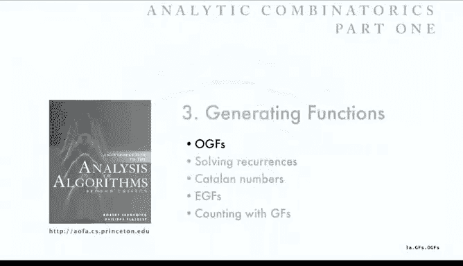

# 010：普通生成函数


## 概述
在本节课中，我们将要学习**普通生成函数**。生成函数是解析组合学中的核心研究对象，它在解决递推关系和分析算法等方面有广泛的应用。我们将首先了解生成函数的定义，然后学习如何通过基本操作来构造和操作生成函数，最后通过一个例子展示其应用。

## 普通生成函数的定义
给定一个无限序列 `a0, a1, a2, ...`，其**普通生成函数** 定义为以下关于自由变量 `z` 的无穷级数：
```
A(z) = a0 + a1*z + a2*z^2 + ... = Σ_{k>=0} a_k * z^k
```
我们使用符号 `[z^n] A(z)` 表示函数 `A(z)` 中 `z^n` 项的系数。

**例子**：
*   如果序列全为 `1`，即 `a_k = 1`，则其生成函数为 `A(z) = Σ_{k>=0} z^k = 1 / (1 - z)`。
*   如果序列为 `1/k!`，即 `a_k = 1/k!`，则其生成函数为 `A(z) = Σ_{k>=0} z^k / k! = e^z`。

生成函数的意义在于，它允许我们用一个单一的数学函数来表示整个无限序列，这为分析算法和研究组合结构的性质带来了极大的便利。

## 生成函数的基本操作
为了能够灵活运用生成函数，我们需要掌握一些基本操作。这些操作可以帮助我们从已知序列的生成函数推导出新序列的生成函数，或者从生成函数中提取出对应的序列。

### 缩放
如果 `A(z)` 是序列 `{a_k}` 的生成函数，那么 `A(C*z)` 就是序列 `{C^k * a_k}` 的生成函数。
```
A(C*z) = Σ_{k>=0} a_k * (C*z)^k = Σ_{k>=0} (C^k * a_k) * z^k
```
**例子**：已知序列全为 `1` 的生成函数是 `1/(1-z)`。那么 `1/(1-2z)` 就是序列 `{2^k}` 的生成函数，因为 `1/(1-2z) = Σ_{k>=0} (2z)^k = Σ_{k>=0} 2^k * z^k`。

### 加法
如果 `A(z)` 和 `B(z)` 分别是序列 `{a_k}` 和 `{b_k}` 的生成函数，那么 `A(z) + B(z)` 就是序列 `{a_k + b_k}` 的生成函数。
```
A(z) + B(z) = Σ_{k>=0} a_k * z^k + Σ_{k>=0} b_k * z^k = Σ_{k>=0} (a_k + b_k) * z^k
```
**例子**：`1/(1-2z) - 1/(1-z)` 是序列 `{2^k - 1}` 的生成函数。

### 微分
如果 `A(z)` 是序列 `{a_k}` 的生成函数，那么 `z * A'(z)` 就是序列 `{k * a_k}` 的生成函数。
```
z * A'(z) = z * Σ_{k>=0} k * a_k * z^{k-1} = Σ_{k>=0} k * a_k * z^k
```
**例子**：从 `A(z) = 1/(1-z)` 开始，求导可得 `A'(z) = 1/(1-z)^2`。因此 `z/(1-z)^2` 是序列 `{0, 1, 2, 3, ...}`（自然数序列）的生成函数。再次求导，`z^2/(1-z)^3` 是序列 `{n*(n-1)/2}`（即组合数 `C(n, 2)`）的生成函数。推广可知，`z^m/(1-z)^{m+1}` 是序列 `{C(n, m)}` 的生成函数。

### 积分
如果 `A(z)` 是序列 `{a_k}` 的生成函数，那么 `∫_0^z A(t) dt` 就是序列 `{a_{k-1}/k}`（其中 `a_{-1}=0`）的生成函数。
```
∫_0^z A(t) dt = ∫_0^z Σ_{k>=0} a_k * t^k dt = Σ_{k>=0} a_k * z^{k+1} / (k+1) = Σ_{k>=1} (a_{k-1}/k) * z^k
```
**例子**：对 `1/(1-z)` 积分，得到 `-ln(1-z)`，这是序列 `{1/k}` 的生成函数。

### 部分和与卷积
上一节我们介绍了对生成函数进行缩放、加减、微积分等线性操作。本节中我们来看看一个更强大的操作：**卷积**。它对应着序列之间的特定组合运算。

如果 `A(z)` 是序列 `{a_k}` 的生成函数，那么 `A(z) / (1-z)` 就是该序列**部分和**序列 `{S_n}` 的生成函数，其中 `S_n = a_0 + a_1 + ... + a_n`。
```
A(z) / (1-z) = A(z) * Σ_{k>=0} z^k = Σ_{n>=0} (Σ_{k=0}^n a_k) * z^n
```
**例子**：已知 `-ln(1-z)` 是序列 `{1/k}` 的生成函数。那么 `-ln(1-z) / (1-z)` 就是**调和数** `H_n = 1 + 1/2 + ... + 1/n` 的生成函数。

部分和是卷积的一个特例。更一般地，如果 `A(z)` 和 `B(z)` 分别是序列 `{a_k}` 和 `{b_k}` 的生成函数，那么它们的乘积 `A(z) * B(z)` 就是序列 `{c_n}` 的生成函数，其中 `c_n` 是 `{a_k}` 和 `{b_k}` 的**卷积**：
```
c_n = Σ_{k=0}^n a_k * b_{n-k}
```
**证明**：将两个级数相乘并合并同类项即可得到上述形式。
```
A(z) * B(z) = (Σ_{i>=0} a_i z^i) * (Σ_{j>=0} b_j z^j) = Σ_{n>=0} (Σ_{k=0}^n a_k b_{n-k}) z^n
```
**例子**：序列全为 `1` 的生成函数是 `1/(1-z)`。其平方 `1/(1-z)^2` 是序列 `{n+1}` 的生成函数，这验证了 `1` 序列与自身的卷积是 `n+1`。

## 生成函数的应用：求解和式
我们已经学习了生成函数的定义和基本操作。现在，让我们通过一个具体问题来看看如何应用这些知识。我们将使用生成函数来证明一个关于调和数求和的恒等式。

**问题**：证明 `Σ_{k=1}^n H_k = (n+1)H_n - n`，其中 `H_n` 是第 `n` 个调和数。

**求解思路**：
1.  **为左边构造生成函数**：我们知道 `H_n` 的生成函数是 `H(z) = -ln(1-z) / (1-z)`。左边是和式 `S_n = Σ_{k=1}^n H_k`。根据部分和的性质，`S_n` 的生成函数是 `H(z) / (1-z)`，即 `-ln(1-z) / (1-z)^2`。
2.  **用卷积解释生成函数**：`-ln(1-z) / (1-z)^2` 可以看作是两个已知生成函数的乘积：
    *   `A(z) = -ln(1-z)`，其系数 `[z^k]A(z) = 1/k`。
    *   `B(z) = 1/(1-z)^2`，其系数 `[z^m]B(z) = m+1`。
    根据卷积公式，`[z^n] (A(z)*B(z)) = Σ_{k=0}^n ([z^k]A(z)) * ([z^{n-k}]B(z))`。
3.  **计算系数**：
    ```
    S_n = [z^n] (-ln(1-z)/(1-z)^2)
        = Σ_{k=0}^n (1/k) * ((n-k)+1)   // 注意 k=0 时项为0，求和可从 k=1 开始
        = Σ_{k=1}^n (1/k) * (n - k + 1)
        = (n+1) Σ_{k=1}^n (1/k) - Σ_{k=1}^n 1
        = (n+1) H_n - n
    ```
    这就完成了证明。

这个例子展示了生成函数如何将复杂的求和问题转化为对已知生成函数的操作（这里是乘法和提取系数），从而系统化地求解。




## 总结
本节课中我们一起学习了**普通生成函数**。我们首先了解了它的定义，即用一个幂级数来表示一个无限序列。接着，我们学习了操作生成函数的一系列基本工具：**缩放**、**加法**、**微分**、**积分**以及最重要的**卷积**。这些操作使我们能够在序列和它们的生成函数表示之间灵活转换。最后，我们通过证明一个关于调和数求和的恒等式，实际演练了如何运用生成函数来简化并解决具体的求和问题。生成函数是连接离散数学与连续分析的强大桥梁，在算法分析中有着广泛的应用。