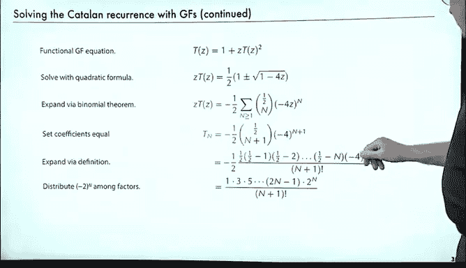

# 012：卡特兰数


在本节课中，我们将学习一个在组合数学中极为重要的数列——卡特兰数。我们将通过生成函数这一强大工具来推导其通项公式，并了解其在多个经典问题中的应用。

## 概述

卡特兰数是一个在计算机科学和组合数学中频繁出现的基础数列。它描述了多种看似不同但结构等价的问题的计数结果，例如多边形的三角剖分数、赌徒破产路径数、二叉树形态数等。我们将从递推关系出发，利用生成函数求解，最终得到其简洁的闭式解。

## 卡特兰数的应用

以下是卡特兰数的一些经典应用场景，它们都满足相同的递推关系。

### 多边形三角剖分

考虑一个具有 `n+2` 条边的凸多边形，将其用不相交的对角线完全划分为三角形的方法数，即为卡特兰数。例如，正方形有两种三角剖分，五边形有五种，六边形则有十四种。

### 赌徒破产问题

一个赌徒从0元开始，每次下注1元。他持续赌博直到输光所有钱。记录其资金变化路径，要求路径始终非负（即从未负债）。对于包含 `n` 次赢和 `n` 次输的路径，其数量也是卡特兰数。

### 二叉树计数

一个二叉树由一个根节点和其左右两个子树（可为空）构成。具有 `n` 个内部节点的不同形态的二叉树数量是卡特兰数。例如，1个节点有1种形态，2个节点有2种，3个节点有5种，4个节点有14种。

### 普通树计数

普通树由一个根节点连接任意数量的子树构成。具有 `n` 个节点的不同形态的普通树数量同样是卡特兰数。

这些问题的共同点在于，它们都满足以下递推关系：
```
T_n = Σ_{k=0}^{n-1} T_k * T_{n-1-k} + δ_{n,0}
```
其中 `T_n` 表示规模为 `n` 的问题的解的数量，`δ_{n,0}` 是克罗内克δ函数（当 `n=0` 时为1，否则为0）。

## 使用生成函数求解

上一节我们看到了卡特兰数满足的递推关系。本节中，我们将使用生成函数来求解这个递推式。

### 建立生成函数方程

设卡特兰数的生成函数为：
```
T(z) = Σ_{n≥0} T_n * z^n
```
将递推关系两边乘以 `z^n` 并对所有 `n≥0` 求和。

左边直接得到 `T(z)`。

右边分为两部分：
1.  `δ_{n,0}` 项求和后得到 `1`。
2.  双重求和项 `Σ_{n≥0} Σ_{0≤k≤n-1} T_k * T_{n-1-k} * z^n`。

我们处理双重求和项。交换求和顺序，先对 `k` 求和，再对 `n` 求和：
```
Σ_{k≥0} T_k * Σ_{n≥k+1} T_{n-1-k} * z^n
```
令 `m = n - k - 1`，则当 `n ≥ k+1` 时，`m ≥ 0`。代入得：
```
Σ_{k≥0} T_k * z^{k+1} * Σ_{m≥0} T_m * z^m
```
内层的求和正是 `T(z)`。因此整个式子等于 `z * T(z) * T(z) = z * [T(z)]^2`。

综合两部分，我们得到生成函数必须满足的方程：
```
T(z) = 1 + z * [T(z)]^2
```

### 求解生成函数

这是一个关于 `T(z)` 的二次方程。我们可以使用二次求根公式求解：
```
z * [T(z)]^2 - T(z) + 1 = 0
```
解得：
```
T(z) = [1 ± √(1 - 4z)] / (2z)
```
我们需要根据初始值 `T_0 = 1` 来确定符号。当 `z -> 0` 时，`√(1 - 4z) -> 1`。若取正号，则 `T(z) -> (1+1)/(2z) = 1/z`，趋于无穷大，与 `T_0=1` 矛盾。因此必须取负号：
```
T(z) = [1 - √(1 - 4z)] / (2z)
```

### 提取系数得到通项公式

现在我们需要从生成函数 `T(z)` 中提取 `z^n` 的系数，即 `T_n`。

首先，利用广义二项式定理展开 `√(1 - 4z)`：
```
√(1 - 4z) = (1 - 4z)^{1/2} = Σ_{n≥0} C(1/2, n) * (-4z)^n
```
其中 `C(α, n)` 是广义二项式系数：
```
C(α, n) = α(α-1)(α-2)...(α-n+1) / n!
```
因此：
```
T(z) = [1 - Σ_{n≥0} C(1/2, n) * (-4z)^n] / (2z)
```
将常数项1与级数合并。注意当 `n=0` 时，`C(1/2, 0)=1`，`(-4z)^0=1`，所以 `1 - 1 = 0`。求和可以从 `n=1` 开始：
```
T(z) = - Σ_{n≥1} C(1/2, n) * (-4z)^n / (2z)
```
令 `m = n-1`，则 `n = m+1`：
```
T(z) = - Σ_{m≥0} C(1/2, m+1) * (-4)^{m+1} * z^m / 2
```
所以，`z^m` 的系数 `T_m` 为：
```
T_m = - (1/2) * C(1/2, m+1) * (-4)^{m+1}
```
接下来进行代数化简。写出广义二项式系数的定义：
```
C(1/2, m+1) = (1/2) * (1/2 - 1) * (1/2 - 2) * ... * (1/2 - m) / (m+1)!
           = (1/2) * (-1/2) * (-3/2) * ... * (-(2m-1)/2) / (m+1)!
           = (-1)^m * (1 * 3 * 5 * ... * (2m-1)) / (2^{m+1} * (m+1)!)
```
代入 `T_m` 表达式：
```
T_m = - (1/2) * [ (-1)^m * (1*3*5*...*(2m-1)) / (2^{m+1} * (m+1)!) ] * (-4)^{m+1}
```
化简 `(-4)^{m+1} = (-1)^{m+1} * 4^{m+1} = (-1)^{m+1} * 2^{2(m+1)}`。
符号部分：`(-1)^m * (-1)^{m+1} = (-1)^{2m+1} = -1`。
与前面的 `- (1/2)` 相乘，得到 `+ (1/2)`。

因此：
```
T_m = (1/2) * (1*3*5*...*(2m-1)) * 2^{2(m+1)} / (2^{m+1} * (m+1)!)
    = (1*3*5*...*(2m-1)) * 2^{m} / (m+1)!
```
为了得到更熟悉的形式，分子分母同时乘以 `m!`，并将分子补成 `(2m)!`：
```
(1*3*5*...*(2m-1)) * (2*4*6*...*2m) = (2m)!
```
其中 `(2*4*6*...*2m) = 2^m * m!`。
所以：
```
T_m = [ (2m)! / (2^m * m!) ] * 2^m / ( (m+1) * m! )
    = (2m)! / ( m! * m! * (m+1) )
    = C(2m, m) / (m+1)
```
其中 `C(2m, m)` 是组合数。

最终，我们得到卡特兰数的通项公式：
```
T_n = C(2n, n) / (n+1)
```
或者写作：
```
T_n = (1/(n+1)) * ( \binom{2n}{n} )
```



## 总结


本节课我们一起学习了卡特兰数。我们首先看到了它在多边形三角剖分、赌徒破产路径、二叉树计数等多个组合问题中的统一出现。接着，我们从其递推关系出发，运用生成函数这一工具，通过建立方程、求解方程、展开并提取系数等一系列步骤，最终推导出了卡特兰数的经典闭式解：`T_n = C(2n, n) / (n+1)`。这个公式简洁而优美，是组合数学中最重要的结果之一。在后续课程中，我们还会在分析树形数据结构时再次遇到卡特兰数。