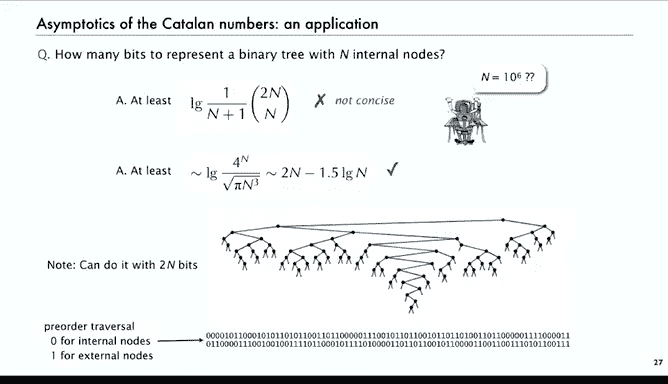

# 017：有限和渐近分析


在本节课中，我们将学习如何处理以和式形式表达的量的渐近展开。在算法分析中，最终结果常常以和式形式出现，我们需要掌握相应的技术来估算它们。

## 处理有限和的三种基本技术

上一节我们介绍了渐近分析的基本概念，本节中我们来看看当分析对象是有限和时，有哪些实用的技术。以下是三种基本方法。

### 1. 尾部边界法

当和式的尾部项远小于前部项时，我们可以直接估算整个尾部的总和。

**核心思想**：将原和式写成一个已知的无穷级数减去一个尾部余项，然后证明这个余项非常小。

**经典例子**：估算和式 `S = n! * Σ_{k=0}^{n-1} (-1)^k / k!`。
1.  我们知道无穷级数 `Σ_{k≥0} (-1)^k / k! = 1/e`。
2.  因此，`S = n! / e - R`，其中余项 `R = n! * Σ_{k≥n} (-1)^k / k!`。
3.  可以证明 `|R| ≤ 1/n`。所以，`S = n! / e + O(1/n)`。由于 `n!` 增长极快，这是一个非常精确的估计。

### 2. 最大项主导法

当和式的项迅速增加时，通常只有最后一项（最大项）起主导作用。

**核心思想**：识别和式中最大的项，并证明其他所有项的总和相对于最大项可以忽略不计。

**经典例子**：估算和式 `Σ_{k=1}^{n} k!`。
1.  最后两项是 `n! + (n-1)!`。
2.  其余 `n-2` 项都小于 `(n-2)!`，其总和小于 `(n-2) * (n-2)!`。
3.  可以证明 `(n-2) * (n-2)! / n! = O(1/n)`。因此，`Σ_{k=1}^{n} k! = n! + (n-1)! + O(n!/n)`。

### 3. 积分近似法

这是最常用、最强大的方法，调和数、阶乘（斯特林公式）的近似都源于此。

**核心思想**：用一个积分来近似代替离散的和式。

**核心公式**：欧拉-麦克劳林求和公式。它给出了和式 `Σ_{k=a}^{b} f(k)` 的一个渐近级数（类似于泰勒展开），表达式中包含函数 `f(x)` 的积分及其各阶导数。

对于一个典型和式 `Σ_{k=1}^{n} f(k)`，其欧拉-麦克劳林展开的前几项为：
```
Σ_{k=1}^{n} f(k) = ∫_{1}^{n} f(x) dx + (1/2)[f(n) + f(1)] + C + (1/12)[f'(n) - f'(1)] + ...
```
其中 `C` 是一个与函数 `f` 相关的常数。

**经典应用**：
*   **调和数**：`f(k) = 1/k`。
    *   `H_n = Σ_{k=1}^{n} 1/k = ln n + γ + 1/(2n) - 1/(12n^2) + O(1/n^4)`
    *   其中 `γ` 是欧拉常数。
*   **斯特林公式（对数形式）**：`f(k) = ln k`。
    *   `ln(n!) = Σ_{k=1}^{n} ln k = n ln n - n + (1/2) ln(2πn) + 1/(12n) + O(1/n^3)`

这些近似在 `n` 很大时极其精确，是算法分析的基石。

## 应用实例：估算二项式系数

现在，我们运用已学的技术来解决一个具体问题：估算中心二项式系数 `C(2n, n)` 的渐近行为。

**目标**：得到 `C(2n, n) = (2n)! / (n! * n!)` 的渐近展开，精确到 `O(1/n)`。

**步骤**：
1.  **利用对数化乘为加**：
    `C(2n, n) = exp( ln((2n)!) - 2 ln(n!) )`
2.  **代入斯特林公式**（取到 `O(1/n)` 项）：
    *   `ln((2n)!) = (2n) ln(2n) - 2n + (1/2) ln(4πn) + O(1/n)`
    *   `ln(n!) = n ln n - n + (1/2) ln(2πn) + O(1/n)`
3.  **代数化简**：
    *   将 `ln(2n)` 写为 `ln n + ln 2`。
    *   计算 `(1/2) ln(4πn) - 2 * (1/2) ln(2πn) = (1/2) ln(πn)`。
    *   大量项相互抵消后，得到：
        `ln(C(2n, n)) = 2n ln 2 - (1/2) ln(πn) + O(1/n)`
4.  **取指数还原**：
    `C(2n, n) = exp(2n ln 2) * exp(-(1/2) ln(πn)) * exp(O(1/n))`
    `= 4^n / sqrt(πn) * (1 + O(1/n))`

**最终结果**：
```
C(2n, n) ~ 4^n / sqrt(πn)
```
这是一个非常简洁而强大的渐近估计。

## 实际应用：二叉树编码

这个理论结果有直接的实际意义。考虑用二进制串编码一个有 `n` 个内部节点的二叉树。

1.  **信息论下界**：不同的二叉树数量是卡特兰数 `C(2n, n)/(n+1) ~ 4^n / (sqrt(π) * n^(3/2))`。要唯一表示所有树，至少需要 `log2(数量)` 个比特。
2.  **计算比特数**：
    `log2(4^n / (sqrt(π) * n^(3/2))) = 2n - (3/2) log2 n - O(1)`
3.  **实践意义**：对于一个有100万个内部节点的树，至少需要约 `2 * 10^6 - (3/2) * log2(10^6) ≈ 2,000,000 - 30` 比特。而存在一种简单的先序遍历编码方法，恰好使用 `2n` 比特。这意味着该编码方案非常接近理论最优值（仅多出约30比特），程序员可以放心使用。

这个例子生动地展示了渐近分析如何将复杂的离散函数转化为清晰、实用的工程指导。



## 总结


本节课中我们一起学习了处理有限和渐近分析的三种核心技术：**尾部边界法**、**最大项主导法**和**积分近似法（欧拉-麦克劳林公式）**。我们通过斯特林公式推导了中心二项式系数 `C(2n, n) ~ 4^n / sqrt(πn)` 的经典近似，并看到了该结果在二叉树编码问题中的直接应用。掌握这些技术，能够帮助我们将算法分析中出现的复杂和式，转化为简洁、可用的渐近估计。