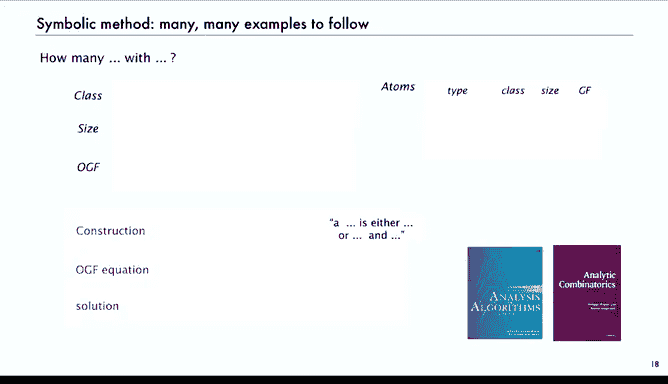

# 019：符号方法入门 🧮


在本节课中，我们将学习解析组合学的入门知识。解析组合学是研究大型组合结构的定量分析的一种“微积分”。它建立在生成函数等概念之上，为我们分析算法和组合结构提供了一个连贯的起点。通过本节课，你将了解解析组合学的基本框架，特别是其核心部分——符号方法。

## 概述

解析组合学是研究大型组合结构的定量分析的一种方法。它的基本流程是：从**组合构造**出发，通过**符号转移定理**得到**生成函数方程**，最后利用**解析转移定理**获得系数的渐近估计。这种方法使我们能够避免许多繁琐的计算，直接得到结果。

## 符号方法

符号方法是解析组合学的起点。它主要用于定义组合构造，并将其翻译为生成函数方程。其基本步骤如下：
1.  定义一个组合对象的**类**。
2.  定义对象的**大小**。
3.  定义其**生成函数**，其系数用于计数相同大小的对象。
4.  定义允许我们构造性地定义对象的**操作**。
5.  为每个构造操作提供对应的生成函数操作**翻译规则**。

我们使用大写字母表示组合类，用绝对值符号表示大小，生成函数则使用相同字母（通常为 `Z` 的函数）。

### 组合类与原子

一个**组合类**是一个对象集合及其大小函数。我们需要一些基础构件来开始构造，这些基础构件称为**原子**，即大小为1的对象。为了方便递归定义，我们还会引入一个大小为0的**中性对象**。

以下是几个简单的组合类例子：

*   **自然数**：可以看作是一系列原子的序列。每个大小只有一个对象。其普通生成函数为 `1/(1 - z)`。
*   **比特串**：由0或1比特组成的序列。长度为 `n` 的比特串有 `2^n` 个。其普通生成函数为 `1/(1 - 2z)`。
*   **二叉树**：要么为空，要么是一个节点连接两棵（有序的）二叉树。其计数序列是卡特兰数，生成函数满足 `T(z) = 1 + z * T(z)^2`。

### 无标号类的构造

对于无标号类，我们主要使用三种基本构造。假设 `A` 和 `B` 是无标号组合类：
*   **不相交并** (`A + B`)：包含来自 `A` 和 `B` 的对象副本。
*   **笛卡尔积** (`A × B`)：包含来自 `A` 和 `B` 的对象的有序对。
*   **序列** (`SEQ(A)`)：包含来自 `A` 的对象的序列。

### 转移定理

符号方法的核心是**转移定理**。它允许我们将组合构造直接翻译为生成函数上的操作：
*   **不相交并**：生成函数为 `A(z) + B(z)`。
*   **笛卡尔积**：生成函数为 `A(z) * B(z)`。
*   **序列**：生成函数为 `1 / (1 - A(z))`。

这些定理的证明基于生成函数计数的基本思想。例如，对于笛卡尔积，由于组合对象由来自 `A` 和 `B` 的各一个独立部分组成，其大小的生成函数自然就是两者生成函数的乘积。

## 应用示例

上一节我们介绍了符号方法的基本构造和转移定理，本节中我们来看看如何应用它们解决具体问题。

### 示例1：二叉树（按内部节点计数）

以下是分析一个组合类的标准步骤：
1.  **定义类**：所有二叉树的类 `T`。
2.  **定义大小**：树 `t` 中内部节点的数量 `|t|`。
3.  **定义生成函数**：`T(z) = Σ_{t∈T} z^{|t|}`。
4.  **定义原子**：
    *   外部节点 `□`（大小 0）：生成函数 = 1。
    *   内部节点 `•`（大小 1）：生成函数 = `z`。
5.  **组合构造**：一棵二叉树要么是一个外部节点，要么是一个（左子树，内部节点，右子树）的笛卡尔积。用符号表示为：
    ```
    T = □ + (T × • × T)
    ```
6.  **应用转移定理**：将构造翻译为生成函数方程。
    *   `□` 对应 `1`。
    *   `(T × • × T)` 对应 `T(z) * z * T(z) = z * T(z)^2`。
    *   因此，方程是：`T(z) = 1 + z * T(z)^2`。

这个方程与我们之前通过其他方法得到的完全一致，但推导过程更加系统和机械化。

### 示例2：二叉树（按外部节点计数）

同一个组合结构，如果采用不同的“大小”定义，就会得到不同的组合类和生成函数。
1.  **定义类**：所有二叉树的类 `T_□`（注意类名变化，以示区分）。
2.  **定义大小**：树 `t` 中外部节点的数量。
3.  **定义生成函数**：`T_□(z) = Σ_{t∈T_□} z^{|t|}`。
4.  **定义原子**：
    *   外部节点 `□`（大小 1）：生成函数 = `z`。
    *   内部节点 `•`（大小 0）：生成函数 = `1`。
5.  **组合构造**：与之前相同：`T_□ = □ + (T_□ × • × T_□)`。
6.  **应用转移定理**：
    *   `□` 对应 `z`。
    *   `(T_□ × • × T_□)` 对应 `T_□(z) * 1 * T_□(z) = T_□(z)^2`。
    *   因此，方程是：`T_□(z) = z + T_□(z)^2`。

可以验证，`T_□(z) = z * T(z)`，这证明了具有 `n` 个外部节点的二叉树数量等于具有 `n-1` 个内部节点的二叉树数量。

### 示例3：比特串

我们已知比特串的生成函数是 `1/(1-2z)`。用符号方法可以轻松得到：
*   **原子**：比特 `0` 和 `1`，大小均为1，生成函数均为 `z`。
*   **构造**：一个比特串是 `0` 或 `1` 的序列。即 `B = SEQ(Z_0 + Z_1)`。
*   **转移**：`Z_0 + Z_1` 的生成函数是 `z + z = 2z`。序列的生成函数是 `1/(1 - 2z)`。

另一种构造方式是：一个比特串要么是空的，要么是一个比特 (`0` 或 `1`) 后接一个比特串。即 `B = ε + (Z_0 + Z_1) × B`。转移后得到方程 `B(z) = 1 + 2z * B(z)`，解得 `B(z) = 1/(1-2z)`。这展示了同一个类可以有多种等价的构造方式。

### 示例4：不含连续两个0的比特串

这是一个更具实际意义的问题。我们想计算长度为 `n` 且不含“00”子串的比特串数量。
1.  **定义类**：所有不含“00”的比特串的类 `B_{00}`。
2.  **大小**：比特串的长度。
3.  **原子**：比特 `0` 和 `1`（生成函数均为 `z`），以及空串 `ε`（生成函数为 `1`）。
4.  **构造**：需要仔细思考如何描述这个受限的类。一种有效的描述是：
    *   一个不含“00”的串，要么是空的，要么是单个 `0`，要么是单个 `1`，要么是 `01` 后接一个不含“00”的串。
    *   用符号表示：`B_{00} = ε + Z_0 + Z_1 + (Z_0 × Z_1) × B_{00}`。
5.  **应用转移定理**：
    *   `ε` 对应 `1`。
    *   `Z_0` 和 `Z_1` 各对应 `z`。
    *   `(Z_0 × Z_1)` 对应 `z * z = z^2`。
    *   因此，生成函数方程为：`B_{00}(z) = 1 + z + z + z^2 * B_{00}(z) = 1 + 2z + z^2 * B_{00}(z)`。
6.  **求解生成函数**：解得 `B_{00}(z) = (1 + 2z) / (1 - z - z^2)`。

这个生成函数对应斐波那契数列的某种变形。提取系数后可以发现，长度为 `n` 且不含“00”的比特串数量正是斐波那契数 `F_{n+2}`。这个例子表明，符号方法可以轻松处理带有约束条件的组合类。

## 总结

本节课中我们一起学习了解析组合学及其核心工具——符号方法。我们了解到：
1.  解析组合学通过**组合构造** → **生成函数** → **系数渐近**的流程来系统分析组合结构。
2.  **符号方法**提供了一套将组合构造（如并、积、序列）机械地翻译为生成函数方程的规则。
3.  我们通过**二叉树**、**比特串**以及**受限比特串**等例子，实践了如何定义组合类、选择原子、进行构造并应用转移定理得到生成函数方程。




符号方法的优势在于其系统性和可扩展性。一旦掌握了基本规则，我们就能以统一的方式处理大量复杂的计数问题，而无需每次都从头进行繁琐的求和与卷积运算。在后续课程中，我们将在此基础上，学习如何从生成函数中提取系数（即计数序列），并处理更复杂的标号组合对象。