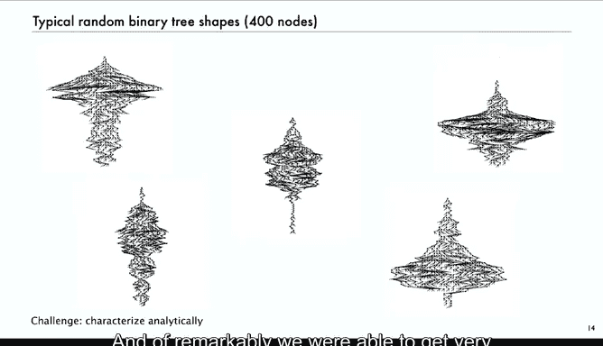

# 023：树与森林 🌲

在本节课中，我们将学习树与森林的基本概念。这是课程下半部分关于应用主题的第一讲。我们将从回顾二叉树开始，然后扩展到更一般的树和森林的定义，并学习如何使用解析组合学的方法来研究它们。

## 二叉树回顾 🌳

上一节我们介绍了二叉树。二叉树由一个外部节点，或一个内部节点及其两个子树（顺序重要）构成。顶部是根节点，根节点可以有两个子树作为其子节点。底部的节点称为叶子节点，其两个子节点均为外部节点。我们通常用圆圈表示内部节点，用小方框表示外部节点。

节点的深度从根节点（深度为0）开始计算，根节点的子节点深度为1，以此类推。树的高度是树中最深节点的深度。

我们之前研究的一个问题是：具有 `n` 个内部节点的二叉树有多少种？答案是卡特兰数。我们使用符号方法进行了推导，其核心步骤如下：

*   **生成函数**：`B(z) = Σ_{对象 b ∈ B} z^{size(b)}`，其中 `size` 计算内部节点的数量。
*   **组合构造**：二叉树 `B` 的定义可以符号化表示为：`B = ε + (● × B × B)`。其中 `ε` 代表空树（外部节点），`●` 代表一个内部节点。
*   **转移定理**：上述构造直接转化为生成函数方程：`B(z) = 1 + z * B(z)^2`。
*   **求解**：解此方程可得 `B(z) = (1 - sqrt(1 - 4z)) / (2z)`，其系数渐近估计为卡特兰数。

这是对二叉树符号方法的快速回顾，为我们今天要处理的不同问题设定了背景。

## 树与森林的定义 🌲➡️🌳🌳

现在，我们来看更一般的数学概念。经典的树概念通常基于森林。

*   **森林** 是一组**树**的序列。
*   **树** 是一个称为**根**的节点，连接到森林中所有树的根。

这是一个递归定义：森林是树的序列（可以为空）；树是一个根节点，连接到其子森林中所有树的根。因此，一个根节点可以有任意数量（包括零个）的子节点。没有子节点的节点称为叶子节点。

节点的深度和树的高度定义与二叉树相同。与二叉树不同，一般树没有显式的“外部节点”概念。

一个立即出现的问题是枚举：具有 `n` 个节点的森林有多少种？下图展示了具有1、2、3、4个节点的所有森林。

你可以立即认出，卡特兰数再次出现了。例如，有5种具有3个节点的森林。同样，树是根节点连接到一个森林，因此具有 `n` 个节点的树的数量，等于具有 `n-1` 个节点的森林的数量，其数值也是卡特兰数（平移后）。

## 解析组合学推导 📊

接下来，我们使用解析组合学来推导树和森林的生成函数。我们将严格遵循之前概述的基本步骤。

定义两个组合类：
*   `F`: 所有森林的类，大小函数为节点数。
*   `G`: 所有树的类，大小函数为节点数。
我们的原子是节点，其生成函数为 `z`。

根据定义，我们可以直接得到组合构造：
1.  森林是树的序列：`F = SEQ(G)`
2.  树是根节点加上一个森林：`G = ● × F`

应用转移定理，我们立即得到它们的普通生成函数方程：
*   `F(z) = 1 / (1 - G(z))`
*   `G(z) = z * F(z)`

现在我们来解这个方程组。将第二个方程代入第一个：
`F(z) = 1 / (1 - z * F(z))`
整理得：`F(z) - z * F(z)^2 = 1`
这正是卡特兰数的生成函数方程。因此，具有 `n` 个节点的森林数等于具有 `n` 个节点的二叉树数（卡特兰数）。具有 `n` 个节点的树数则等于具有 `n-1` 个节点的森林数。

## 双射：森林与二叉树的对应关系 🔄

从解析角度看，我们得到了结果。但在组合学中，当发现两个类枚举结果完全相同时，我们通常希望找到一个**双射**，即两个类中每个成员之间的一一对应关系。这种双射很重要，因为它为我们提供了一种在计算机中方便地表示森林和树的方法。

以下是该双射的规则：每个具有 `n` 个节点的森林都精确对应一个具有 `n` 个节点的二叉树。

森林中的节点可以有多个孩子，而二叉树中的节点恰好有两个孩子（左、右）。对应的方式是：对于森林中的每个节点，我们将其连接到它的**第一个孩子**（作为二叉树的**左孩子**）和它的**下一个兄弟**（作为二叉树的**右孩子**）。

另一种更容易理解的方式是**旋转对应**。如果你将二叉树顺时针旋转45度，并将右孩子边视为“兄弟”关系，你就会看到森林的结构。

这种表示法在计算机中非常有用，因为二叉树很容易用内存块表示（每个节点包含信息和两个子指针），而森林中每个节点的子节点数量可变，在某些计算环境中可能不方便处理。

## 树的绘制算法 🎨

作为补充，我们思考一下绘制二叉树的算法。展示这个是因为我将展示许多二叉树，而编写绘制二叉树的程序对每个人都是一个有价值的练习。

最自然且常用的方法（特别是在讨论排序和搜索算法时）如下：
1.  **Y坐标**：很简单，就是节点的深度。通常我们从根节点在顶部开始，所以 `y = 高度 - 深度`。
2.  **X坐标**：最简单的方法是递归地执行树的**中序遍历**，并在每次访问节点时分配X坐标。递归程序可以这样定义：根节点的X坐标是其左子树中的节点数加1。右子树中所有节点的X坐标都大于此值。

这种方法有两个优点：第一，通过中序遍历很容易分配坐标；第二，它能将树中的节点很好地间隔开。通常我们在绘制大型二叉树时会省略外部节点。

但这种方法有一个问题：对于某些类型的树（特别是表示一般树的二叉树），可能会产生冗长而分散注意力的边。有时我们会采用另一种方法：在每一层，我们将该层的节点均匀分布，并以根节点为中心。这种绘制方式很有用，因为它能展示树的“轮廓”，即每层有多少节点，这在某些分析中是一个有趣的属性。

下图是使用第一种方法绘制的随机二叉树示例。

当你观察随机二叉树时，它们拥有许多不同的形状。随机树或随机森林也会呈现出各种各样有趣的形态。

我们面临的挑战，也是我展示这些大型二叉树的原因，就是我们需要以某种方式（例如对所有树进行平均）从解析角度描述这种行为。令人惊讶的是，我们能够在这方面取得很大进展，而这正是我们现在要开始做的事情。

## 总结 📝

本节课中，我们一起学习了树与森林的基本概念。我们从二叉树的回顾开始，然后定义了一般意义上的树和森林。我们使用解析组合学的方法推导出它们的生成函数，并确认其数量由卡特兰数给出。我们还探讨了森林与二叉树之间重要的双射关系，这为计算机表示提供了便利。最后，我们简要介绍了树的绘制算法。这些基础为我们后续分析树的更多参数和行为做好了准备。