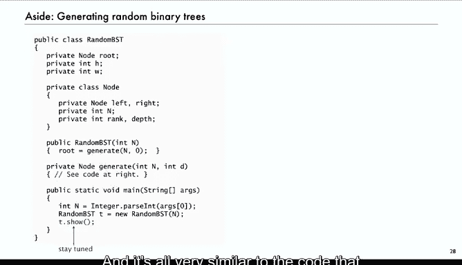

# 024：二叉搜索树 🧮


在本节课中，我们将要学习计算机科学中的一个经典且重要的数据结构——二叉搜索树。我们将了解它的基本概念、工作原理，以及它与纯组合数学中的随机二叉树有何不同。

## 概述

二叉搜索树是一种用于实现符号表（或称字典）的基础数据结构。它允许我们高效地插入、查找和删除与键相关联的数据。其核心思想是利用二叉树的结构，并遵循一个简单的排序规则：对于任意节点，其左子树中的所有键都小于该节点的键，其右子树中的所有键都大于该节点的键。

## 数据结构定义

二叉搜索树由节点构成。每个节点包含一个键、一个关联的值，以及指向其左子树和右子树的引用。

在Java中，我们可以用以下代码定义一个节点：

```java
class Node<Key, Value> {
    Key key;
    Value val;
    Node left;
    Node right;
}
```

这个定义体现了二叉搜索树的递归结构：一个树要么为空（`null`），要么是一个根节点，该节点连接着两个更小的二叉搜索树（左子树和右子树）。

## 查找操作 🔍

查找操作是二叉搜索树的核心功能之一。其算法非常直观，利用了树的有序性。

以下是查找操作的递归实现逻辑：

1.  从根节点开始。
2.  将目标键与当前节点的键进行比较。
3.  如果目标键**小于**当前节点的键，则递归地在**左子树**中继续查找。
4.  如果目标键**大于**当前节点的键，则递归地在**右子树**中继续查找。
5.  如果目标键**等于**当前节点的键，则查找成功，返回该节点关联的值。
6.  如果到达一个空链接（`null`），则说明键不存在于树中，返回`null`。

这个过程就像在一个有序的列表中执行二分查找，但数据是以树形结构组织的。

## 插入操作 ➕

插入操作与查找操作紧密相关。其基本思想是：先执行一次查找。如果找到了键，则更新其关联的值；如果未找到（最终到达一个空链接），则在该位置创建一个新节点。

以下是插入操作的递归实现逻辑：

1.  从根节点开始递归查找插入位置。
2.  如果当前节点为`null`，说明到达了应插入的位置，在此处创建一个新节点并返回。
3.  否则，比较键值：
    *   若新键较小，则递归地在左子树中插入。
    *   若新键较大，则递归地在右子树中插入。
4.  递归调用返回后，将返回的（可能是新的）子树链接回当前节点。

通过这种递归方式，新节点被自然地“挂”到了树中正确的位置。

## 树的形状与性能分析 ⚖️

上一节我们介绍了插入和查找的基本操作，本节中我们来看看一个关键问题：二叉搜索树的性能。

二叉搜索树的性能高度依赖于树的**形状**，而树的形状又完全由**键被插入的顺序**决定。

*   **最佳情况**：如果键以完全平衡的顺序插入，树的高度约为 **log₂ N**。此时查找和插入的时间复杂度为 **O(log N)**，效率极高。
*   **最坏情况**：如果键按严格递增或递减的顺序插入，树会退化成一条链表，高度为 **N**。此时查找和插入的时间复杂度退化为 **O(N)**，效率很低。

对于一个包含海量数据（如百万或十亿级）的符号表，`O(log N)`和`O(N)`的性能差异是决定性的，可能直接导致一个应用可行或不可行。

## 随机二叉搜索树模型 🎲

为了进行理论分析，我们通常假设键是以**随机顺序**插入的。这是一个合理的模型，在许多实际场景中能得到验证。

在随机插入的假设下，生成的二叉搜索树趋向于相对平衡，这与纯组合数学中的“随机二叉树”模型有本质区别。

*   **随机二叉搜索树模型**：输入是一个随机的**排列**（共`N!`种可能）。树形是排列的属性。
*   **卡塔兰随机二叉树模型**：每个具体的**树形结构**（共`C_N`种，`C_N`为卡塔兰数）是等概率出现的。

这两种模型产生的树形分布截然不同。随机二叉搜索树更可能产生平衡的树形。

## 树形与排列的映射关系 🔗

理解为何随机二叉搜索树更平衡的关键，在于探究有多少种不同的插入排列会生成同一个树形。

对于一个给定的树形`T`，设其左子树有`L`个节点，右子树有`R`个节点。那么，能生成树形`T`的排列数量`P(T)`满足以下递归公式：

**P(T) = (L+R choose L) * P(T_left) * P(T_right)**

其中，`(L+R choose L)`是二项式系数，表示将左子树和右子树的节点在插入序列中交错混合的方式数。

这个公式揭示了一个重要事实：当左右子树大小接近（即树更平衡）时，二项式系数`(L+R choose L)`的值**远大于**子树大小悬殊时的情况。因此，平衡的树形对应着**更多**的插入排列，从而在随机插入模型下出现的概率也**更高**。

## 两种模型的概率分布对比 📊

我们可以通过根节点秩（即根节点是第几小的元素）的概率分布来直观对比两种模型。

*   **在随机BST模型中**：根节点是插入序列的第一个元素。由于序列是随机的，任何键成为根节点的概率都是**1/N**。这是一个均匀分布。
*   **在卡塔兰随机树模型中**：每个树形等可能。根节点秩为`k`的概率由卡塔兰分布给出。该分布的质量高度集中在边缘（即`k`接近1或`N`），意味着树极有可能非常不平衡。事实上，至少有一个子树为空的概率约为**1/2**。

下图展示了卡塔兰分布的形状，清晰表明了其不平衡性。




## 总结

本节课中我们一起学习了二叉搜索树这一核心数据结构。

我们首先了解了它的定义和用于实现符号表的目的。接着，我们详细探讨了其查找和插入操作的递归算法。然后，我们深入分析了决定其性能的关键因素——树的形状，并引入了随机二叉搜索树作为分析模型。


最后，我们通过比较**随机BST模型**和**卡塔兰随机树模型**，从原理上解释了为何在实际的随机插入下，二叉搜索树倾向于保持相对平衡。核心结论是：平衡的树形对应着指数级更多的插入序列，因此在随机模型中出现的概率远高于不平衡的树形。这为二叉搜索树在实践中良好的平均性能提供了理论依据。