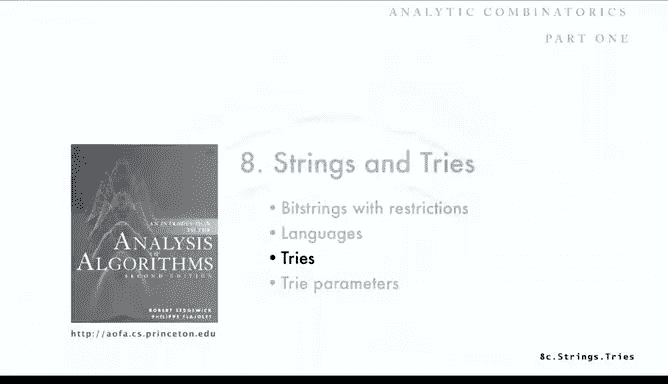

# 034：字典树

## 概述
在本节课中，我们将要学习一种称为“字典树”的数据结构。字典树是一类组合对象，近年来因其在计算机领域的应用而受到广泛研究。它拥有非常丰富且有趣的分析特性。我们将首先介绍字典树是什么及其应用，然后再探讨其分析。

## 什么是字典树？🌳

上一节我们介绍了字典树的基本概念，本节中我们来看看它的具体定义。

一种理解字典树的方式是将其视为一棵二叉树，其中某些外部节点被标记。黑色的节点称为“空节点”，白色的节点称为“非空节点”。规则是：在叶子节点中，不能有两个空节点互为兄弟节点。也就是说，如果一个节点是空节点，那么它的兄弟节点不能是空节点。

实际上，你可以尝试给出字典树的递归定义作为练习。

字典树最常用的理解方式是：它代表一组比特字符串。每个非空外部节点代表一个比特字符串。通过从根节点到该节点的路径来获取这个字符串：向左走记为0，向右走记为1。

例如，路径“左、左、右、右、左”会到达一个非空外部节点，该节点代表的比特字符串就是 `00110`。另一个节点代表的比特字符串是 `1010`。

空节点则有不同的解释。例如，如果我们连续向右走四次再向左，会到达一个空节点。这意味着，在字典树所代表的字符串集合中，**没有**以该路径为前缀的字符串。因此，字典树代表了一组比特字符串，而空节点则代表了所有未被包含的字符串的前缀。

另一种理解方式是：字典树递归地表示了字符串集合。左边的子树代表所有以0开头的字符串（去掉开头的0），右边的子树代表所有以1开头的字符串（去掉开头的1）。

这仅适用于“无前缀”的字符串集合，即集合中没有任何一个字符串是另一个字符串的前缀。我们可以通过使用空和非空内部节点来处理更一般的情况，但在典型的应用中，处理无前缀集合就足够了。例如，所有长度固定的比特字符串集合就是无前缀的，因为所有字符串长度相同且互不相同。

## 字典树的应用 💡

字典树有非常广泛的应用。在算法书籍中，你可以找到用于排序、字符串键的简单表以及后缀数组的字典树代码。它在经典数据压缩算法（如霍夫曼编码和LZW压缩）中扮演着角色。我们还将看到字典树如何用于理解决策、冲突解决和领导者选举算法。如今，字典树在网络系统、生物信息学、互联网搜索和各种商业数据处理中都非常重要。这是一个常被忽视但极其重要的数据结构。

### 应用一：符号表

字典树最基本的应用之一是作为符号表。它代表一组比特字符串，因此我们可以基于定义实现搜索算法。

**搜索算法**的基本思想是：如果待查键的首位比特是0，则向左走；如果是1，则向右走。然后递归地使用剩余的字符串。
*   如果最终到达一个空外部节点，则表示该键不在集合中。
*   如果到达一个非空外部节点且正好用完了所有比特，则报告搜索成功。

例如，在示例字典树中搜索 `0011`：从0开始向左，下一个0向左，下一个1向右，下一个1向右。此时字符串结束，且位于一个非空外部节点，因此搜索成功。搜索 `10110` 则会遇到空节点，表示搜索失败。

**插入算法**则是通过搜索直到遇到一个空外部节点。如果中途遇到内部节点或非空外部节点，可能意味着存在前缀冲突，需要特殊处理。对于要插入的新键，最终会到达一个空节点。然后，对于键中剩余的每个比特，我们添加一个新的内部节点，其中一个子节点是空外部节点，另一个子节点则根据比特值（0左1右）指向一个新的节点或最终的非空节点。例如，插入 `01110` 的过程就如上所述。

当然，存在一些变体（如使用指针记录尾部），但最简单的版本通常就很有效。一个自然的问题是：这些空外部节点似乎浪费了空间。因此，我们需要分析字典树的空间占用，这在实际应用中非常重要。

### 应用二：子字符串搜索

另一个重要应用是子字符串搜索。假设我们有一个给定的长字符串（例如基因组序列，可能长达数十亿个字符），我们需要快速判断一个特定的子串是否存在于该字符串中。

解决方案是构建一个**后缀字典树**。思路是：对于给定的字符串，考虑其所有后缀（从每个位置开始到结尾的子串）。如果原字符串长度为 `n`，则有 `n` 个后缀。我们将这些后缀作为独立的字符串插入到一个字典树中，这就构成了后缀字典树。这是一个无前缀集合。

此后，字典树的每个内部节点都对应原字符串的某个子串。要查询子串 `X` 是否存在，只需使用 `X` 的字符遍历字典树。如果能遍历完 `X` 并到达一个非空节点（或内部节点），则 `X` 存在；如果中途遇到空节点，则 `X` 不存在。例如，查询 `AC` 可以成功找到，而查询 `TGA` 则会失败。这是一个利用字典树回答子串查询的简洁算法。

### 应用三：领导者选举算法

字典树还可以作为算法的模型，例如**分布式领导者选举算法**。在分布式系统中，一组个体需要选举出一个领导者。

算法过程如下：每个参与者独立地抛硬币。
*   将抛得1的视为胜者，进入下一轮；抛得0的视为败者，被淘汰。
*   剩余胜者再次抛硬币，重复此过程。
*   直到只剩下一名胜者，该胜者即为领导者。

这个过程可能失败：如果某一轮所有参与者都抛得0，则没有胜者，选举失败。

这个选举过程恰好可以映射到一棵随机字典树中。选举的轮数对应于字典树中最右侧路径的长度。选举失败的概率则对应于随机字典树中最右侧路径以空节点结尾的概率。这里的“随机字典树”模型，通常指通过向初始为空的字典树中插入无限长的随机比特串所得到的结构。

## 总结

本节课中我们一起学习了字典树这一重要的数据结构。我们首先了解了字典树的定义，它是一类用于表示比特字符串集合的二叉树变体。接着，我们探讨了字典树的三个主要应用：作为高效的符号表实现、用于快速子字符串搜索的后缀字典树，以及作为分布式领导者选举算法的模型。这些应用展示了字典树在计算机科学多个领域的实用性和重要性，也为我们后续分析其性能参数（如搜索时间、空间占用、路径长度等）提供了动机和背景。