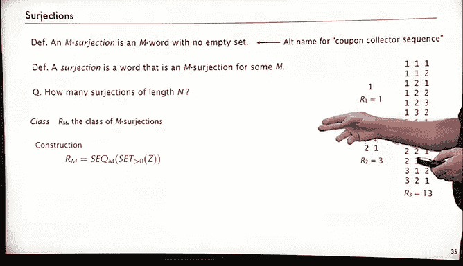

# 039：赠券收集问题 🎫


在本节课中，我们将学习一个经典的概率与组合问题——赠券收集问题。我们将探讨其定义、经典概率分析，以及如何使用解析组合学的方法来研究它。

---

## 问题定义 🎲

赠券收集问题描述了一个常见场景：假设有 `M` 种不同的赠券（或卡片、生日等），每次随机获得一种。问题是：平均需要收集多少次，才能集齐所有 `M` 种不同的赠券？

这类似于向 `M` 个瓮中随机投球，需要投多少次才能确保每个瓮中至少有一个球。或者，掷一个 `M` 面的骰子，需要掷多少次才能看到所有 `M` 个面。

---

## 经典概率分析 📊

上一节我们定义了问题，本节中我们来看看如何使用经典概率论计算平均收集次数。

首先，假设我们已经收集了 `k` 种不同的赠券。获得第 `k+1` 种新赠券的概率是 `(M - k) / M`。因此，为了获得下一种新赠券，所需的尝试次数服从参数为 `p = (M - k) / M` 的几何分布。其期望值为 `1/p = M / (M - k)`。

以下是计算总期望次数的步骤：
1.  从 `k = 0`（尚未收集任何赠券）开始。
2.  获得第 `k+1` 种新赠券的期望尝试次数是 `M / (M - k)`。
3.  要集齐所有 `M` 种赠券，需要将获得第1种、第2种...直到第 `M` 种新赠券的期望次数相加。

因此，总期望次数 `E[T]` 为：
```
E[T] = Σ (k=0 到 M-1) [ M / (M - k) ]
     = M * Σ (j=1 到 M) [ 1 / j ]
     = M * H_M
```
其中 `H_M` 是第 `M` 个调和数。当 `M` 较大时，`H_M` 近似于 `ln M + γ`（γ 为欧拉常数）。所以，**平均收集次数渐近于 `M ln M`**。

例如，对于一个20面的骰子（`M=20`），平均需要掷 `20 * ln(20) ≈ 60` 次才能看到所有面。

---

## 解析组合学方法 🔬

虽然经典方法能轻松得出平均值，但如果我们想研究分布、方差或更复杂的变化形式，就需要解析组合学提供的结构。

我们首先定义“赠券收集序列”：它是一个长度为 `n` 的序列，使用了字母表中所有 `M` 个字母，且每个字母至少出现一次。

### 指数生成函数 (EGF) 构建

我们可以将赠券收集序列视为一个由 `M` 个“非空集合”构成的序列（每个集合对应一个字母的出现位置）。在标记组合结构中，这对应于：
```
C = SEQ_M( SET_{≥1}(Z) )
```
其指数生成函数为：
```
C(z) = (e^z - 1)^M
```
系数 `[z^n] C(z)` 给出了长度为 `n` 的赠券收集序列的数量，再除以 `M^n` 即可得到随机序列是赠券收集序列的概率。然而，直接提取系数会得到一个交替和，对于渐近分析并不方便。

### 普通生成函数 (OGF) 与等待时间

另一种更有效的方法是定义一个新类 `W_{M,k}`：它是使用恰好 `k` 种不同字母的 `M` 字，并且**最后一个字母只出现一次**。这有助于分析收集到第 `k` 种赠券的等待时间。

以下是其组合构造：
*   最后一个字母是已出现的 `k` 种字母之一。
*   或者，最后一个字母是一种全新的字母（第 `k+1` 种）。

这个构造直接转化为生成函数方程。通过计算相应的概率生成函数，对其求导并在 `z=1` 处求值，我们可以得到收集到第 `k` 种赠券的平均等待时间，最终也能推导出相同的总和公式 `M * H_M`。

---

## 应用与扩展 💡

赠券收集问题在现实世界和计算机科学中有许多应用。

**实际应用示例：**
*   **收集卡片：** 估算集齐一套 `M` 张不同卡片需要购买的卡包数量。
*   **软件测试：** 随机访问内存页面进行测试。若要确保测试覆盖所有 `M` 个页面，平均需要约 `M ln M` 次随机访问。例如，对于 `M=1,000,000`，大约需要 `1,000,000 * ln(1,000,000) ≈ 14.5M` 步。

**组合学扩展：**
我们讨论的“赠券收集序列”在组合学中称为 **M-满射 (M-surjection)**，即使用了所有 `M` 个字母的序列。
一个更一般的概念是 **满射 (surjection)**，它指使用了某个字母表（不一定是全部）但**无遗漏**的序列，即使用的字母集合是连续的 `{1, 2, ..., k}`（对于某个 `k`）。
其组合构造为：`S = SEQ( SET_{≥1}(Z) )`，对应的指数生成函数为：
```
S(z) = 1 / (1 - (e^z - 1)) = 1 / (2 - e^z)
```
分析这个生成函数可以得到长度为 `n` 的满射数量的渐近估计，约为 `n! / (2 * (ln 2)^{n+1})`。这展示了解析组合学在处理此类复杂结构时的威力。

---



## 总结 📝

本节课中我们一起学习了赠券收集问题。
1.  **问题核心：** 随机收集 `M` 种不同物品，集齐所有种类所需的平均次数约为 **`M ln M`**。
2.  **两种方法：** 我们回顾了简洁的经典概率推导，也介绍了更具一般性的解析组合学方法，后者为分析更复杂的性质（如方差、分布）奠定了基础。
3.  **广泛应用：** 从趣味游戏到计算机系统测试，该问题模型都有着重要的实用价值。
4.  **组合扩展：** 我们看到了如何将其自然扩展为“满射”这一组合对象，并通过生成函数进行研究。


下一节，我们将继续探讨解析组合学在计算机科学中的其他应用。