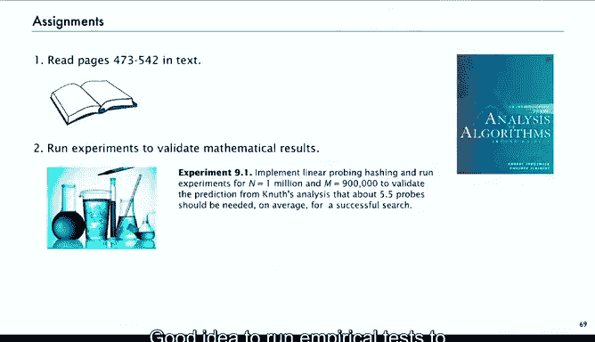
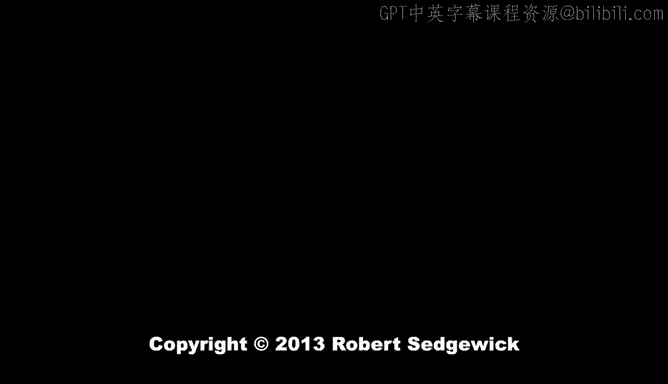

# 042：习题与总结 🧮

在本节课中，我们将回顾并完成《算法分析》中关于解析组合学第一部分的习题与总结。我们将通过几个具体的练习来检验对本章内容的理解，并回顾所学的核心技术与概念。

---

## 习题练习

以下是几个可用于检验你对本章内容理解的练习题。

### 生日悖论计算 🎂

第一个练习是一个计算题。假设你是一位多疑的教授，拥有一个很大的班级。你需要计算，班级需要有多大，才能有99%的把握确定，当你询问班上所有人时，能找到两个生日相同的人？这是一个有趣的计算问题。

### 组合定理证明 📐

下一个练习是一个组合问题。它实际上是线性探查算法（linear probing）的克努特（Knuth）分析基础，并将我们在本章中涉及的一些与凯莱树（Cayley trees）相关的计算联系了起来。这个证明实际上比看起来要简单。它旨在证明由AL提出的二项式定理的一个推广形式。完成这个计算是很有价值的。

### 随机映射的概率问题 🔄

第三个练习在书中没有，但应该被包含在内，因此我将其编号为99。这个练习要求证明：对于一个大小为 `n` 的随机映射，其不包含任何单元素环（即没有任何元素映射到自身）的概率是多少？令人惊讶的是，结果证明是 `1/e`，这与排列中的错排问题（derangement problem）结果相同。这两者之间并没有明显的必然联系，但结果确实相同。这是一个值得你仔细研究的好练习。

---

## 课程总结与后续建议

上一节我们介绍了几道检验理解的习题，本节我们来对解析组合学第一部分进行总结。

至此，我们完成了解析组合学第一部分的内容。我们对基本技术进行了相当全面的概述，介绍了解析组合学，并展示了它如何应用于研究基本的组合结构，如树、排列、字符串、单词和映射。

我们建议你完成以下步骤以巩固学习：
*   阅读教材的相关部分。
*   运行实证测试，以验证克努特分析是否有效（你会发现它确实有效）。
*   查看映射的性质，并检查相关分析是否同样有效。
*   尝试完成上述练习并写下解答。

我们希望许多同学对我们所探讨的问题足够感兴趣，从而报名参加即将开始的解析组合学第二部分课程。

本节课中，我们一起学习了如何通过具体习题应用解析组合学知识，并回顾了第一部分涵盖的核心技术与结构。感谢你的学习。