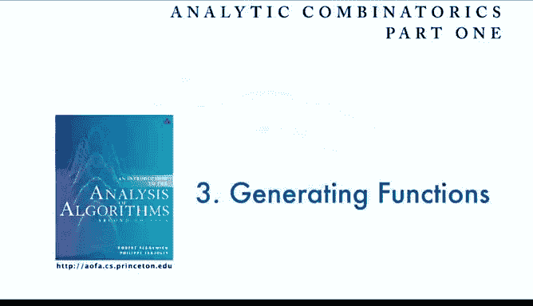
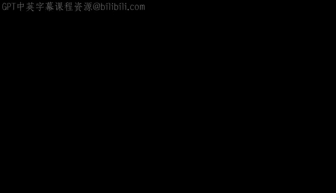

# 普林斯顿大学《算法分析｜Analysis of Algorithms》中英字幕 - P11：11_03_02_用生成函数计数.zh_en - GPT中英字幕课程资源 - BV1YE421T7kf

We're going to finish off by looking at the idea of counting directly with generating functions。

 this is going to be a first step to ease us into the really important role that generating functions play in analytic combatorics。

So it's really an alternate view of what generating functions can do for us and it's very combinatorial and will'll be much more formal and thorough and extensive coverage of this。

 but still it's good to look at the same problem that we just looked at from this point of view in this lecture。

So what we're going to do is define a class of combinatorial objects that have an associated size function and the generating function is going to be a sum over all members of the class still get to the same point of getting an equation that a generating function must satisfy and from that point on the analysis will be the same。

 but getting that equation is much more natural and fundamental with this kind of correspondence。

 it seems kind of abstract， but so let's look at a specific example。

So let's say t is a set of all binary trees， then we're going to define a size function that looks like absolute value。

 if you have any binary tree， it's going to be the number of internal nodes in that tree。啊。

Now what we're interested in is a counting sequence and that's what we're interested in before。

 it's the number of binary trees from the set of all binary trees that have size function equal to n so that's the number of binary trees with n internal nodes。

 that's what we're counting before， this is just the formal definition tree by tree now what's that good for。

 well if we define the generating function to be the sum over all possible trees of z to the size of the tree。

 then that treats each term individually each tree contributes individually to a term in the generating function but it's exactly the same as if the trees of size n were collected together and counted by t sub n。

So that's a fundamental idea on this equation， we sum over all possible trees。

 but since it's z to the size of the tree， all the ones of the same size are going to contribute to the coefficient of that size。

 say n and give us T sub n。So it's the same generating function looked at a different way。And so。

 and the reason that's helpful is that。We can look at the way that we define the combinatorial structures to give us the equation that we want for the generating function。

And so this is how it works for binary trees， so the definition of a binary tree is that it's a root node with a binary tree on the left and a binary tree on the right。

And say on the left there's T subL internal nodes on the right there's T subbar internal nodes。

 if we take that sum of all possible trees and it's got all possible left nodes。

 all possible right nodes then but we had，Z to the size of the whole tree。

 that's the size of the left， the size of the right plus one。

 so the decomposition that we use to define what we mean by what is a binary tree immediately gives this equation on the generating function theres it starts out with a one that's for the empty tree that doesn't compose so the double sum is for non-empty trees。

So that's a first key step to understand that the decomposition， the recursive decomposition。

 the way that we define binary trees， immediately translates to an equation on the generating function。

So now that equation， those t subl and t sub R are just formal variables and they're independent so we can immediately split that sum up into z times sum over all t subl z to the t subl。

 sum over all t sub Rs z to the t sub bar and then get the answer that t of z equals1 plus z t of z squared。

 just the same as we found before by worrying about all the counting， but this is much more direct。

 really the equation says that a binary tree is empty or it's a root connected to two binary trees。

 and actually we're going to see a very formal way to really go right from the description of what it is right down to that generating function equation。

啊。So here's another way to look at it just to make sure。

 So the generating function is really got a term for each tree。 So those are all the possible trees。

 and it just keeps going。 So each tree of size3 is represented。

 It's a sum over all tree z to that tree size。Now， when we're worrying about the counts。

 we're just collecting all the terms with the same exponent， we're just doing the algebra。So now。

 but if you multiply T of z times t of z， it's like taking two trees and composing them。

 Well that's what we mean by a binary tree， take two trees and compose them。

So t of z equals1 plus z T of z squared， if we write the things out symbolically as trees。

 then you can see immediately that this tree here comes from one of those in one of those and so forth。

It's in fact， some mathematicians prefer to work with the symbols in some cases in combatorics。

 people go very far working with completely symbolic representations。

That's a good way to think about it， there's a term in that generating function corresponding to each tree when we're trying to find out how many there are of each size we're just doing the algebra of collecting by size。

Now that's important， but there's another idea that is related to this that I want to introduce。

 and that's all about cost。So a lot of times it's not just about the size。

 it's about some other property of the structure and so we'll do two examples。

 one's a very easy example， how many one bits are there in a random bit string well everybody knows it should be about half。

 but still that'll be a warm up， we'll get the right answer for that。

More complicated thing is that if we're using a binary tree in a computer representation。

 it's important to know how many of the nodes have both both leaves external you can save space in that way in a lot of situations so if we have a random binary tree how many leaves are there then maybe that's not so easy and in fact with generating functions。

 we can have a unified approach to studying parameters and again that's one of the key benefits of the combinatorious way of looking at things and I want to do these examples to show the advantages of using generating functions to help us do calculations and analysis like this。

So again it's the same kind of idea， we're going to have classs the same idea。

 we're going to have a classic combinatorial objects。

 our model is going to be that all objects of each size are equally likely。

 and that's realistic in a lot of situations， so let's look at how the calculations look when we're trying to find the value of a parameter。

So let's say the all set of all objects in the class is P， and then we have a size function。

 which for every object in the class， we have a defined size。Then we have the counting function。

 so that's the number of objects that have size n。 So that's what we've been talking about up to this point。

But now let's say we also have a cost associated with each object。啊。And then in that case。

 we're going to be interested in the number of objects that have a given size and a given cost。

And we want to know that so we can do the calculation of the average value。

 so that is the expected cost of an object of size n is going to be the probability that the object cost of an object of size n is k。

 which is the number that have cost k divided by the total number that we're assuming they're all equally likely。

 times k， so that's the definition of the expected cost。

And so that's all a familiar calculation if we know all these quantities， but what。

This point of view buys for us is， well let's notice that we can factor out the piece of n and we can just count up the total cost of all objects of size n。

 that's called the accumulated cost。So every objects got a cost associated with it。

 and then we take all the objects of size n， add up all their costs and divide that by the number of objects of size N。

 that's the expected cost， it's a trivial calculation but still it's an important distinction so the idea is if we can compute the accumulated cost。

 then we can get the expected cost just by dividing accumulated cost by number of objects。

Now what's that F to do with generating functions well again？We start out with the same situation。

 let's take a look at the generating functions， so we have already talked about the counting generating function if we sum overall objects in the class。

 Z to their size， then just algebra collects their terms。

 to get the coefficient of Z to the n is a number of objects of size n。

But we can have a similar generating function to compute the accumulated cost if we look at the function c of z。

 which is the sum for every object in the class， it cost times z to the size。

 then those things are going to collect by size， and so the coefficient of z to the n and that is going to be nothing other than for all values of k the sum of k times p and K it just collects the objects of cost K by size and it'll get them all so the coefficient of z to the n in that function c of z is exactly the accumulated cost。

So that gives us the average cost， we just extract coefficients from those two generating functions。

The bottom line is if we want to compute the expected value of a cost。

 we have two GF counting problems to solve， and they're similar， we know how to solve。

 we've already done examples where we can solve GF counting problems and now we can get average values of parameters by solving GF counting problems。

So again， it's really a trivial calculation to say we're going to compute the average by computing the total and divide by the number。

 but still it's fundamental because now everything is counting and we're going to have very powerful mechanisms for counting。

 so let's see how it works for the two examples that I mentioned。

How many1 bits in a random bit string？Okay， so B is the set of all bit strings。

 The number of bits is our size function。 So that's going to be the size function for any bit string。

Then in the class functional be， we'll call ones of B。

 that's the number of one bits in a given bit string。Number of bit strings of size n， that's d sub。

 and that's2 to the n。And then C cement， and we can use G to get that。

 but let's assume that we're happy with that。And then the accumulated cost function。

 C sub n is the total number of1 bits in all bit strings of size n。So counting Gf， so that's B of z。

 some overall bit strings z to its size， and that's equal to 2 to the z to the n。1 over1 minus 2 z。

So that's B of Z， and actually we can get that formally just from the definitions。

 but I'm sure you believe that one。What about the cumulative cost Gf？So。So that's the function。

 so now what we want to do is similar to what we did for the cattlean is to use a recursive description of what a bit string is to get us a formula for this function and well what's a bit string。

 it's either a zero or a one followed by another bit string。So。

If we're going to have for all bit strings， the number of ones。

That's going to be equal to for all bit strings， you could put a0 or a one in the front。

 and that'll give you all possible bit strings。 And this whole set of bit strings。 there's  one。

1 bit。Plus there's two， however any1 bits there are in the bit string B prime and that's summed over all B B prime and we had length of B it's the length of B prime plus1。

 So again， that recursive description immediately gives that formula for the accumulatemd cost GF。

And so now just doing the math， that the first term gives us a Z B of Z。

 and the second term gives us a 2 Z C of Z。So that's an equation for the accumulated cost function。

 And we've got what B of Z is。 And so we can just solve that equation。🤧嗯。

Zb of z is1 over 1 minus2 z and it's c of z bring 2z c of z over to the left hand side and so we divide by another factor of 1 minus2z。

 and so that's a proof that c of z is equal to z over 1 minus2 z squared。

 so now we have explicit expressions for both the enumerating Gf in the cud cost Gf and all we need to do is extract coefficients from those two functions in order to get the average cost。

2 z over 1 minus 2 z squared is that's a standard generating function that we've seen several times before。

 and so the bottom line is the coefficient of z to the n and the accumulated cost is n to the n minus1 coefficient of z to the n in。

And the enumeration is 2 to the n， and that gives us the result that the expected cost is n over2。

Again， that's a warm up， we kind of knew it's in over2 now let's do a problem that you might have a lot of difficulty solving some other way。

And that's leaves in binary trees。So again， a leaf in a binary tree is an internal node whose children are both external。

So， for example， in the trees of size2， each one of them has one leaf。

So that if we wanted to go down to do all the counts。

 So T eventss the number of binary trees with n nodes。

 T and K is the number of n known binary trees with K leaf。 So T21 equals 2。

 there's two of them that have one leaf。And CN is the average number of leaves in a random and binaryary tree。

 that's the ratio of those two， so C2 equals1。So for five， there's four of them that have one leaf。

 so I'm sorry for three， there's four of them that have one leaf， so t31 equals 4， there's one。

 the balanced one has two leaves， so t31 equals1 and so。

If you want to compute the average number of leaves in a binary tree with three nodes。

 it's four plus 2 times1 divided by5 or 1。2。And similarly for 14 you find that eight of them have one leaf and six of them have two leaves and that gives a solution so what's the average number of leaves in a random binary tree if we treat them all likely how do we get that counting sequence and again that's actually a practical problem that plague programmers when binary trees first came into use because these things were wasteful of space and people want to know how much space they could save。

Okay， so let's use accumulated accounting to solve that problem so。Se of all binary trees。

 internal nodes， is our size function， leaves， is our cost function， number of leaves in the tree。

 the number of binary trees of size n is the catalan numbers that's the analysis that we did。

 and now what we want to do is develop a generating function for the accumulated cost which is the total number of leaves in all binary trees of size n。

So the counting Gf， we already did that one。 so that's just summarizing that and the accumulated cost cost Gf。

 that's for the。That c of z equals a sum over all trees， number of leaves times z to the size。呃。

And then the average number of leaves and a random and binary tree is just the ratio of the coefficients of those we already know the coefficient of the number of trees。

 that's the catalan number， so we're looking for coefficient of z to the n in C of Z。

So that's the next thing were going to do is try to find that accumulated cost function。

So that's the function now again we're going to use the same kind of decomposition that we did when we're enumerating trees and actually usually that's what happens。

 the same formal description that gave us the number of trees is going to give us the cost and that's why this method is so powerful。

 we do the work to figure out the composition or the way to describe it and then we get to apply it twice once to find out the total number and the other to find out the total cost。

And so that decomposition immediately leads to this equation for the accumulated generating function。

 so there's the tree that is just a leaf so that's accounts for the Z term。

 and then for all the other trees， there's a left and a right。

 so that's T subbel nodes on the left T sub R nodes on the right。

 and however many leaves there are on the left， there。

In the tree is the total number of leaves on the left plus the total number of leaves on the right。

 leaf can't if it's got more than one node in it， the leaf can't cross between the two trees。

 so this equation here holds exactly again， the plus one for the root。

 but that same decomposition gives us this same equation and again。

 T sub L and T sub R are independent so that immediately。

Allows us to break these sums up into independent sums so we have leaves of t subL Z to the T subL times the sum on T sub bar is two terms that are similar one where for the T subL and one for the T sub bar。

 and then we have the double sum， we distribute over those， so that's just elementary distribution。

 and then those things we have expressions for every one of them。Leavs of T sub L Z， the T C L。

 That's C of Z and some T sub R Z the T sub R。 That's T of Z。 We have two of those。

 So that gives us a simple equation for。C of Z， the accumulated generating function。

 all this left is to extract coefficients from that generating function。

 so this is the summary of the aeration so far we're looking for that CGF。

 we did that decomposition and we have an equation for it we know the number of trees is the catalan numbers and so our accumulated generating function is c of z z plus 2 z T of z c of z and we solve for c of z we get z over 1 minus 2 z T of Z。

CalN numbers multiply by 2 z then subtract one， you get z over squared to 1 minus4z。

 so that's an explicit expression for the accumulated cost function C of z equals z over 1 minus4 z and we can extract coefficients from that the same way that we did for the catal n numbers using the binomial theorem the end result is2 n minus2 choose n minus1 and very much the same calculations just with slightly different result。

That's accumulated cost and then the final thing is to divide those two and if you divide those two。

 almost everything cancels except for an n plus1 times nN on the top。

2 n times 2 n minus1 on the bottom， so that's three ns and twoNs and that's asymptotic to n over 4。

 so about a quarter of the。Noodedes in a random binary tree are leaves。

 and that's an example of the use of。acccumulated generating functions to discover the average cost of a quantity and we'll seeing lots and lots of derivations like this and actually many of them will be much simpler because we have coherent ways to deal with explaining the decomposition in terms of the generating function and we'll talk about that when we introduce analytic combatorics。

So that's counting with generating functions。 And so now I want to finish by giving you a few exercises that you might do before the next lecture。

So first one is to just practice solving a recurrence and this is an example that shows that the initial conditions really matter。

 so solve a recurrence with one set of initial conditions and then solve the same recurrence with just that one initial condition changed and you can see the impact of just that one change on the recurrence and also get some practice on solving recurrences。

Another thing that you might do is practice expanding some unknown generating functions and there's many exercises like this in the book。

 these are just a couple that you might try。So what about one over square root of 1 minus z natural log of1 over 1 minus z there's a bunch of ways to do that。

 there's a hint or one way that might work and that'll give you some practice in how we extract coefficients from generating functions and you can try some other exercises there as well。

So what I think would be useful for people to do to make sure they understood the material in this lecture。

 one thing is to， if you've got access to a symbolic math system or if you're used to using one。

 do things like check the initial values on that equation that we got for accumulated costs for for leaves and binary trees。

 similar to the check that I did just that the regular cattleal and recurrence holds and if you don't have a symbolic math system。

 look around and see if you can do that in some way， somewhere freely available。I think again。

 the best way to learn this material is after you've listened to the lecture and got some idea of the overview of the material is to read the text carefully because the text really does tell the story in some detail and then it's certainly worthwhile to check your understanding by really try to write up full solutions to those exercises。

 maybe using tech or maybe using HTML+ math jack and really seeing that you can create the math that is the solution to those exercises。

That's an introduction to generating functions。

