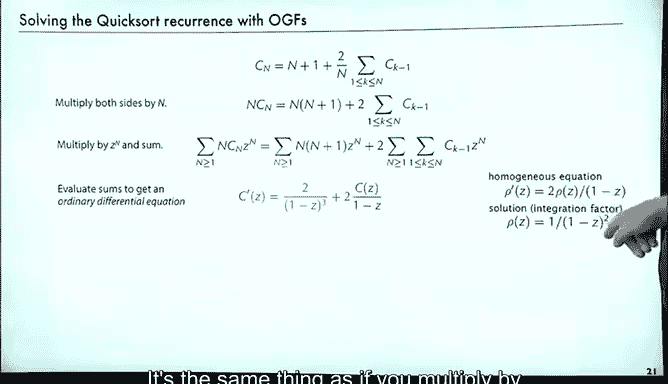

# 算法分析：13：求解递归关系 🔍


在本节课中，我们将学习如何使用生成函数来解决递归关系。递归关系是分析算法行为时常见的数学模型。通过生成函数，我们可以将递归关系转化为代数方程，进而求解出序列的显式表达式。这是一个系统化的过程，适用于多种类型的递归。

---

## 概述 📋

上一节我们介绍了生成函数的基本概念。本节中，我们将具体探讨如何利用生成函数来求解递归关系。这个过程通常是机械化的：输入一个递归关系，通过一系列代数操作，最终输出序列的简单表达式。我们将通过多个例子来演示这一过程。

---

## 通用求解步骤 🛠️

以下是使用生成函数求解递归关系的标准步骤：

1.  **使递归对所有 `n` 有效**：通过引入克罗内克δ函数（Kronecker delta），将递归关系扩展到所有非负整数 `n`。
2.  **乘以 `z^n` 并对 `n` 求和**：将递归方程两边同时乘以 `z^n`，并对所有 `n` 求和。这将得到一个关于生成函数 `A(z)` 的方程。
3.  **求解生成函数方程**：解出关于 `A(z)` 的代数方程，得到其显式表达式。
4.  **展开生成函数求系数**：将得到的生成函数 `A(z)` 展开为幂级数，其系数 `a_n` 就是我们要求的序列项。

---

## 示例一：常系数线性递归 📐

让我们从一个简单的二阶线性递归开始，其定义为：
```
a_n = 5a_{n-1} - 6a_{n-2}， 对于 n >= 2
a_0 = 0， a_1 = 1
```

**步骤1：使递归对所有 `n` 有效**
我们引入克罗内克δ函数 `δ_{n,1}`（当 `n=1` 时为1，否则为0），得到对所有 `n >= 0` 都成立的方程：
```
a_n = 5a_{n-1} - 6a_{n-2} + δ_{n,1}
```

**步骤2：乘以 `z^n` 并求和**
定义生成函数 `A(z) = Σ_{n>=0} a_n z^n`。将方程两边乘以 `z^n` 并对 `n` 求和：
```
Σ_{n>=0} a_n z^n = 5 Σ_{n>=0} a_{n-1} z^n - 6 Σ_{n>=0} a_{n-2} z^n + Σ_{n>=0} δ_{n,1} z^n
```
通过调整求和下标，我们得到：
```
A(z) = 5z A(z) - 6z^2 A(z) + z
```

**步骤3：求解生成函数方程**
整理方程，解出 `A(z)`：
```
A(z) (1 - 5z + 6z^2) = z
A(z) = z / (1 - 5z + 6z^2)
```

**步骤4：展开求系数**
分母可以因式分解为 `(1-2z)(1-3z)`。使用部分分式法：
```
A(z) = z / ((1-2z)(1-3z)) = 1/(1-3z) - 1/(1-2z)
```
我们知道 `1/(1-αz)` 是几何级数 `Σ α^n z^n` 的生成函数。因此，展开后 `z^n` 的系数为：
```
a_n = 3^n - 2^n
```
这就是原递归关系的解。

---

## 示例二：带重根的递归 🔄

现在看一个更复杂的例子，其递归关系为：
```
a_n = 5a_{n-1} - 8a_{n-2} + 4a_{n-3}
```
带有初始条件 `a_0=0， a_1=1， a_2=2`。

遵循相同的步骤，我们最终得到生成函数：
```
A(z) = z / (1 - 2z)^2
```
我们知道 `1/(1-αz)^2` 对应序列 `(n+1)α^n`。因此，展开后得到：
```
a_n = n * 2^{n-1}
```

这个例子展示了当特征多项式有重根时，解中会出现 `n` 的幂次项。

---

## 示例三：含复根的递归 🌊

递归关系也可能产生复根，导致解呈现振荡行为。考虑以下递归：
```
a_n = a_{n-1} - a_{n-2}
```
带有适当的初始条件。通过生成函数法求解，最终会得到包含虚数单位 `i` 的表达式：
```
a_n = (i^n + (-i)^n) / 2
```
虽然表达式中含有复数，但对于整数 `n`，`a_n` 始终是实数。当 `n` 为奇数时，结果为0；当 `n` 为偶数时，结果在1和-1之间振荡。这展示了复数如何简洁地描述序列的周期性行为。

---

## 快速排序递归分析 ⚡

快速排序算法的平均比较次数满足一个更复杂的递归：
```
C_N = N + 1 + (1/N) * Σ_{0<=k<=N-1} (C_k + C_{N-1-k})， 对于 N > 0， C_0 = 0
```
为了用生成函数求解，我们首先两边乘以 `N` 以简化分母：
```
N C_N = N(N+1) + 2 Σ_{0<=k<=N-1} C_k
```
然后定义生成函数 `C(z) = Σ_{N>=0} C_N z^N`，并对方程两边乘以 `z^N` 求和。经过一系列代数操作（包括处理卷积项），我们得到一个关于 `C(z)` 的微分方程：
```
C'(z) = (2/(1-z)) * C(z) + 2/(1-z)^3
```
这是一个一阶线性常微分方程。求解此方程，我们得到：
```
C(z) = -2 * ln(1-z) / (1-z)^2
```
最后，展开这个生成函数，提取 `z^N` 的系数，就得到了快速排序平均比较次数的著名公式：
```
C_N = 2(N+1)H_N - 4N ≈ 2N ln N
```
其中 `H_N` 是第 `N` 个调和数。

---

## 总结与定理 📚

本节课中，我们一起学习了使用生成函数求解递归关系的系统方法。对于 **t 阶常系数线性递归**，该方法总能导出一个解。其形式由特征多项式的根决定：



*   若根 `α` 的重数为 `m`，则解中会包含形如 `n^{k} α^n` 的项，其中 `k = 0， 1， ...， m-1`。
*   复根会导致解中出现正弦或余弦形式的振荡项。
*   所有待定常数都可以通过初始条件，利用部分分式法和求解线性方程组来确定。

这个过程是机械化的，甚至已被集成到许多符号计算系统中。生成函数不仅提供了求解递归的强大工具，也深刻揭示了序列行为与多项式代数、复数分析之间的内在联系。

---


**本节课中，我们一起学习了：**
1.  使用生成函数求解递归关系的四个标准步骤。
2.  如何处理常系数线性递归，包括有重根和复根的情况。
3.  如何将生成函数应用于分析快速排序等复杂算法的递归关系。
4.  理解递归关系的解由其特征根的性质（实根、重根、复根）完全决定。