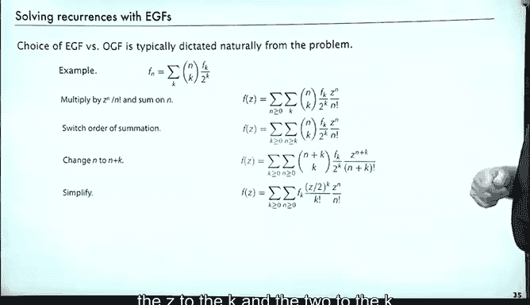

# 算法分析：14：指数生成函数

## 概述
在本节课中，我们将要学习一种新的序列表示方法——指数生成函数。我们将看到，除了普通的生成函数，使用不同的“核”来表示序列有时会更加方便和自然，特别是在处理增长迅速的序列时。

## 普通生成函数的补充
上一节我们介绍了普通生成函数，它使用 `z^k` 作为核来表示序列。然而，这并不是表示序列的唯一方式。

实际上，在解析组合学中，有一种非常重要的替代方法，我们现在来简要介绍一下。

## 指数生成函数的定义
我们可以定义其他类型的核来表示序列。例如，不使用 `z^k`，而是使用 `z^k / k!`。

如果这样做，我们得到的就是所谓的**指数生成函数**。

以下是几个例子：
*   **全1序列**：其指数生成函数是 `∑ (z^n / n!)`。我们之前见过，这就是 `e^z`。
*   **2的幂序列**：其指数生成函数是 `∑ (2^n * z^n / n!)`，也就是 `e^(2z)`。

所以，相同的序列，可以用不同的函数来表示。在某些情况下，使用指数生成函数更自然、更方便。

## 为何使用指数生成函数
解析组合学主要关注普通生成函数和指数生成函数。指数生成函数在处理快速增长序列时尤其有用。

例如，考虑序列 `n!`（阶乘序列）：
*   它的普通生成函数 `∑ (n! * z^n)` 对任何 `z` 都不收敛，处理起来很麻烦。
*   而它的指数生成函数 `∑ (n! * z^n / n!) = ∑ z^n`，结果是 `1 / (1 - z)`。

这可能会有点令人困惑，因为相同的函数出现在不同的上下文中，但这只是表示序列的不同方式。

## 指数生成函数的运算
指数生成函数也有类似的运算规则，如微分、积分等。书中对此有详细描述。

一个重要的运算是**乘法**。当两个指数生成函数相乘时，你会得到所谓的**二项式卷积**。

推导过程与我们证明两个普通生成函数乘积性质时的步骤类似，但需要处理分母中的阶乘项。最终，我们得到的新序列的指数生成函数，其系数是原序列系数的二项式卷积。

## 应用实例：求解递推关系
在实际应用中，经常会出现这类序列。我们很快就会看到它们。

以下是可能出现的递推关系示例。如果遇到这样的递推式，从问题本身就能自然地判断出应该使用指数生成函数。

这个例子以及类似的例子，将在后续关于重要算法的具体应用中出现。

假设我们有递推关系：
`F_n = Σ (n choose k) * F_k / 2^k`，其中求和是对 `k` 进行的。

我们如何找到这个数的方程？使用指数生成函数，规则相同，只是我们构造的是指数生成函数。

以下是求解步骤：
1.  两边同时乘以 `z^n / n!` 并对 `n` 求和。
2.  左边得到 `F(z)`。
3.  右边得到一个双重求和。
4.  接下来，我们基本上是反向进行之前提到的卷积运算：交换求和顺序，进行变量替换（令 `n = n + k`）。
5.  经过化简，`k!` 项被消去，求和可以分离。
6.  最终我们得到方程：`F(z) = e^z * F(z/2)`。
7.  这个方程可以“套叠”求解（虽然形式化上不一定收敛，但我们暂时不担心这一点）。结果是 `F(z) = e^(2z)`。
8.  `e^(2z)` 是什么？这正是我们最开始看的例子之一，它表示序列 `F_n = 2^n`。

在这个例子中，无论生成函数是否收敛，我们得到了一个可以验证的答案：`2^n` 确实满足原递推式（根据二项式定理）。因此，一个看似困难的递推关系，通过指数生成函数得到了简单的解。

对于类似的函数（例如，系数是 `(n-1 choose k)` 或带有额外项），同样的过程也适用，并能告诉我们所研究算法需要了解的事实。

## 总结
本节课中，我们一起学习了指数生成函数。我们看到，在处理快速增长序列或特定形式的递推关系时，指数生成函数比普通生成函数更具优势。它通过使用 `z^k / k!` 作为核，提供了另一种强大的序列表示和操作工具。在后续关于解析组合学的课程中，我们将更深入地看到指数生成函数所扮演的重要角色。