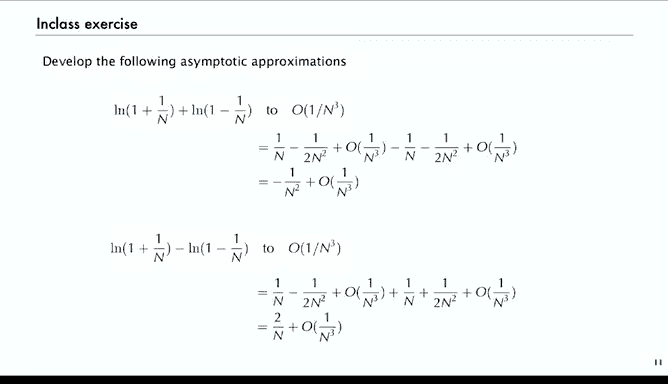

# 算法分析：15：标准尺度 📊

在本节课中，我们将学习渐近分析。这是一种在18和19世纪计算机出现之前就已发展成熟的数学工具，但它对算法分析和解析组合学至关重要。我们将从介绍标准渐近尺度开始。

## 概述
我们的目标是开发简洁且准确的表达式，以估算我们感兴趣研究的量。正如前几节课提到的，大O符号本身不足以提供精确的估算。它只是一个常数因子内的上界，无法给出量的精确估计。我们需要的是既能准确反映数量级，又便于计算的表达式。

## 渐近符号回顾
在深入之前，我们先回顾一下之前介绍过的几种渐近符号。

*   **大O符号**：用于表示上界。如果 `g(n) = O(f(n))`，意味着当 `n` 趋于无穷大时，比值 `|g(n)/f(n)|` 有上界。我们通常用它来表示误差项。
*   **小o符号**：如果 `g(n) = o(f(n))`，意味着当 `n` 趋于无穷大时，比值 `g(n)/f(n)` 趋于0。这表示 `g(n)` 渐近地小于 `f(n)`，也用于误差项。
*   **波浪号符号**：如果 `g(n) ~ f(n)`，意味着当 `n` 趋于无穷大时，比值 `g(n)/f(n)` 趋于1。这是最弱的一种非平凡小o关系。

我们使用这些符号来构建近似表达式。例如，`g(n) = f(n) + O(h(n))` 意味着误差项最多是 `h(n)` 的一个常数倍。而 `g(n) = f(n) + o(h(n))` 则意味着误差项会随着 `n` 增大而减小。

## 渐近展开
上一节我们回顾了基本符号，本节我们来看看如何系统地构建近似表达式。

如果我们有一个渐近递减的函数序列 `g_k(n)`，满足 `g_{k+1}(n) = o(g_k(n))`。那么，如果我们将函数 `f(n)` 表示为这些函数的线性组合，我们就称之为 `f(n)` 的一个**渐近展开**。

由于函数序列是递减的，随着我们添加更多项，展开式会变得更加精确。具体来说，它代表了一系列公式：`f(n) = O(g_0(n))`，`f(n) = c_0 g_0(n) + O(g_1(n))`，依此类推。我们可以从这个公式列表中，根据估算精度的需求，选取最合适的一个。当我们看具体例子时，这一点会更加清晰。

## 标准尺度
那么，我们使用哪些函数来构建这个序列呢？我们使用所谓的**标准尺度**。

标准尺度中的函数通常包括 `n` 的幂、`log n`、`log log n` 以及指数函数等。这些是科学研究中常见的函数，许多问题都可以用标准尺度来表达。通常，我们只使用前几项（如两到四项），当未使用的项已经非常小时就停止，因为我们有大O估计保证误差在常数倍以内。

很多时候，为了简化计算，我们会使用波浪号 `~` 符号，省略大O信息。我们通常会通过对比实际值来验证渐近估计的准确性。如果需要，我们可以使用大O或小o符号来指定未使用项的信息。关键在于，我们使用的方法在原则上可以扩展到任何所需的精度。

## 应用示例：线性递推
让我们看一个来自第二节课的具体应用示例，它展示了渐近分析如何简化复杂定理。

我们曾遇到一个关于线性递推系数提取的定理。最终，通过生成函数，我们发现感兴趣的量是两个多项式之比的 `z^n` 项系数。利用渐近分析，我们可以将一个相当复杂的定理陈述，简化为一个相当通用的结果：`z^n` 的系数渐近于一个常数乘以 `β^n * n^{ν-1}`，其中 `β` 是分母多项式中模最小的根，`ν` 是该根的重数。

这实际上是从更详细的定理中提取出了主导项。原定理指出，系数对应于 `G(z)` 的每个零点及其重数。通过渐近分析，我们可以忽略求和式中所有较小的项，只精确地提取出最大的一项。例如，如果根是3和2，那么项可能是 `3^n` 和 `3^n + 2^n`。当 `n` 很大时，`3^n` 将完全主导 `2^n`，因此 `3^n + 2^n ~ 3^n`。实际上，随着 `n` 增大，收敛是指数级快速的。通常，模最小的极点（分母为零且最接近原点的点）才是真正重要的。

## 递推关系分析步骤
上一节我们看到了渐近分析的结果，本节我们来看看对一个具体递推关系进行分析的典型步骤。

以递推式 `a_n = 5a_{n-1} - 6a_{n-2}`，初始条件 `a_0=0, a_1=1` 为例。
1.  首先，我们使其对所有 `n` 有效。
2.  然后，乘以 `z^n` 并对 `n` 求和，得到一个多项式方程，从而解出生成函数，它是一个有理函数（两个多项式的比）。
3.  我们感兴趣的是该生成函数中 `z^n` 的系数。
4.  现在，我们可以直接套用定理：分母的最小根是1/3，因此系数将渐近于 `3^n`。
5.  接着计算常数项，代入公式可得常数为1。

对于斐波那契数列的递推关系，同样的步骤也适用。在那种情况下，常数将是 `1/√5`，主导项是 `φ^n`（`φ` 是黄金比例）。额外的项 `\hat{φ}^n` 小于1，完全可以忽略。通过渐近分析，我们得到了一个相对简单且通用的定理，为一大类问题提供了精确而简洁的结果。

## 基础展开：泰勒定理
那么，我们最初从哪里获得所需的渐近展开式呢？对于许多出现的生成函数，**泰勒定理**立即给出了答案。

泰勒定理提供了函数的幂级数展开。虽然级数是无限的，但由于它们收敛，我们可以在任意点截断，得到类似以下的结果。原则上，我们可以从无穷级数中取出任意多项，从而在标准尺度下得到一个渐近级数。

以下是一些直接从泰勒定理得到的基本展开式（当 `x → 0` 时）：
*   `e^x = 1 + x + x^2/2! + x^3/3! + ...`
*   `ln(1+x) = x - x^2/2 + x^3/3 - ...`
*   `(1+x)^k = 1 + kx + k(k-1)x^2/2! + ...` （`k` 为常数）
*   `1/(1-x) = 1 + x + x^2 + x^3 + ...`

现在，我们通常关心的是当 `n` 增大时 `z^n` 的系数。因此，我们只需在所有公式中将 `x` 替换为 `1/n`，即可得到渐近展开式。例如：
*   `e^{1/n} = 1 + 1/n + 1/(2n^2) + ...`
*   `ln(1 + 1/n) = 1/n - 1/(2n^2) + 1/(3n^3) - ...`
*   `1/(1 - 1/n) = 1 + 1/n + 1/n^2 + ...`

这些是构建我们所需渐近展开的基本模块。仅使用这些简单公式，我们就可以通过代数运算，对许多函数的和与差得到相对准确的近似。

## 简单练习
让我们通过两个简单的练习来应用上述知识。

**问题1**：估计 `ln((n+1)/(n-1))`，精确到 `O(1/n^3)`。
**问题2**：估计 `ln((n+1)/(n-1))^n`，精确到 `O(1/n^2)`。

**解答**：
对于问题1，我们有：
`ln(1 + 1/n) = 1/n - 1/(2n^2) + O(1/n^3)`
`ln(1 - 1/n) = -1/n - 1/(2n^2) + O(1/n^3)`
因此，
`ln((n+1)/(n-1)) = ln(1+1/n) - ln(1-1/n) = [1/n - 1/(2n^2)] - [-1/n - 1/(2n^2)] + O(1/n^3) = 2/n + O(1/n^3)`

对于问题2，我们利用问题1的结果：
`[ln((n+1)/(n-1))]^n = [2/n + O(1/n^3)]^n`，但更简单的方法是直接计算：
`ln((n+1)/(n-1))^n = n * ln((n+1)/(n-1)) = n * [2/n + O(1/n^3)] = 2 + O(1/n^2)`

这只是一个简单的例子，展示了如何利用从泰勒定理获得的基本信息进行渐近展开。通过组合这些结果，我们可以为大量出现的函数开发出准确的展开式。

## 总结
本节课中，我们一起学习了渐近分析的核心概念。我们从回顾大O、小o和波浪号符号开始，理解了它们如何用于表示误差和主导项。接着，我们介绍了渐近展开和标准尺度的概念，这是构建精确估算的框架。通过线性递推的例子，我们看到了渐近分析如何将复杂定理简化为清晰易懂的结果。最后，我们探讨了泰勒定理作为许多渐近展开基础的重要性，并通过练习加以巩固。掌握这些工具，将使我们能够为算法分析中遇到的各种复杂函数，推导出简洁而准确的估算。