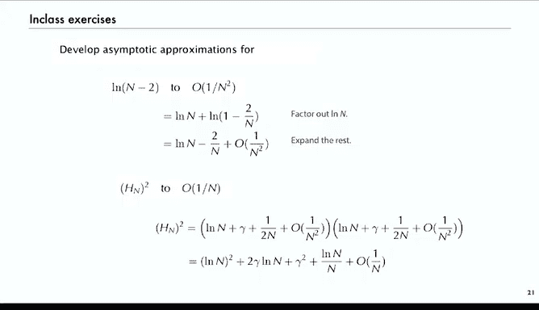

# 算法分析：P16：展开式运算技巧 🧮


在本节课中，我们将学习如何操作渐近展开式，以推导出我们研究对象的准确且简洁的估计。这些技巧对于分析算法中出现的复杂表达式至关重要。

## 概述

我们的目标是为分析中可能出现的任何表达式，在标准尺度上建立展开式。例如，像 `2N choose N` 这样的表达式，直接计算可能非常困难，但通过渐近展开，我们可以将其转化为一种连贯且易于处理的形式。

我们将介绍几种基本技巧：简化、变量替换、提取公因子、乘法、除法、复合函数以及 `exp-log` 技巧。每种技巧都相对简单，但关键在于识别何时使用它们。

---

## 简化 ✂️

上一节我们介绍了渐近展开的概念，本节中我们来看看如何简化它们。渐近级数的有效性取决于其大O项。因此，如果某些项被大O项所包含，就没有必要保留它们。

例如，我们不会写成 `log n + γ + O(1)`，因为 `O(1)` 表示误差被某个常数所界定，这个常数可能就是 `γ`。更简洁的写法是 `log n + O(1)`。

**核心思想**：丢弃被大O项包含的更小项，使计算更简洁。

---

## 变量替换 🔄

变量替换是一种直接的方法，即将已知的展开式（如泰勒级数）中的变量进行替换。

例如，已知 `log(1 + x)` 的泰勒展开为：
```
log(1 + x) = x - x²/2 + x³/3 - ...
```
如果我们代入 `x = 1/n`，就可以立即得到 `log(1 + 1/n)` 的渐近展开。

---

## 提取公因子 📐

提取公因子是常见操作：先估计主导项，将其提取出来，然后展开剩余部分。

考虑函数 `1/(n² + n)`。当 `n` 很大时，它接近 `1/n²`。因此，我们提取出 `1/n²`：
```
1/(n² + n) = (1/n²) * [1 / (1 + 1/n)]
```
括号内的部分 `1/(1 + 1/n)` 是一个几何级数，其展开式为 `1 - 1/n + O(1/n²)`。将其代入并展开：
```
1/(n² + n) = 1/n² - 1/n³ + O(1/n⁴)
```
这样我们就得到了一个标准尺度上的渐近级数。

---

## 乘法 ✖️

乘法涉及代数运算，并同样需要在计算中运用简化技巧。

以调和数 `H_n` 的平方为例。已知 `H_n` 的渐近展开为：
```
H_n = log n + γ + O(1/n)
```
其中 `γ` 是欧拉常数（约0.577）。计算 `(H_n)²` 时，我们将两个三项式相乘，得到九项。然后，我们丢弃所有被更大项所包含的大O项。

以下是关键步骤：
1.  `(log n)²` 是主导项。
2.  `2γ log n` 是次主导项。
3.  `γ²` 是常数项。
4.  所有 `O(1/n)` 量级的项被合并为 `O(log n / n)`。

最终得到：
```
(H_n)² = (log n)² + 2γ log n + γ² + O(log n / n)
```
通常，我们会展开足够多的项，直到获得精度的显著提升（例如，误差项变为 `O(1/n)` 量级）。

---

## 除法 ➗

除法与乘法类似。我们同时展开分子和分母，然后利用几何级数展开分母，从而将问题转化为乘法。

考虑表达式 `H_n / log(n+1)`。

以下是计算步骤：
1.  展开分子：`H_n = log n + γ + O(1/n)`
2.  展开分母：`log(n+1) = log n + log(1+1/n) = log n + O(1/n)`
3.  分子分母同除以 `log n`，得到 `(1 + γ/log n + O(1/(n log n))) / (1 + O(1/n))`
4.  将分母 `1/(1 + O(1/n))` 用几何级数展开为 `1 + O(1/n)`
5.  进行乘法运算，并简化大O项

最终得到：
```
H_n / log(n+1) = 1 + γ/log n + O(1/n)
```

---

## 复合函数 🔗

对于复合函数 `f(g(n))`，我们将 `g(n)` 的展开式代入 `f` 中，并进行计算。

例如，计算 `e^(H_n)`。
1.  代入 `H_n` 的展开式：`e^(log n + γ + O(1/n))`
2.  利用指数法则：`= e^(log n) * e^γ * e^(O(1/n))`
3.  已知 `e^(log n) = n`，`e^γ` 是常数。
4.  关键步骤：利用引理 `e^(O(1/n)) = 1 + O(1/n)`（可通过泰勒展开证明）。
5.  最终得到：`e^(H_n) = n * e^γ + O(1)`

这表明 `e^(H_n)` 的增长主要受 `n` 主导，误差为一个常数。

---

## exp-log 技巧 🪄

这是处理复杂表达式的一个强大技巧。其核心思想是：`f(x) = e^(log f(x))`。我们先展开 `log f(x)`，然后再取指数。

考虑经典例子：`(1 - 1/n)^n`。

以下是计算步骤：
1.  应用技巧：`(1 - 1/n)^n = e^(log[(1 - 1/n)^n]) = e^(n * log(1 - 1/n))`
2.  展开 `log(1 - 1/n)`：`= -1/n + O(1/n²)`
3.  代入：`n * log(1 - 1/n) = -1 + O(1/n)`
4.  取指数：`e^(-1 + O(1/n)) = e^(-1) * e^(O(1/n)) = (1/e) * (1 + O(1/n))`
5.  最终得到：`(1 - 1/n)^n = 1/e + O(1/n)`

这个结果非常简洁地告诉我们，当 `n` 很大时，该表达式无限接近于常数 `1/e`（约0.367879），且误差在 `O(1/n)` 量级。对于 `n=10^6`，这意味著精度可达约小数点后6位。

---

## 更多练习 💪

为了巩固理解，可以尝试以下练习：
*   求 `log(n/(n-2))` 到 `O(1/n²)` 精度的展开式。
*   求 `(H_n)²` 展开式中 `O(log n / n)` 项的精确系数。

这些练习涉及提取公因子和进行更精确的展开。例如，对于第一个练习：
```
log(n/(n-2)) = log n - log(n-2)
             = log n - [log n + log(1 - 2/n)]
             = -log(1 - 2/n)
             = 2/n + O(1/n²)
```
通过练习，你将能更熟练地运用这些技巧。

---

## 总结

本节课中，我们一起学习了操作渐近展开式的核心技巧：
1.  **简化**：丢弃被大O项包含的次要项。
2.  **变量替换**：在已知展开式中直接代入新变量。
3.  **提取公因子**：提出主导项后展开剩余部分。
4.  **乘法与除法**：对展开式进行代数运算并简化结果。
5.  **复合函数**：将内层函数的展开式代入外层函数。
6.  **exp-log技巧**：通过取对数再取指数来转化复杂表达式。




掌握这些技巧，你就能将算法分析中遇到的复杂、难以直接计算的表达式，转化为由标准函数（如对数、指数、多项式）构成的简洁渐近估计，从而深刻理解其增长规律和近似行为。