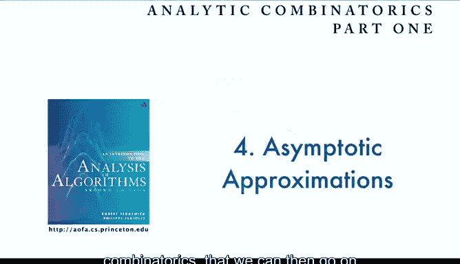

# 算法分析：18：二元渐近分析 📊

在本节课中，我们将学习渐近分析的一个复杂扩展，即涉及两个变量的情况。这在算法分析中经常出现。我们将探讨如何处理这类二元函数，并学习几个关键函数的渐近近似方法。

---

## 概述

许多算法分析问题涉及两个变量：问题规模 `n` 和成本 `k`。这导致我们得到包含这两个变量的复杂表达式，且它们可能独立变化，带来了分析上的挑战。主要困难在于，变量的相对值可能很重要，这使得处理整个值域上的求和更具挑战性。幸运的是，与调和数和斯特林数类似，有几个基本的二元函数会反复出现，我们将重点学习它们的渐近性质。

---

## 二元函数的挑战与示例

上一节我们介绍了单变量渐近分析。本节中，我们来看看当函数依赖于两个变量 `n` 和 `k` 时的情况。

分析这类函数的主要挑战在于，函数的行为可能强烈依赖于 `k` 相对于 `n` 的值。例如，当 `k` 很小时，函数值可能接近 1；而当 `k` 接近 `n` 时，函数值可能指数级地小。我们需要一种能覆盖整个值域的分析方法。

以下是两个在算法分析中常见的二元函数示例：

*   **二项分布**：`C(n, k) = n! / (k! (n-k)!)`
    *   当 `k=0` 时，约为 `1 / sqrt(pi * n / 2)`。
    *   当 `k` 很大时，值指数级小。
*   **拉马努金 Q 分布**：`Q(n, k) = n! / ((n-k)! * n^k)`
    *   当 `k=0` 时，值为 1。
    *   当 `k` 接近 `n` 时，值指数级小。

这些函数展示了我们在分析二元函数时所面临的挑战类型。

---

## 可视化二元函数行为

为了理解二元函数的行为，我们可以借助图形。对于每个固定的 `k` 值，我们将函数值视为 `n` 的函数并绘制成曲线。通常，为了在同一图中比较，我们会用 `2^n` 等因子进行缩放。

对于二项式系数，随着 `n` 增大，这个离散的二元分布会收敛到**正态分布**，可以用一个简单的数学函数（曲线）来描述。我们的数学分析目标就是得到这个简单描述。

同样，拉马努金 Q 分布也有类似的特征曲线：当 `k` 较小时接近 1，在 `k` 接近 `n/2` 时变得极小。二元渐近分析的目标就是为任意 `k` 值找到定义这条曲线的函数。

---

## 拉马努金 Q 分布的渐近推导

现在，让我们首先详细看看拉马努金 Q 分布的渐近推导。这个计算是卡特兰数计算的扩展，只是现在我们多了一个变量 `k`。

**第一步：应用取对数技巧（X log trick）**
我们首先对表达式取对数：
`log Q(n, k) = log(n!) - log((n-k)!) - k * log(n)`

**第二步：应用斯特林公式**
对 `log(n!)` 和 `log((n-k)!)` 使用斯特林近似：
`log(n!) = (n + 1/2) * log(n) - n + log(sqrt(2*pi)) + O(1/n)`
对 `log((n-k)!)` 使用类似公式，并将 `O(1/(n-k))` 覆盖为 `O(1/n)`。

**第三步：代数化简与抵消**
代入后，进行代数运算。许多项会抵消，例如 `-n + n`，`log(sqrt(2*pi))` 等。利用 `log(n-k) = log(n) + log(1 - k/n)` 进行展开。最终我们得到：
`log Q(n, k) ≈ -(n - k + 1/2) * log(1 - k/n) - k * log(n)` （简化后形式）

**第四步：展开对数项**
对 `log(1 - k/n)` 进行泰勒展开：
`log(1 - k/n) = - (k/n) - (k^2)/(2n^2) + O(k^3 / n^3)`
将其代入并化简。关键的抵消发生后，我们得到：
`log Q(n, k) ≈ - (k^2) / (2n) + O(k/n) + O(k^3 / n^2)`

**第五步：指数化得到最终近似**
因此，`Q(n, k) ≈ e^{- (k^2) / (2n)}`，误差项由 `O(k/n)` 和 `O(k^3 / n^2)` 控制。

这个推导表明，对于相对较小的 `k`（例如 `k = O(n^{2/5})`），`Q(n, k)` 可以很好地用 `e^{- (k^2) / (2n)}` 来近似。这正是我们在图中看到的曲线。

---

## 二项分布的渐近推导

二项分布的推导过程与 Q 分布非常相似，同样依赖于斯特林公式和细致的代数运算。

以下是推导的关键步骤概要：

1.  对 `C(n, k)` 应用取对数技巧。
2.  对 `log(n!)`, `log(k!)`, `log((n-k)!)` 应用斯特林公式。
3.  利用展开式 `log(n ± k) = log(n) + log(1 ± k/n)` 处理变量 `k`。
4.  进行大量的代数化简和抵消。例如，`2n` 项等会抵消。
5.  对 `log(1 ± k/n)` 进行展开，并组合项。我们会遇到 `(n+1/2) * [log(1 - k/n) + log(1 + k/n)]` 和 `k * [log(1 + k/n) - log(1 - k/n)]` 这样的形式。
6.  这些和与差可以分别渐近地简化为 `-k^2 / n^2` 和 `-2k / n` 等项（包含 `O(k^3/n^2)` 误差）。
7.  代入并化简后，取指数，得到著名的**正态近似**（德莫弗-拉普拉斯定理）：
    `C(n, k) / 2^n ≈ (e^{- (k^2) / n}) / sqrt(pi * n)`
    或者更常见的形式：
    `C(n, k) ≈ (2^n / sqrt(pi * n)) * e^{- (k^2) / n}`

这个近似在 `k` 的很大一个范围内（直到约 `n^(3/4)`）都是准确的。当 `k` 更大时，项本身已经非常小，可以用其他方法证明。

这个推导虽然涉及大量运算，但本质上是初等代数。掌握它对于理解二元渐近分析至关重要。

---

## 泊松近似及其他

同样的技术（取对数技巧加斯特林公式）也可以导出著名的**泊松近似**。当概率 `p = λ/n` 很小，且 `n` 很大时，二项分布 `C(n, k) * p^k * (1-p)^{n-k}` 近似为 `(λ^k * e^{-λ}) / k!`。

我们将在具体算法应用的上下文中讨论它。目前，从数学角度应认识到，相同的技术可以产生这类近似。

对于之前讨论的 Q 分布，我们有 `Q(n, k) ≈ e^{-k^2 / (2n)}`，在 `k` 较小时精度很高。这些二元渐近近似在算法分析及其他领域都极为重要。使用像 `e^{-k^2 / n}` 这样的标准数学函数，通常比处理精确但繁琐的阶乘表示要容易得多。

---

## 处理二元函数的求和：拉普拉斯方法

接下来的挑战是，当我们需要对这类二元函数求和时该怎么办？例如，考虑**拉马努金 Q 函数**，它是 Q 分布对所有 `k` 的求和：`Q(n) = Σ_k Q(n, k)`。这本质上是求曲线下的面积。

挑战在于，我们需要在求和的不同部分使用不同的近似：在 `k` 小的地方值接近 1，在 `k` 大的地方值可忽略。这就是我们需要二元渐近分析的原因，以确保能在整个值域上获得良好的估计来近似求和。

**通用方法：拉普拉斯方法**
以下是该方法的示意图：

1.  **尾部截断**：函数的尾部通常很小。我们将求和范围限制在主要贡献区域（例如 `k < k0`）。
2.  **核心近似**：在限制后的范围内，使用我们得到的良好渐近近似（例如 `e^{-k^2/(2n)}`）。
3.  **范围扩展与积分近似**：有趣的是，这个近似函数本身在尾部也是指数级小的。因此，我们可以安全地将求和范围从 `0` 到 `k0` 扩展回 `0` 到 `∞`，因为添加的尾部贡献可忽略。现在，对连续近似函数的求和可以近似为一个积分。
4.  **计算积分**：计算该积分，得到整个和的一个简洁近似。

**应用于 Q(n) 函数**
对于 `Q(n) = Σ_{k=0}^n Q(n, k)`：
*   选择 `k0` 如 `n^{2/3}`，可以证明原函数的尾部 `Σ_{k>k0} Q(n, k)` 指数级小。
*   对于 `k ≤ k0`，使用近似 `Q(n, k) ≈ e^{-k^2/(2n)}`。
*   将近似函数的求和范围扩展到无穷：`Σ_{k=0}^∞ e^{-k^2/(2n)}`。
*   用积分近似该求和：`∫_{0}^{∞} e^{-x^2/(2n)} dx = sqrt(pi * n / 2)`。

因此，我们得到 `Q(n) ≈ sqrt(pi * n / 2)`。这是一个非常有用的结果，原始的 `Q(n)` 定义计算可能很困难，但这个渐近近似给出了一个简单可用的表达式。

---

## 总结与练习

本节课中，我们一起学习了二元渐近分析。我们看到了分析两个变量函数的挑战，并通过具体推导，学习了如何获得二项分布和拉马努金 Q 分布等关键函数的渐近近似。我们还介绍了处理这类函数求和的拉普拉斯方法。

为了巩固理解，你可以尝试以下练习：

*   **练习 1（指数级小的比较）**：对于不同的 `α` 和 `β`（`0<β<α<1`），比较 `α^n` 和 `β^n`。理解“指数级小”的含义。
*   **练习 2（推导另一个函数）**：在教材中，还有一个拉马努金 P 函数（或 R 函数）：`P(n) = Σ_k (n-k)^k * (n-k)! / n!`。尝试模仿 Q 函数的推导步骤，证明 `P(n) ≈ sqrt(pi * n / 2)`。这将极大地帮助你测试对这部分内容的理解。
*   **编程练习**：编写一个程序，计算并输出 `log2(C(n, k))` 的值，并思考如何利用本节课的知识来实现。
*   **阅读**：详细阅读教材中关于渐近分析的章节，以获取更多细节和示例。

在下一讲中，我们将把前面几讲所学的所有内容整合起来，看看它们如何共同构成解析组合学的基础，以便我们将其应用于算法分析。