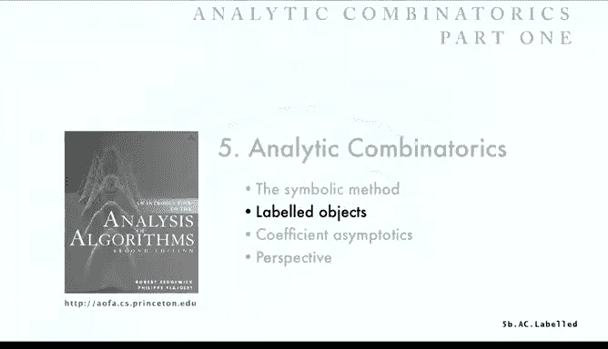

# 算法分析：20：带标签对象 🏷️

在本节课中，我们将学习组合类中一个重要的类别：带标签对象。我们将解释带标签对象与之前讨论的无标签对象的区别，并探讨一些有趣的问题。

## 带标签组合类

带标签组合类中的对象由原子构成，但我们认为这些原子是**彼此不同**的。为了明确这一点，我们为它们加上标签。通常，我们考虑用整数 1 到 n 来标记它们。

从原理上讲，对于无标签对象，这两个对象可能因为结构不同而被视为不同。但对于带标签对象，不同的标记方式会产生不同的对象。例如，一个正方形有两种不同的标记方式。在左边的标记中，1 连接到 2 和 4；在右边的标记中，1 连接到 3 和 4，它们是不同的。对于右边的对象，标记方式的数量并不总是显而易见的，实际上有四种方式，因为连接到所有其他点的点可以是 1、2、3 或 4。

因此，在研究不同对象的数量时，标签带来了巨大的差异，因为它提供了更多的可能性。事实上，在处理带标签对象时，我们使用**指数生成函数**，随着学习的深入，这一点会变得清晰。

## 基本示例

让我们看一些带标签对象的基本简单示例。

### 瓮 🏺

一个“瓮”是一组带标签的原子。它是一个集合，顺序无关紧要。同样，每种类型只有一个。我们稍后会看到为什么使用这种定义，届时会非常清楚。

由于每种类型只有一个，我们使用指数生成函数。瓮的指数生成函数是 **e^z**。因为每种大小的对象只有一个，求和 Σ (z^n / n!) 的结果就是 e^z。这是第一个基本示例。

### 排列 🔄

排列是带标签原子的一个序列。“序列”意味着顺序很重要，原子是带标签的，因此原子的每一种可能排序都会产生一个不同的对象。

*   大小为 2 的对象有 2 个：1,2 或 2,1。
*   大小为 3 的对象有 6 个。
*   大小为 4 的对象有 24 个，依此类推。

那么排列的指数生成函数是什么？大小为 n 的排列有 n! 个，因此指数生成函数是 n! 除以 n! 再乘以 z^n，这简化为 Σ z^n，即 **1 / (1 - z)**。

这是另一个基本的组合类。n! 的作用是防止生成函数因排序带来的所有不同可能性而增长过快。

### 环 🔁

一个“环”是带标签原子的一个循环序列。所有元素连接成一个环，但每种类型的数量更少。实际上，如果你研究一下，固定最大或最小的元素，你会发现其他元素构成一个排列，因此计数序列是 **(n-1)!**。

那么环的指数生成函数是什么？它是 Σ ((n-1)! * z^n) / n!，其中除了一个 1/n 项外，其他项都抵消了。所以结果是 **ln(1 / (1 - z))**。这是另一个基本的组合类。

解析组合学的特点是从这类极其简单的推导和类开始，然后以有趣的方式组合它们，为感兴趣的解析问题提供答案。

## 带标签类的运算

笛卡尔积运算的类比是什么？对于带标签类来说，这要复杂得多。

当我们取两个类的乘积时，例如第一个例子，我们称之为星积。取 {1,2,3} 的星积，我们会得到大小为 4 的对象，但它们必须用 1 到 4 编号。组合学要求我们进行 1 到 4 的编号，但要以所有一致的方式进行。在这个例子中，第二个参数是一个递增序列，因此重新编号时，我们必须为每种可能性按递增顺序分配标签。

这是一个更复杂的例子，我们取一个 2-环和一个 3-环的星积。同样，我们得到由 5 个原子组成的对象，具有一个 2-环和一个 3-环的结构，但原子必须用 1 到 5 编号，并且我们必须以所有可能的方式进行。在这种情况下，你可以选择任何标签。标记 2-环只有一种方式，然后你可以从 5 个中选择 2 个（即 C(5,2) 种方式）来标记 2-环。标记完 2-环后，你取剩余的标签分配给 3-环，但必须保持一致并保持顺序。

这就是星积运算：以所有一致的方式重新标记。当我们进入应用部分时，我们会看到这不仅仅是直观的，而且是处理带标签对象的基础。

对于带标签对象，由于我们可以区分顺序，我们有更多的基本构造，我们将使用更丰富的运算集。实际上，我在这里介绍的带标签和无标签的构造只是开始，研究仍在继续，人们已经开发出比我在这里介绍的更多的构造。

## 构造与转移定理

我们讨论了“加”运算，它和以前一样，取 A 和 B 中对象的副本，但以所有一致的方式重新标记。“星积”是取有序对副本的运算。

“序列”类似于我们对无标签所做的，它是 A + (A ★ A) + (A ★ A ★ A) + ...，但你可以有像瓮那样的对象集合，也可以有排列成循环序列的对象，等等。

这些是我们可以使用的构造，一个更丰富的构造集，它引出了更丰富的对象类别。同样重要的是，我们有一个**转移定理**。

如果我们有组合类并且知道它们的指数生成函数，那么无论我们从该列表中选择什么运算，我们都会知道该运算结果的指数生成函数。

和以前一样：
*   如果做不相交并集，我们得到生成函数的**和**。
*   如果做带标签星积，我们得到生成函数的**积**。
*   如果做 k 个对象的序列，它类似于 A(z)^k。
*   任意数量对象的序列是求和，即 **1 / (1 - A(z))**。
*   如果有一个集合（大小为 k），它是 A(z)^k / k!。
*   任意大小的集合是这些的和，即 **e^{A(z)}**。
*   环是 A(z)^k / k。
*   任意长度的环是 **ln(1 / (1 - A(z)))**。

因此，如果我们知道一个组合类的生成函数，并执行这些运算之一，我们就知道结果的生成函数。这是极其强大的。转移定理是符号方法的基础。

## 基本对象的构造

让我们使用这些运算来看基本对象的基本构造。

*   **瓮**：瓮是原子的一个集合。根据集合的转移定理，这立即转化为 **e^z**。正如我们所见，这给出了计数序列 u_n = 1。
*   **环**：环是原子的一个环。同样，根据转移定理，生成函数是 **ln(1 / (1 - z))**，因此计数序列是 n! 乘以该式中 z^n 的系数，即 (n-1)!。
*   **排列**：和比特串一样，有两种不同的方式来定义排列。
    1.  你可以说排列是原子的一个序列。然后根据转移定理立即得出，排列的生成函数必须是 **1 / (1 - z)**。
    2.  或者你可以说，排列要么是空的，要么是一个原子与一个排列的星积，这将生成所有可能的排列。这立即转化为 P(z) = 1 + z * P(z)。解出 P(z) 得到相同的结果。然后计数序列是 n! 乘以该式中 z^n 的系数，即 n!。

这些只是一些基本构造的起点。

转移定理的证明同样直接来自定义以及我们之前讨论过的生成函数计数方法。

*   **加**：它们分离成不相交的集合，这立即给出结果。
*   **星积**：它是我们之前见过的那种卷积。为了进行所有不同的重新标记，我们从 A 中取一个 α，从 B 中取一个 β。重新标记的方式数是 C(α+β, α)。然后，由 α 和 β 组成的对象的大小是 z^(α+β)，分母是 (α+β)!。如果你进行这个复杂的求和，(α+β)! 会抵消，你可以分离出 z^α/α! 和 z^β/β! 来得到它又是一个乘积。这是一个复杂的卷积，但这是我们唯一需要做的一次。

对于其他运算，虽然涉及一些数学，但原理很简单。正如我们之前所见，A(z)^k 是 k-序列的指数生成函数。如果你把它们全部加起来，对于任意长度的序列，你得到 1/(1-A(z))。但如果你有所有大小为 n 的 k-序列，那么每个大小为 n 的 k-环会出现 k 次（每个循环方向一次）。这意味着 A(z)^k / k 是 k-环的指数生成函数。然后对所有 k 求和，就得到任意长度环的结果。类似地，如果你有所有大小为 n 的 k-序列，所有集合会出现 k! 次。这意味着 A(z)^k / k! 是大小为 n 的 k-集合数的指数生成函数。然后对所有 k 求和，就得到任意集合的结果，即 e^{A(z)}。

这些值得研究，但它们非常直接，源于定义和生成函数计数的基本思想。

## 一个有趣的例子：环的集合

现在我们来看一个更有趣的例子。我们有这些运算，可以以各种有趣的方式组合它们。实际上，正如我们将在第二部分看到的，组合这些基本运算的每一种方式都引出了人们详细研究过的组合类，但我们也可以加入更多运算。

这是一个著名的例子：带标签原子的环集合有多少种？例如，对于三个原子，你可以有一个大小为 3 的环，有两种不同的标记方式；或者你可以有一个大小为 1 的环和另一个大小为 2 的环，有三种标记可能性；或者你可以有三个大小为 1 的环。总共有 6 个带标签原子的环集合。如果你计算出四个原子的情况，右边是所有可能性：四个单例环，或一个大小为 4 的环（有 6 种标记方式），或者介于两者之间的东西。你可能认出了这些数字，是的，n 个带标签原子的环集合有 **n!** 个。接下来我们将看看如何从解析组合学中了解到这一点。

这不仅具有指导意义，还为我们解决原本无法解决的问题奠定了基础。

让我们使用常规方法。我们必须阐明我们的类是什么。P* 是所有原子环集合的类。原子数量是大小。像往常一样，指数生成函数将系数 [z^n/n!] 联系在一起，即 n 个原子的环集合的数量。原子只是带标签的原子，对于带标签类，这总是一样的。

我们的构造是什么？它只不过是说：原子的环集合就是原子的环集合。数学上就是这么说的，根据转移定理，它立即转化为：环的生成函数是 ln(1/(1-z))，某物的集合是 e 的该函数次幂。结果就是 **1/(1-z)**。因此计数序列是 n!，这与排列相同。同样，这是一个非常快的结果，它直接来自组合描述：一个环的集合，我们可以立即从转移定理得到环集合的生成函数。

这是一个众所周知的组合双射：一个排列就是一个环的集合。要看到这一点，可以从任何地方开始。例如，从 4 开始。在这个排列中，我们查看序列中该位置的索引（即排列中的第 4 个条目），它说是 10，所以我们转到 10。10 处的条目是 6，所以我们转到 6。6 处的条目是 15，所以我们转到 15。关键是从这个例子中可以看到，最终你会回到起点。这就是一个环。我们可以像这样描述它：从 4 到 10 到 6 到 15 回到 4。如果你这样做，如果已经处理过一个项就忽略它，否则继续这个过程，你可以将任何排列转换为一组环。弄清楚如何从一组环重建一个排列是一个值得做的练习，但这是一个著名的双射。

## 实际问题：错位排列

这引出了我们的第一个实际问题，你可能不知道答案，或者你可能知道，因为这是一个经典问题。但我们会遇到一个你可能不知道答案的问题。

这就是**错位排列**问题，一个来自 18 世纪的著名问题。当时它是这样表述的：有 n 个人去看歌剧，他们把帽子留在衣帽间的架子上，但帽子看起来都一样。当他们离开时，每个人都随机拿一顶帽子。问题是：没有人拿到自己帽子的概率是多少？

用组合学术语来说，我们称之为错位排列。没有人拿到自己的帽子，意味着没有单例环。拿到自己的帽子意味着如果你在位置 4，你拿到的是第 4 项。这是一个单例环。所以问题是：一个排列是错位排列的概率是多少？或者有多少个错位排列？作为一个有趣的旁注，几个世纪以来，这个问题以许多不同的方式被提出。那是经典的歌剧方式。有些人说，教授随机发回考试，没有人拿到自己考试的概率是多少？许多人在组合学课上用这种方式提出问题。或者一个更有趣的方式是“醉酒的水手”：一群有点醉的水手回家后随机睡在船舱里，没有人睡在自己船舱的概率是多少？或者对大学生更相关的是，住在单间宿舍的学生也喝醉了，没有人最终睡在自己房间的概率是多少？这都是同一个问题。为了解决这个问题，我们想要计算错位排列的数量。

错位排列就是没有单例环的排列。这是我们环集合的表格，其中带有单例环的排列被灰显了。对于大小为 4 的排列，有 9 个排列没有单例环。因此，没有人拿到自己帽子的概率是 9/24。

这个序列可能不熟悉，让我们看看如何用符号方法分析它。

我们将按照常规步骤进行。定义 D 为所有错位排列的类。大小是原子数。标准的带标签原子。生成函数总是指数生成函数。那么组合构造是什么？

一种表述方式是：错位排列是一个**长度大于 1 的环的集合**。排列是原子的环集合。这个排除了长度为 1 的环。这立即转化，所以错位排列（没有单例环的排列）就是它所说的。

因此，“集合”运算是 e^{某函数}。长度大于 1 的环的生成函数是什么？所有环的生成函数是 z + z^2/2 + z^3/3 + ...，我们只是去掉第一项 z。所以立即转化，那就是 ln(1/(1-z)) - z。这个无穷级数正是 ln(1/(1-z)) - z。如果我们简化它，得到 **e^{-z} / (1-z)**。

这是生成函数的直接转化。另一种推导方式可能更容易理解：我们可以说，一个排列是单例环的集合与一个错位排列的（星）积。然后这立即转化为 e^z * D(z) = 1/(1-z)，解出 D(z) 得到相同的结果。

因此，符号方法给了我们生成函数。现在，从这个函数中提取系数有点复杂。我们实际上已经在关于渐近分析的讲座中做过了。

结果是它渐近于 **1/e**。让我们看看其中的每个元素。首先，由于我们想要概率，使用指数生成函数很方便，因为概率的分母是 n!，所以我们利用了这一点。这不是巧合，但在这种情况下，它确实有效。为了得到概率，我们只需查看生成函数中 z^n 的系数（不需要再乘以 n!，因为它会被约掉）。所以概率是 D_n / n!。那个系数是什么？它是 e^{-z} 和 1/(1-z) 的卷积。你只需进行卷积，z^n 的系数是 Σ_{k=0}^{n} (-1)^k / k!。这是一个直接的卷积，然后这个求和我们在渐近分析讲座中作为“尾界”的例子研究过，以证明它渐近于 1/e，并且非常接近 1/e。

在本讲座的最后，我们将看一种更简单的方法来得到这个结果。但符号方法让我们到达那里，并为这类问题提供了实用的解决方案。实际上，如果你去参加派对，喝醉了，最终随机进入一个房间，你有相当好的概率（约 36%）没有人最终睡在自己的房间。或者，也许告诉你父母这个问题的方式是：当学生毕业并把帽子扔向空中，每个人随机接住一顶帽子，没有人拿回自己帽子的概率是 36%。实际上，你的父母或租赁公司可能希望你拿回自己的帽子。这就引出了广义错位排列的概念。如果你随机拿到一顶帽子，你总是可以通过跟随环来拿回自己的帽子。例如，学生 4 拿到了 10 的帽子，她可以去找 10；10 拿到了 6 的帽子，然后她可以去找 6；6 拿到了 15 的帽子，然后她可以去找 15；15 那里有她的帽子。所以跟随环可以让你拿回帽子。

现在我们有一个更普遍的问题：所有环的长度都大于 M 的概率是多少？也就是说，每个人都必须至少与 M 个朋友或 M 个随机的人交谈才能拿回帽子。这就是广义错位排列问题：所有环的长度都大于 M 的概率是多少？

这个问题分析起来要困难得多，但使用符号方法，我们可以直接得到生成函数。它只是推广我刚才给出的论证。D_sub_M 是所有广义错位排列（没有长度小于或等于 M 的环）的类。其他一切相同。

构造是：它是长度大于 M 的环的集合。这直接转化为生成函数：你从 z^(M+1)/(M+1) 项开始。或者，它是 ln(1/(1-z)) 减去 z + z^2/2 + ... + z^M/M。

简化后，我们得到 **e^{-z - z^2/2 - ... - z^M/M} / (1-z)**。这就是我们从符号方法立即得到的生成函数。

非常简单，如果没有这种符号方法，你可能很难自己得到这个生成函数。当然，因为符号方法背后的原理很简单，所以做这些事情是可能的，但符号方法确实让它变得连孩子都能做。

这就是生成函数方程。现在要找到这个问题的答案，我们需要从这个方程中提取系数。这个就不那么明显了，它将是一个更复杂的卷积。尝试从那个函数中提取系数，这将激发我们思考：如何找到系数？如何估计那个复杂函数中 z^n 的系数？这将激发解析组合学的第二部分：解析转移定理。

但这是对带标签对象符号方法的基本介绍。

---

**本节课总结**：在本节课中，我们一起学习了带标签组合对象的基本概念。我们了解了带标签与无标签对象的区别，认识了瓮、排列、环等基本带标签类及其指数生成函数。我们介绍了处理带标签类时更丰富的构造运算（如星积、集合、序列、环）以及强大的转移定理，它能将组合构造直接转化为生成函数方程。最后，我们应用符号方法解决了经典的错位排列问题，并推广到更一般的广义错位排列，展示了符号方法在将复杂组合问题转化为可分析的生成函数方面的强大能力。这为后续学习解析方法（如系数提取和渐近分析）奠定了基础。