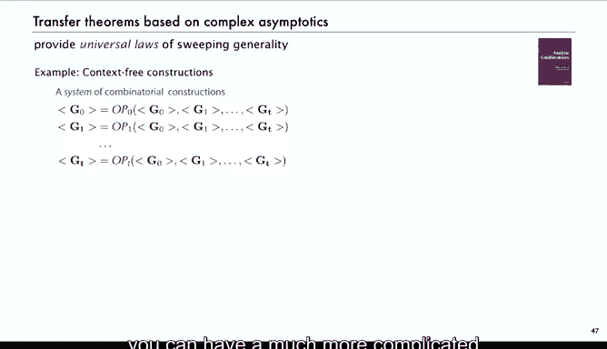

# 算法分析：21：系数渐近分析 📊

在本节课中，我们将学习如何通过生成函数来估计系数，特别是利用符号方法轻松获得生成函数后，如何进一步得到其系数的渐近估计。我们将介绍一个强大的工具——收敛半径转移定理，并通过实例展示其应用。

## 概述

上一节我们介绍了生成函数及其符号方法。本节中，我们来看看如何从生成函数中提取系数的渐近信息。幸运的是，我们通常可以通过通用的“转移定理”立即获得系数渐近估计。

## 转移定理简介

我们已经见过一些适用于许多情况的转移定理例子。

*   **泰勒定理**：这是一个转移定理。如果你有一个生成函数 **F(z)**，并且知道它的导数，那么 **F(z)** 中 **z^n** 的系数就是 **F** 在零点处的 **n** 阶导数除以 **n!**。对于许多函数，这是我们提取系数、开始处理生成函数的方式。
*   **有理函数**：我们在生成函数和渐近分析的讲座中讨论过这个例子。为了简化，本幻灯片展示一个特例。如果 **F(z)** 和 **G(z)** 是多项式，那么比值 **F(z)/G(z)** 中 **z^n** 的系数取决于分母的最大根。如果 **1/β** 是该根，则表达式 **β * F(1/β) / G'(β) * β^n** 给出了系数的渐近形式，其增长类似于 **β^n**。如果该根的重数为1，这就是常数项；如果重数更高，则有一个更复杂的公式。

以上是两个转移定理的例子。接下来我想讨论的是所谓的“收敛半径转移定理”，它涵盖了我们今天讨论的许多问题以及其他问题。实际上，我们在现实生活中使用的大多数转移定理都基于复分析渐近，我们将在第二部分详细讨论。但收敛半径定理适用于许多情况，有助于在这个层面上对解析组合学进行连贯的处理。

## 收敛半径转移定理

以下是定理内容。这个定理的核心思想是，函数 **1/(1-z)** 经常出现在我们发展的组合结构中。这里将其推广为 **(1-z)^α**，其中 **α** 不一定是整数，唯一的限制是它不能是零或负整数。在某种意义上，它推广了我之前做的比值情况（那时 **G(z)** 是多项式），现在它是 **(1-z)** 的 **α** 次幂。

**定理**：设 **F(z)** 在 **|z| < 1** 内解析，且 **α** 不是 **0, -1, -2, ...**。那么，**F(z)/(1-z)^α** 中 **z^n** 的系数渐近于 **F(1) * C(n+α-1, n)**。这进一步渐近于 **F(1) * n^(α-1) / Γ(α)**。

这里，**Γ(α)** 是一个常数，我稍后会讨论。

我现在不进行证明，因为大多数人只想应用这个定理而不是证明它。但证明并不难，它本质上是一个涉及广义二项式定理的卷积，并且由于级数收敛，前 n 项系数的和以指数速度收敛于 **F(1)**。这是第一部分证明的简要描述。第二部分是标准的渐近分析，只是使用了广义二项式系数和 Γ 函数的定义。

### Γ 函数简介

如果你不知道 Γ 函数是什么，这里有一个非常简要的总结：它是推广阶乘函数的一种方式，在解析组合学和算法分析中扮演重要角色，因为它出现在像这样的转移定理中。

对于实数 **z**，定义函数 **Γ(z) = ∫_0^∞ t^(z-1) e^(-t) dt**。这个函数具有我们期望的推广阶乘的性质。

例如：
*   **Γ(α+1) = α * Γ(α)**，就像 **n! = n * (n-1)!**。
*   计算可得 **Γ(1) = 1**，因此 **Γ(n+1)** 恰好等于 **n!**。所以对于整数，它与阶乘匹配。
*   但它对任何 **α** 都满足这个性质，且 **Γ(1)=1**。
*   对我们来说经常出现的一个值是 **Γ(1/2)**。如果你想计算 **Γ(1/2)**，令 **z=1/2**，你会得到类似正态分布积分的形式，计算结果为 **√π**。

所以，**Γ(1/2) = √π** 是一个我们需要知道的值，因为我们在 **α = 1/2**（例如 **√(1-z)**）的情况下应用这个定理。

这是一个转移定理，适用于某个函数与 **(1-z)^α** 的卷积，而这种情况经常出现。

### 定理的推广

更一般地，如果收敛半径大于某个 **ρ**，且 **ρ ≠ 0**（这实际上就是将定理应用于 **z/ρ**，在定理中代入 **z/ρ**），那么我们会得到稍微更一般的形式：**1/(1 - z/ρ)^α**，这会在渐近式中提出一个 **ρ^n** 因子。

所以，这个推论才是我们真正感兴趣的。

## 定理应用实例

如果生成函数具有那种形式，我们就知道其渐近性质。这适用于本讲座到目前为止讨论的两个主要问题。

### 1. 卡特兰数

对于卡特兰数，**T(z) = (1 - √(1-4z)) / (2z)**。这里有一个小复杂之处，因为第一项必须消去，但忽略这一点，我们使用的是 **α = -1/2**（分母中是 **√(1-4z) = (1-4z)^(1/2)**，所以整体是 **(1-4z)^(-1/2)** 的形式），并且 **ρ = 1/4**。那么，**F(z)** 在这种情况下只是前面的常数 **1/2**。

因此，我们最终需要 **Γ(-1/2)**，根据 **Γ(α+1) = αΓ(α)**，它等于 **-2Γ(1/2) = -2√π**。代入所有值，也许最容易理解的方法是两边乘以 **z**，然后精确应用这些公式。完成计算以证明这个转移定理立即给出了卡特兰数的渐近形式并不困难。

所以，一个转移定理（符号方法）得到生成函数，另一个转移定理（解析的）得到系数的渐近估计。

### 2. 错位排列问题

同样的定理也适用于广义错位排列问题。对于错位排列，我们有这个复杂的函数，但在这个转移定理下并不复杂：我们有 **α = 1**，**ρ = 1**，我们的函数 **F(z)** 是 **e^(-z - z^2/2 - ... - z^m/m)**。我们需要做的就是计算 **F(1)**，即 **e^(-1 - 1/2 - ... - 1/m) = e^(-H_m)**，其中 **H_m** 是调和数。这立即给出了渐近估计 **~ e^(-H_m) / n!**。

所以，对于第一个问题（卡特兰数），需要很多计算才能得到结果；对于第二个问题（错位排列），我们甚至不知道如何直接得到结果，但通过这个解析转移定理，我们可以立即得到结果。

## 更广阔的图景：通用定律

这仅仅是个开始。第二部分将致力于探讨基于复分析渐近的转移定理所能得出的真正通用定律。这里只提一个例子（有很多技术细节），让你有个概念：

如果你有一个组合构造系统，包含许多类别，它们通过一系列操作（用 **Op0, Op1, ...** 表示，这些操作可以是序列、乘积等）相互作用，你可以创建一整套组合构造的线性系统。一个非常简单的特例是二叉树：**T = Z + Z * T * T**。你可以有更复杂的东西，比如循环、集合的二叉树等等。

一个由组合类组成的完整系统，一整套组合构造，通过符号方法可以立即转移为一个生成函数方程组。

这很好，但这些生成函数方程可能相当复杂且难以求解。然而，实际上有一种称为 **Gröbner 基消元法** 的方法，可以将所有这些方程简化为一个单一的生成函数方程。不仅如此，还有一个称为 **Drmota–Lalley–Woods 定理** 的定理表明，该方程有一个显式解（在复数域中涉及平方根）。还有一个称为 **奇点分析** 的过程，可以立即给出一个简单的渐近形式。

因此，**任何** 这样的组合构造，其对象数量的渐近形式都是 **A / (2√π) * n^(-3/2) * B^n**，其中 **A** 和 **B** 是我们可以从构造中显式计算出的常数。

这是一个惊人的通用定律。你可以在较旧的数学文献中找到数百篇得出这类结果的论文，而这一过程就涵盖了它们。这只是我们在解析组合学中看到的众多通用定律中的一个例子。

## 总结

本节课中，我们一起学习了系数渐近分析的核心方法。我们介绍了如何利用转移定理，特别是收敛半径转移定理，从生成函数直接获得系数的渐近估计。通过卡特兰数和错位排列的例子，我们看到了该定理的强大与便捷。最后，我们展望了基于复分析的更通用定律，它们能够为一大类组合结构提供统一的渐近形式，展现了解析组合学的深刻与优美。