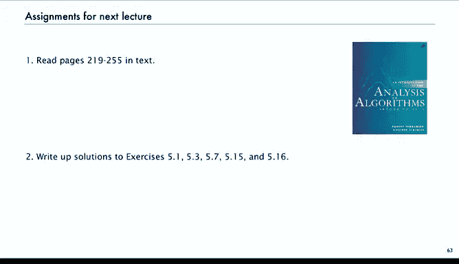

# 算法分析：P22：视角与展望 📊

在本节课中，我们将对解析组合学这门强大的“微积分”进行总结与展望。我们将回顾其核心流程，对比传统方法与解析组合学方法的差异，并了解其在后续课程中的广泛应用。

## 概述

解析组合学为我们研究各种大型组合结构提供了一套非常有效的定量分析框架。其核心流程始终如一：从一个**组合构造**出发，推导出对应的**生成函数**，最终通过复渐近分析得到**系数渐近式**。通常，我们甚至无需显式求解生成函数，仅凭方程的形式就能应用**转移定理**，直接获得我们感兴趣的渐近结果。

## 传统方法与解析组合学对比

上一节我们介绍了生成函数的威力，本节中我们来看看解析组合学如何简化分析过程。

回想一下我们在前四讲中讨论的内容与本次讲座的对比。

*   **以二叉树计数为例**：传统方法需要一整页幻灯片来从递推关系推导涉及卷积的生成函数。然后展开该生成函数涉及使用二项式系数进行复杂计算，才能得到卡特兰数的精确形式。接着，我们还需使用斯特林近似进行渐近分析，这同样涉及大量计算。第一次接触这些步骤时，你会觉得每一步都充满了复杂的计算，尽管每一步本身是直接的。
*   **解析组合学方法**：使用解析组合学，我们不再进行那些计算。我们只需建立组合构造，得到生成函数方程，然后应用转移定理即可获得我们感兴趣的渐近结果。这些结果通常非常精确，足以满足实际应用需求。

再以**错位排列**为例，传统方法的计算过于复杂，我们甚至没有展示计算过程。但通过解析组合学，我们可以立即得到系数渐近式。

## 解析组合学的特点与应用范式

这是一个能体现解析组合学特点的典型例子。我们从一个基本构造（排列是环的集合）出发，稍作修改即可得到答案。这非常普遍：

1.  **基础构造**：我们从一些希望研究的基本事物（如排列、树、字符串）开始。它们要么是初等的，要么是平凡的，要么符合我们的直觉，我们理解它们。但我们尝试从解析组合学的角度来理解它们。
2.  **复合构造**：然后我们可以有复合构造，例如一组环、集合的序列等等。我介绍的只是部分构造，实际上还有很多其他可用的构造。这些构造能告诉我们关于结构的信息（例如排列作为环的集合），实际上许多经典组合学问题都可以用这种方式处理。
3.  **变体与推广**：接下来是变体，例如推广错位排列或添加其他参数。可能性几乎是无限的。不仅如此，当我们得到一个生成函数方程时，通常存在一个**普适定律**能直接给出渐近结果。原则上，你可以通过精确结果再进行渐近分析（因为解析组合学的基础是一系列非常简单的技术），但如果你的目标就是渐近结果，何必多此一举呢？

这是一个非常标准的范式。此外，**组合参数**也可以处理，我们将会看到很多例子。这意味着我们不仅仅是计数事物，还在计数事物的属性。

## 处理组合参数：以二叉树叶子节点为例

在关于生成函数的讲座中，我们讨论了“累计成本”的概念。我们不是使用概率来计算平均值，而是计算所有结构中的总成本，然后相除。这将寻找随机对象中某个属性的期望值问题，简化为两个计数问题。

以下是寻找二叉树中叶子节点平均数量的步骤：

1.  **计数对象总数**：使用标准流程计数二叉树，得到卡特兰数的估计。
2.  **计数总成本**：符号方法同样适用于二元生成函数。因此，相同的构造将给出总成本（即所有树中的叶子总数）的显式方程。你只需用另一个变量跟踪叶子节点，相同的构造流程依然适用。
3.  **求导与计算**：像我们之前所做的那样，求导并在1处取值，即可得到所有树中的叶子总数。我们将再次得到一个显式结果，并且也有直接的转移定理。
4.  **相除得平均值**：我们无需深入细节。有了这两个渐近结果，我们只需相除，就得到了 `n/4` 这个结果。同样，我们可以在不展示之前所有细节的情况下完成这一切。

## 核心流程总结

现在，在学习了多个例子之后，这张幻灯片可能更容易理解了。

在解析组合学中，我们：
1.  从**组合构造**开始。
2.  使用**符号转移定理**得到**生成函数**。生成函数是研究的核心对象，因为我们通过组合构造转移到它们。
3.  使用**解析转移定理**从生成函数中提取系数。

原则上，我们可以在标准尺度上以任何精度进行此操作，并且也能处理各种变体。

## 课程展望与练习

在接下来的课程中，我们将看到解析组合学的许多应用。首先我们将研究**树**，然后是**排列**（实际上可以表示为某种标记树），接着是**比特串**及其相关的数据结构，以及**映射**这些迷人的结构。这些都在算法分析中有广泛应用。

为了巩固你对这些材料的理解，以下是一些练习：

*   **练习 5.1**：有多少个长度为 `n` 的比特串中不出现三个连续的零？这是一个尝试应用这些技术的好练习。
*   **关于树的练习**：再次演练解析组合学的步骤，解决类似问题。这里二叉树的大小是总节点数（内部和外部）。总节点数总是奇数。请为此得到一个表达式。
*   **关于排列的练习**：如果所有环的长度都是奇数呢？这是一个简单的问题。
*   **关于树参数的练习**：图中的红色节点有两个内部子节点，蓝色节点有一个内部和一个外部子节点。红色节点和蓝色节点的平均数量是多少？我们已经知道叶子节点的平均数量是 `n/4`，这是类似的问题。

对于下一讲，如果你能写出这些练习的解决方案，并阅读教材中关于解析组合学的章节，你将对我们从下一讲开始的算法分析基础有很好的理解。

## 总结

本节课中，我们一起学习了解析组合学的核心视角与强大之处。我们了解到，它将复杂的组合计数与渐近分析，系统化地转化为基于构造、生成函数和转移定理的流畅流程，极大地简化了分析工作，并为后续研究树、排列、字符串等复杂结构及其在算法分析中的应用奠定了坚实基础。