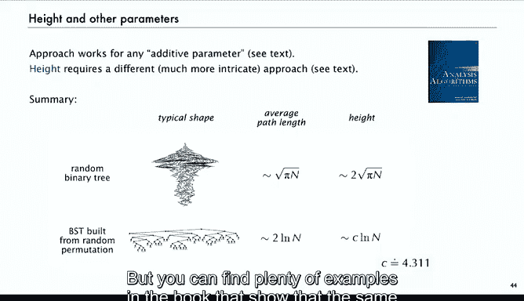

# 算法分析：P25：路径长度分析 📊

在本节课中，我们将要学习二叉树中路径长度的分析。路径长度是衡量树中节点到根节点平均距离的重要指标，它直接关系到二叉搜索算法等算法的性能预测。

## 概述

我们将首先定义内部路径长度和外部路径长度，并探讨它们之间的递归关系。接着，我们会分析两种不同类型的树：随机二叉树和由随机排列构建的二叉搜索树。通过解析组合数学的方法，我们将推导出它们平均路径长度的渐近表达式，并比较两者的差异。

---

## 二叉树路径长度定义 🌳

在二叉树中，每个节点都有一个深度，即从根节点到该节点的路径上的边数。

*   **内部路径长度** 定义为所有**内部节点**（非叶子节点）的深度之和。
*   **外部路径长度** 定义为所有**外部节点**（空链接或叶子节点下的虚拟节点）的深度之和。

计算内部路径长度的方法是：统计每一层的节点数，将层数与该层节点数相乘，然后对所有层求和。例如，若第1层有2个节点，第2层有4个节点，则内部路径长度贡献为 `1*2 + 2*4 + ...`。

上一节我们介绍了路径长度的基本概念，本节中我们来看看路径长度之间的一些基本递归关系。

## 路径长度的递归关系 🔄

设一棵二叉树 `T`，其左子树为 `TL`，右子树为 `TR`。我们用 `size(T)` 表示内部节点数，`xsize(T)` 表示外部节点数，`IPL(T)` 表示内部路径长度，`XPL(T)` 表示外部路径长度。

以下是它们之间的递归关系：

*   **内部节点数**: `size(T) = size(TL) + size(TR) + 1` （根节点计为1）
*   **外部节点数**: `xsize(T) = xsize(TL) + xsize(TR)`
*   **内部路径长度**: `IPL(T) = IPL(TL) + IPL(TR) + (size(TL) + size(TR))`
    *   解释：左右子树的路径长度之和，还需要为左右子树中的每一个节点额外加上从根到该子树的这条边（即深度+1）。
*   **外部路径长度**: `XPL(T) = XPL(TL) + XPL(TR) + (xsize(TL) + xsize(TR))`
    *   解释：原理与内部路径长度类似，为每个外部节点加上连接其子树的边。

从这些递归关系出发，可以证明两个简单而重要的恒等式：
1.  **外部节点数 = 内部节点数 + 1**。 (`xsize(T) = size(T) + 1`)
2.  **外部路径长度 = 内部路径长度 + 2 * 内部节点数**。 (`XPL(T) = IPL(T) + 2*size(T)`)

这些关系是后续分析的基础。

理解了路径长度的基本性质后，我们进入核心内容：分析随机二叉树的平均路径长度。

## 随机二叉树的平均路径长度 🎲

我们的第一个问题是：对于一个所有树形等概率出现的随机二叉树（树形总数由卡特兰数给出），其平均内部路径长度是多少？这描述了树中节点平均离根有多远。

我们使用解析组合学中的**累积计数法**。定义：
*   `T(z)`：二叉树计数的生成函数（卡特兰生成函数）。`T(z) = (1 - sqrt(1-4z)) / (2z)`。
*   `Q(z)`：累积成本生成函数。`Q(z) = Σ_{所有树T} IPL(T) * z^{size(T)}`。

我们目标是求平均内部路径长度 `E[IPL] = [z^n]Q(z) / [z^n]T(z)`，即 `Q(z)` 中 `z^n` 的系数除以 `T(z)` 中 `z^n` 的系数。

关键步骤是利用递归关系建立 `Q(z)` 与 `T(z)` 的方程。根据定义 `IPL(T) = IPL(TL) + IPL(TR) + (size(TL)+size(TR))`，可以推导出生成函数满足的方程：
`Q(z) = 2z T(z) Q(z) + z T'(z) T(z)`

这是一个关于 `Q(z)` 的方程。代入已知的 `T(z)` 及其导数 `T'(z)`，并利用关系 `1 - 2z T(z) = sqrt(1-4z)` 进行化简，最终可以解出 `Q(z)` 的显式表达式。

通过分析 `Q(z)` 的系数，我们得到所有大小为 `n` 的二叉树的内部路径长度总和渐近于 `4^n`。将其除以大小为 `n` 的二叉树数量（卡特兰数 `~ 4^n / (n^{3/2} sqrt(π))`），得到平均内部路径长度的渐近表达式：

**平均内部路径长度 ~ n * sqrt(πn)**

这是一个精确的渐近结果。对于一个有1万个节点的树，平均深度约为 `sqrt(π*10000) ≈ 177`。这表明在随机二叉树中，节点平均离根的距离与 `sqrt(n)` 成正比。

分析完随机二叉树，我们转向在算法中更常见的结构：由随机排列构建的二叉搜索树。

## 随机二叉搜索树的平均路径长度 🔍

现在考虑二叉搜索树，它由随机排列顺序插入空树构建而成。我们想分析由此得到的BST的平均内部路径长度。

此时，计数对象是排列。大小为 `n` 的排列有 `n!` 个。我们定义：
*   `P(z)`：排列的指数型生成函数。`P(z) = 1/(1-z)`。
*   `C(z)`：累积成本的指数型生成函数。`C(z) = Σ_{所有排列σ} IPL(BST(σ)) * z^{|σ|} / |σ|!`。

这里有一个技巧：由于概率空间是均匀分布的排列（概率为 `1/n!`），而EGF系数自带 `1/n!`，因此平均路径长度恰好就是 `C(z)` 中 `z^n` 的系数，无需额外除法。

接下来，我们利用BST的递归结构建立方程。对于一个排列，其第一个元素是树根，剩余元素根据与根的大小关系分成左右子排列，分别构建左右子树。路径长度满足：`IPL(σ) = IPL(σ_L) + IPL(σ_R) + (|σ_L| + |σ_R|)`。

将这个递归关系代入 `C(z)` 的定义，并进行一系列化简（包括对生成函数求导以消除分母中的阶乘项），最终得到一个关于 `C(z)` 的微分方程：
`C'(z) = 2C(z)/(1-z) + 2/(1-z)^3`

这是一个一阶线性微分方程，可以通过积分因子法求解。解得：
`C(z) = 2/(1-z)^2 * ln(1/(1-z)) - 2/(1-z)^2`

展开 `C(z)` 的幂级数，提取 `z^n` 的系数，即可得到平均内部路径长度的渐近表达式：

**平均内部路径长度 ~ 2n ln n**

因此，在由随机排列构建的BST中，节点的平均深度与 `log n` 成正比，这远优于随机二叉树的 `sqrt(n)`。这是因为随机排列更倾向于产生平衡的BST。

这个结果与**快速排序**的平均比较次数密切相关。事实上，快速排序的递归划分过程与BST的构建过程存在双射关系，快速排序的平均比较次数恰好等于随机BST的外部路径长度。

## 其他参数与总结 📝

上述分析路径长度的方法可以推广到许多其他树参数，例如计算叶子节点数量等。书中提供了相关练习。

一个更复杂但同样重要的问题是树的高度（最远节点的深度）。其分析更为 intricate，但已知结果如下：
*   **随机二叉树**的平均高度约为 `2 * sqrt(πn)`，大约是平均路径长度的两倍。
*   **随机BST**的平均高度约为 `c * ln n`，其中常数 `c ≈ 4.31`，也大约是平均路径长度的两倍。

**本节课总结**：
我们一起学习了二叉树路径长度的分析。我们定义了内部和外部路径长度，并推导了其递归关系。利用解析组合学，我们分别分析了随机二叉树和随机二叉搜索树的平均内部路径长度，得到了截然不同的渐近结果：`~ n√(πn)` 与 `~ 2n ln n`。这深刻揭示了不同随机模型下树结构的差异，并建立了与快速排序算法的有趣联系。这种方法为分析各种树参数提供了强大工具。