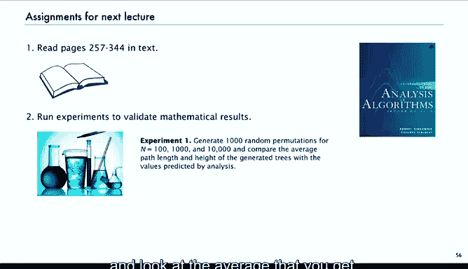

# 算法分析：26：其他树类型 🌳

在本节课中，我们将探讨算法分析中除二叉搜索树之外的其他树结构。我们将了解数学和计算机科学中定义的各种树类型，并简要介绍一些高级概念和未解决的问题，为后续的深入学习做准备。

---

## 自由树、有根树与有序树

上一节我们重点讨论了二叉搜索树。本节中，我们来看看数学中更基础的树分类。

在经典数学中，研究者们定义了以下几种基本树结构：
*   **自由树**：一个**无环的连通图**。它没有指定的根节点，子节点顺序也不重要。
*   **有根树**：在自由树的基础上，**指定一个根节点**。子树的顺序仍然不重要。
*   **有序树**：在计算机实现中，我们通常需要一种具体的表示方式，因此会为子树**指定一个顺序**。我们之前讨论的树本质上都是有序树。

下图清晰地展示了这几种树的区别（以5个节点的树为例）：

以下是具体说明：
*   5个节点的**自由树**只有3种不同的结构。
*   如果指定根节点（成为**有根树**），不考虑子树顺序，则有9种不同的结构。
*   如果进一步考虑子树顺序（成为**有序树**），则有14种不同的结构，这个数字恰好是卡特兰数。

这些不同类型的树各自对应着不同的计数问题。人们已经解决了其中许多问题。此外，还可以为节点添加标签，考虑标签的顺序等，从而衍生出更多种类的问题。我们将在解析组合学（课程第二部分）中详细研究这些问题。

---

## 算法中的其他树结构

在算法领域，也会自然衍生出多种树结构变体。

以下是几种常见的变体：
*   **T叉树**：每个节点**恰好有T个子节点**。
*   **T受限树**：每个节点**最多有T个子节点**，但不一定恰好是T个。
*   **2-3树**：这是符号表实现中的首选方法之一。它的特点是**一个节点可以包含多个键**。这种结构看似奇特，但可以方便地用二叉树表示。我们稍后会简要说明。

所有这些变体都会引发出枚举问题（例如，对于给定的T和节点数n，有多少种不同的树？）。仅仅以上提到的，我们就已经涉及了十多种树类型。这强调了我们需要像解析组合学这样的通用工具，它可以帮助我们获得问题的解，而无需深入每个变体的具体细节。这也是为什么我们需要之前讨论过（并且后续会继续深入）的通用定理。

你或许已经发现，用生成函数来描述这些结构是相当直接的。我们可以轻松地将二叉树的定义构造推广到三叉树、四叉树等。一旦能做到这一点，我们就得到了一个生成函数方程。虽然其中许多方程不像卡特兰数方程那样容易求解或进行渐近分析，但我们将学习处理它们的技术。至少，我相信本课程的学员已经确信，我们可以为所有这些结构快速建立生成函数。

当然，这将是课程第二部分的重要主题。

---

## 平衡树与一个未解问题

我想最后讨论一个与我们所学内容相关的未解问题。

在实际应用中，我们不能仅仅依赖“键以随机顺序插入”这个假设来保证算法性能。键的插入顺序可能并非随机，因此我们需要有性能保证的方法。基于树的**平衡树**方法就是满足这一需求的首选方案。

平衡树是首选方案，因为其搜索代码极其简单（事实上，你可以用二叉搜索树来表示平衡树，大部分代码都相同，仅在插入时有一点额外开销）。在《算法》一书的3.3节有详细描述。通过这点额外开销，可以**保证无论键以何种顺序插入，树的高度都将小于2 log n**，即小于最优高度的两倍。大多数算法使用2-3树或2-3-4树表示，它们可以直接转换为二叉树。

例如，下图展示了一种具体的平衡树——左倾红黑树（LLRB），它是《算法》书中详细描述的一种2-3树表示。无需深入细节，你可以看到它的二叉树表示，其中有时一个节点包含两个键，但可以通过一个带有特殊链接的左倾节点来表示。

因此，我们得到了一种带有少量额外开销（需要以特定方式维护那些链接）的二叉树，但它目前是符号表实现的首选方法。

现在的问题是：尽管我们有性能保证，但如果假设键是随机插入的（因为这仍然是一个合理的模型），我们仍然想知道其性能表现。如果能够证明平衡树在随机键下的平均高度渐近于 **log n**（系数为1），那将比系数为2快一倍。在大型计算的内循环中，速度提升一倍是非常重要的。所以，我们仍然希望知道这个问题的答案：**由随机排列构建的平衡树的平均成本是多少？**

这其实不是树的属性，而是排列和算法的属性。树只是数据的容器。

我们课程标志所用的图表就与这个问题相关。有一种叫做AVL树的平衡树，它也表示一种二叉树。下图是随机AVL树中根节点秩为K的概率的归一化图（这里的“随机”是指所有合法的AVL树等可能出现，就像随机的卡特兰树模型一样，你可以定义什么是AVL树，建立生成函数关系并生成此图）。

这个图的意义在于它显示：有时根节点在中间，但有时它像1/3、2/3处，有两个峰值。这是一幅非常引人入胜的图。请记住，对于随机二叉树，我们有卡特兰分布，根节点更可能偏向一边（不平衡）。对于随机排列构建的二叉搜索树，分布是平坦的。而这个图看起来不错，因为它至少试图让根节点靠近中间，但我们仍然面临从分析上描述它的挑战。**这是一个尚未解决的问题。**

对于左倾红黑树（LLRB），经验图似乎也具有一些相似的特征，但我们仍然远未理解如何确定由随机排列构建的树（无论是AVL树还是2-3树）的路径长度。2-3树已经用解析组合学进行过研究，我们将在第二部分简要提及。

---

## 练习与实验建议

以上是对其他树类型的简要概述。现在，我将介绍一些你可以在下次课前进行的练习。

有许多关于树枚举的练习，可以帮助你检验使用符号方法解决枚举问题的熟练程度。

**练习1：无单节点树的森林**
我们有很多森林，但可能只关心那些**没有仅包含单个节点的树**的森林。问题是：在n个节点的森林中，这样的森林所占的比例是多少？
草图显示，对于n=1,2,3,4，答案分别是0, 1/2, 2/5, 3/7。请尝试找出其渐近公式。
这再次体现了符号方法的魅力：你可以基于基本推导进行修改，其基本结构仍然成立，从而得到一个可以求渐近或显式解的生成函数方程。这是练习此技巧的好机会。

**练习2：完美平衡二叉搜索树的概率**
这是一个基于我们对排列和二叉搜索树观察的计算：得到一棵完美平衡的二叉搜索树的概率是多少？这是一个有趣的计算练习。

**练习3：随机二叉搜索树的节点类型统计**
这与我们之前对树参数的分析思路相同，但对象是由随机排列构建的二叉搜索树。
*   红色曲线：**两个子节点都是内部节点**的内部节点的平均数量。
*   蓝色曲线：**一个子节点是内部节点，另一个是外部节点**的内部节点的平均数量。
在第五讲中，我们针对随机卡特兰树得到了该问题的解（常数比例）。现在请计算随机二叉搜索树的对应结果，并与第五讲的结果进行比较。

**实验建议**
有些人可能想运行一些实验来验证我们讨论的数学结果。
*   例如，生成一些随机排列，构建二叉搜索树，观察你得到的平均高度，并验证它是否接近 **2 ln n**。进行这样的验证总是很有价值的。
*   编程实现可能有点工作量，但对程序员来说应该不是问题。更难一点的是尝试对随机二叉树做同样的事情，比较内部路径长度和 **S(n)**，看看它们有多接近，n需要多大才能进入渐近区间等等。运行实验总是值得的，有些人可能会乐在其中。

最后，为了检查你对材料的理解，尝试解答一些我给出的练习题是一个好主意。

---

本节课中我们一起学习了自由树、有根树和有序树的区别，了解了算法中如T叉树、平衡树等其他树结构变体，并接触了一个关于平衡树平均性能的未解问题。这些内容为我们后续深入学习解析组合学和应用这些结构解决实际问题奠定了基础。