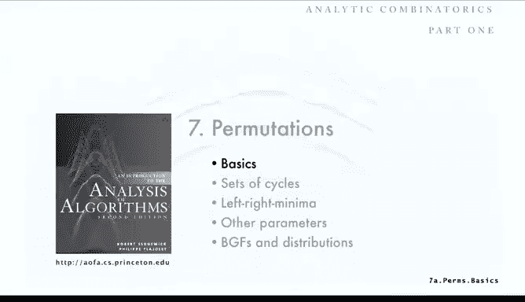

# 普林斯顿大学《算法分析｜Analysis of Algorithms》中英字幕 - P27：27_07_01_基础概念.zh_en - GPT中英字幕课程资源 - BV1YE421T7kf

Today， our topic is permutations， another basic combinatorial structure that we study because it has numerous applications in the analysis of algorithms。

Again， continuing the orientation that we introduced in the last lecture。

We're in the second part of the class where we're surveying fundamental combinatorial classes and mathematical techniques that we covered in the first half of the class。

 primarily analytic combinatorics to study properties of these classes。

 Last time we studied trees mostly from the standpoint as unlabeled structures which we inlic with ordinary generating functions This time we're going to switch to labeled structure that's permutations and exponential generating functions。

Again， there's many more examples in the book than we can possibly cover in lectures。

 what we've try to do in lectures is cover some of the interesting ones and then you can read more and further extend your knowledge by studying from the book we couldn't possibly cover all the examples that are in the book in lecture。

So let's look at the basic properties of permutations。

 and we talked about permutations before as an example when introducing labeled structures in inlytic combinatorics。

So here's just one colorful metaphor to describe permutations that we discussed。

 you have a group of N students and they go to a party and they maybe become inebriated that when the party's over。

 they each wind up in a random room。So yeah the students have numbers one through 16 and the rooms have numbers1 through 16。

 then what you have if you arrange an order by student。

 which you have is a random ordering of the numbers one through 16 or a permutation。

So we looked at those from the standpoint of analytic combinatorics as a sequence of labeled atoms where each possible ordering is different。

 so there's six permutations of three elements and 24 permutations of four and so forth。

 and so there's n factorial permutations of n elements and from the point of view of generating functions。

 the exponential generating functions for permutations。

 the counting sequence is n factorial we have a normalizing factor n factorial so those cancel out and it's the exponential generating function for permutations is some of z to the n of1 over1 minus C and this is just a quick review of what we talked about in the analytic combinatorics lecture。

So now there's many， many interesting properties of permutations that have been studied。

 So one thing that's often of interest is what's called the inverse of a permutation。

Another way to think of a permutation is as a mapping of the numbers from one through N。

 the set of numbers from one through n to itself。So our student to room。

 and I know that's a mapping from one to9，2 to 12 and so forth。

 where all the numbers from one through N appear in the mapping。

So there's a concept known as the inverse of a permutation。

 which is just the inverse of that mapping， and one way to look at that is to rearrange the permutation table so that it's in order by the rooms and then flip it。

So permutation maps students to rooms， the inverse of that permutation maps rooms to students。

 so it says that student room1 has student7 in it room two has student 13 in it and so forth。

 whereas the permutation told us which student was in which room。

And there's lots of direct applications of inverse。 How do you compute the inverse。

 It's a very simple process。 here's the code for it and the code is only slightly complicated because nowadays arrays in job and see you know the languages are zero base the first things at zero and we've been using permutations。

 the first things at one but let's look at an example and then we'll go back to the code So if we have this permutation shown on the right where one maps to eight two maps to1 and so forth we want to compute the inverse of that permutation process is very simple we start out with an empty array and the first thing we do to get the inverse one goes to8 so in the inverse8 is going to have to go to1 so we simply put1 in position 8 in the inverse and then we just move from left to right we put a two in position1。

3 in position 3，4 in position 7，5 in position 6，6， in position 2，7 and 9，8 and 4。

 and 9 and 5 and so forth。So since we know that each thing appears only once there's no collision in this process and simply one pass through the array is shown in the for loop and the code at left we can fill in the inverse in this case。

 the array B and since the arraysor0 based we have to subtract one from the permutation number so when two goes into position1 that goes into the first position in the array which is position 0 so we subtract1 and then we're using index I that goes from0 to n minus1 so we really to stick with the convention that we've been using with one through n we just add one to I so that's an easy computation one pass through we can compute the inverse of a permutation。

And here's a sample application， one of the simplest cipher mechanisms is simply to it's called a substitution cipher。

 is first generate a random permutation of the letters A through Z。

 and in this case we use a minus sign for a blank。We'll talk about generating random permutation in a minute。

And then we use that mapping to encrypt a message so if the message which is called the plain text is a attack it's dawn。

 then the random permutation tells us that A should map to W T to P T to P again A to W again C to L and so forth and that gives us a cipher text and it's encrypted we can send that cipher text and an eavesdroppper couldn't figure out what the plain text is without knowing the random permutation so that's a simple cipher system and now but the receiver of the message in order to be able to understand what the message says has to have the inverse of that permutation。

So that's a key that's transmitted and or generated in some other way。

 but in order to decrypt we need the inverse of the permutation and the inverse will tell us that W is supposed to go to a P is supposed to go to T and so forth and so that's just computing the inverse as on the previous slide and that gives a mechanism for converting the ciphertex back to the plain text。

 so that's a very simple application of the inverse of a permutation。Now。

 actually this type of cipher system is not so often used nowadays because it always maps each character to the same character in so actually an eavesdroppper can figure out by the frequency of occurrence of the letters which letter codes to which letter in actually not too difficult to solve a cipher system built this way from that frequency frequency analysis。

 but it's useful as maybe a piece of a cipher system。u。😔。

Sometimes we work with what's called the lattice representation of a permutation and we simply make an n by n matrix and down at the bottom is a permutation。

 say that's the example permutation and all we do is for each entry in the permutation。

 we put a block in the corresponding row so the first column corresponds to 9 so we put a block in row 9。

 second column 12 put a block in row 12， 11，10， then 5 and then。And so forth。

We have N blocks marked in that permutation in that lattice。

 and that is a direct correspondence to that permutation。

And then what's interesting and it doesn't take too much thought to convince yourself that this works is if you look at the columns that are marked one by one。

 the first column that's marked is7， the second one is 13 and so forth。

 and if you just read off the columns that marked what you get is the inverse of the permutation。So。

In the permutation， one maps to9， and then in the inverse， nine maps to1。

So that block is interpreted both ways， and in fact。

 if you take the transpose of the representation of the permutation in terms of the lattice。

 you get the representation of the inverse。So that's sometimes a useful way to or interesting way to look at permutations。

And remember when we talked about introduced analytic commonics。

 we talked about the cycle representation of a permutation。So if student4 wanted to room。

Room 10 and goes to room 10 is going to find student 6 there and Student 6 is going to go to room 15 and so forth。

 Eventually student 4 will find his room that way， so doing that for every position in the permutation we saw that there's a set of cycles that's equivalent to any given permutation。

And with that set of cycles representation， we were able to analyze interesting properties of permutation and I mentioned that because we're going to extend some of that analysis later on。

And then the tool， the main tool that we use to study permutations when we introduce it for an analytic combodatorics。

 and today， the starting point is the symbolic method for labeled classes。

And we had a number of combinatorial constructions that are natural ways to define sets of label objects。

 including permutations and permutations with restrictions on cycle lengths and other properties。

 and the symbolic method is a set of transfer theorems or a transfer theorem that defines a correspondence between a construction and operation on a generating function。

So when we build constructions， we get generating functions。So for example。

 one way to count permutations using the symbolic method。

 we define the class of all permutations and the exponential generating function。

 which is eachmut Zta the size divided by size factorial。

 which is equivalent to sum on n of the number of permutations of size n Z the enterin factorial。

 the combinatorial construction that creates permutations。

ItSays that a permutation is either empty or it's a star product of an atom and a permutation。

And that transfers immediately to the OGF equation，1 plus Ep of Z。

 and that as a solution 1 over1 minus z。And then the coefficient is E to theN in that is n factorial。

So a fine application of the study of permutation is sorting algorithms。

 chapter 2 of our algorithms book has numerous classic sorting algorithms and these things are very efficient。

 well studied， widely used and extremely useful。And one reason that we've been able to develop them to the point where they're so efficient is that we have mathematical models based on permutations that help us understand them。

 and we saw examples of that in the very first lecture and second lecture when we talked about the analysis of Quick sort in merge sort。

And the key concept as we saw was we need a model for the input to a sorting algorithm。

 and one thing to start with is to say that the inputs are randomly ordered。

 they represent a random permutation。The question is。

 is that a realistic model and the answer is that absolutely it's a realistic model if we just apply a random permutation to the input before the sort。

So the input might not be in random random order in this case it's in reverse order。

 but if we randomly permute it， then we absolutely have a situation where we're sorting a set of items that are random permutations so the model is exact so if we study properties of random permutations then we get properties of our sorting algorithms and that's what we're going to be doing that's what we did for quick sort and we'll do for several other sorting algorithms today。

So in order to do this though you need to be able to generate a random permutation properly and actually at the beginning。

 people would get this wrong and generate things that look like they were randomly permuted but actually did not generate each permutation with equal likelihood。

 so nowadays we use the method articulated by canoe and probably earlier。

 we just go from left to right and exchange each entry with a random entry to its right。

So there's a two liner， a four liner five liner to generate a random permutation I goes from 0 to n。

 we generate a index R that is somewhere between I and n minus1 between this current position and the end of the array and then exchange the element at position I with the element at position R so again if we start with this input。

 maybe this's in reverse order and。The first case generates an index that points to n and exchange T and N。

 And next time we're going to exchange S with L and then T with R and then R with P and so forth。

 So each time the element that gets picked is picked at random from the ones that have not been chosen yet。

In continuing that process， we get a random permutation of the input arrays。

 or if we just want to generate a random permutation， just start with one through n。

 it's the input and you get out a random permutation。

And this process generates all permutations with equal likelihood and that's easy to see the first entry is equally likely to be any one of the n entries。

 we're picking any value from0 to n minus1 at random we could get any one of them。

 so there's n possibilities for the first entry。Similarly。

 there's n minus1 possibilities for the second entry and so forth。

 so there's a total of n factorial different choice。

 of different permutations that are possible to be generated and they're all equally likely。

That's the basic properties of permutations， and next we'll go into looking at analyzing some of them。

