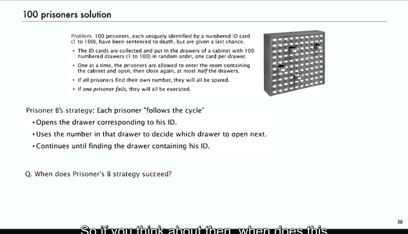
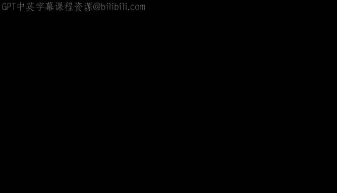

# 算法分析：28：循环集合


## 概述
在本节课中，我们将学习如何分析具有特定循环长度限制的排列。我们将从回顾排列的循环集合表示开始，然后深入探讨**对合**（Involutions）这一特殊排列，并学习如何计算其数量。最后，我们将通过一个著名的“100囚徒问题”来展示这些概念的实际应用。

---

## 回顾：带循环长度限制的排列

在第五讲介绍排列时，我们将其视为循环的集合，并对循环长度施加了限制。我们通过解析组合学的方法研究了这类问题。

排列的符号化构造是“循环的集合”。根据标记对象的符号转移定理，这意味着其生成函数满足：对于“集合”操作，其生成函数是指数形式；对于“循环”操作，其生成函数是自然对数。

因此，排列的生成函数 **P(z)** 为：
```
P(z) = e^{ln(1/(1-z))} = 1/(1-z)
```
所以，其计数序列（系数乘以 n!）是 **n!**。

如果我们想将同样的分析扩展到计算**错排**（derangements）的数量，即没有长度为1的循环（单循环）的排列，我们只需将循环长度限制为大于1。这对应于在 **ln(1/(1-z))** 中减去 **z** 项。

另一种看法是，其生成函数为 **e^{-z} / (1-z)**。其 **z^n** 的系数（乘以 n!）是一个卷积和，渐近于 **1/e**。

接着，我们推广到“广义错排”，即限制不允许出现长度小于等于某个参数 **M** 的短循环。其生成函数是 **e^{-z - z^2/2 - ... - z^M/M} / (1-z)**。我们证明了其渐近形式是 **n! / e^{H_M}**，其中 **H_M** 是调和数。

以上是我们介绍解析组合学时，关于带循环长度限制的排列的回顾。现在，我们将探讨另一个类似性质的问题。

---

## 对合：定义与性质

上一节我们回顾了带限制的排列，本节中我们来看看**对合**。对合是一种排列，其中所有循环的长度必须很短，具体来说，只能是长度1或2。

在长度为4的24个排列中，只有10个排列的所有循环长度均为1或2。其他排列要么包含一个长度为3的循环，要么包含一个长度为4的循环。类似地，在大小为3的排列中，只有4个不包含任何3循环。

对合是有趣的组合对象，有许多应用。一种理解方式是再次考虑逆排列。排列是一个从数字1到n到自身的映射，其逆就是这个映射的逆。那么对合的逆是什么？如果你计算一个对合的逆，你会发现它等于自身。从循环表示来看，在一个2循环中移动一步，再移动一步就会回到起点；在1循环中则保持不动。因此，对合是其自身的逆。

在点阵表示中，1循环对应于对角线上的元素，而2循环必须是对称的（例如，1映射到9，9映射到1）。如果你转置这个矩阵，会得到相同的结果。所以，对合是其自身的逆，这从点阵表示中可以立即看出。

---

## 对合的应用：互易密码

在应用方面，有“互易密码”的概念。如果使用一个对合进行加密，那么你可以用同一台机器进行加密和解密。一个著名的例子是二战期间德国使用的**恩尼格玛密码机**。其组件之一就是一个对合。

其思想是，我们有字母A到Z。如果我们用于加密的排列是一个对合，那么我们就不需要计算逆排列，因为对合就是其自身的逆。因此，我们不需要单独的解密表。如果我们有明文，得到密文（例如A变为D），那么要解密，我们使用相同的对合排列，它会将D变回A，K变回T，等等。

虽然它仍然容易受到字符频率分析攻击，但作为密码机的一个组件，它被证明非常有用，因为它可以极大地增加密码分析者需要考虑的可能性数量。恩尼格玛密码机就是这样使用的。

例如，如果你想知道有多少种不同的恩尼格玛设置，你就需要了解如何枚举对合。关于恩尼格玛密码分析的著名故事涉及艾伦·图灵等人，值得一读。

---

## 热身：仅由2循环组成的排列

作为热身，我们先看看完全由2循环组成的排列数量。

大小为2的排列只有一个，全是2循环。大小为3的排列中有3个全是2循环，依此类推。

一个例子是**ROT13**，这是世界上最弱的加密系统，它只是将字母旋转13个位置（A变为N，N变为A，B变为O，O变为B，等等）。由于它只包含2循环，所以它是一个互易密码，你可以使用同一个表进行加密和解密。

那么，完全由2循环组成的排列有多少个？我们称这种排列为 **R**，它就是“2循环的集合”。2循环的生成函数是 **e^{z^2/2}**。因此，其生成函数就是 **e^{z^2/2}**。我们想要的是其中 **z^n** 的系数乘以 **n!**。

由于只有 **z^2** 项，所以当 **n** 为偶数时，数量为 **(n/2)!**；当 **n** 为奇数时，数量为0。我们可以用斯特林公式来近似其渐近行为。这是解析组合学和渐近分析中非常简单直接的应用。

---

## 对合的计数与渐近分析

那么对合呢？其构造非常相似。对合是“1循环的集合”与“2循环的集合”的并集。也就是说，对合是所有循环长度均为1或2的排列。

这直接导出其生成函数为 **e^{z + z^2/2}**。其中，**e^z** 对应1循环，**e^{z^2/2}** 对应2循环。

现在，我们想从中提取系数。**z^n** 的系数（乘以 n!）是多少？这会得到一个离散和：
```
I_n = n! * Σ_{k=0}^{⌊n/2⌋} 1 / (k! * 2^k * (n-2k)!)
```
这个和的渐近分析更为复杂。它包含一个平方根和 **e** 的四次方根，是一个看起来相当复杂的函数。这可以通过求和的**拉普拉斯方法**得到，即找出求和式中权重最大的部分，用积分进行估计，并限制尾项。我们也可以在后续课程中通过复渐近分析直接得到答案。

因此，通过解析组合学，我们可以直接得到这样的结果，尽管其渐近分析绝非易事。

---

## 推广：无长循环的排列

如果我们像处理错排那样，将循环长度参数化为 **M**，情况会如何？

现在的构造是：对合是“1循环的集合”与“2循环的集合”……直到“M循环的集合”的并集。其生成函数直接来自符号方法：
```
e^{z + z^2/2 + ... + z^M/M}
```
这个生成函数系数的渐近推导是我们解析组合学书籍中最困难的推导之一，但通过解析组合学，我们仍然可以知道其渐近形式。

---

## 示例：计算特定系数

在某些应用中，你可能不需要推导完整的渐近形式。作为一个例子，我们来看一个练习。

假设我们想知道长度为10的排列中，有多少个没有长度大于5的循环。这个问题的答案就是下面这个生成函数中 **z^10** 的系数：
```
e^{z + z^2/2 + z^3/3 + z^4/4 + z^5/5}
```
或者写成另一种形式：
```
e^{ln(1/(1-z)) - (z^6/6 + z^7/7 + ...)} = (1/(1-z)) * e^{-(z^6/6 + z^7/7 + ...)}
```
这里的关键思想是，如果我们用泰勒定理展开这些指数项，我们只需要保留可能贡献到 **z^10** 系数的项。例如，**e^{-z^6/6}** 我们只需要展开到 **1 - z^6/6**，因为 **z^12** 及更高次项乘以任何东西都会超过 **z^10**，不会影响系数。

同样，对于 **1/(1-z)**，我们只需要保留前10项。然后进行交叉相乘，只保留那些乘积次数等于或低于10的项。通过这种推导，你可以有效地计算出特定问题的系数。

---

## 应用：100囚徒问题

现在，我们将应用这些概念来考虑一个被称为“100囚徒问题”的难题，这曾是谷歌的一道面试题。

故事是这样的：有100名囚犯，每人有一张唯一的身份卡，编号从1到100。卡片被收集起来，随机打乱顺序，放入一个有100个编号抽屉的柜子中，每个抽屉一张卡。

囚犯们一个接一个被允许进入房间，每人最多可以打开50个抽屉，查看里面的卡片，然后关上。出来后，他必须说出自己编号所在的抽屉。如果**所有**囚犯都找到了自己的编号，他们都将被释放；如果**任何一人**失败，他们都将被处决。

起初，一位数学家囚犯A认为这毫无希望，因为每人随机开抽屉找到自己卡片的概率是1/2，100人都成功的概率是 **2^{-100}**，微乎其微。

但另一位懂解析组合学的囚犯B提出了一个策略，声称至少有约31%的成功率。这个策略是什么？

策略是：每名囚犯都应遵循“循环追踪”策略。具体来说，编号为 **i** 的囚犯首先打开第 **i** 个抽屉。如果里面的卡片编号是 **j**，那么他接下来就打开第 **j** 个抽屉，以此类推，直到找到自己的卡片编号，或者直到打开了50个抽屉。

这个策略何时成功？当且仅当代表卡片放置的排列**没有长度超过50的长循环**时，所有囚犯都能在50步内找到自己的卡片。



那么，一个随机排列没有长度大于50的循环的概率是多少？这正是我们刚刚讨论的生成函数 **e^{z + z^2/2 + ... + z^50/50}** 中 **z^100** 的系数（乘以 100!）。通过计算（类似于我们之前的练习），这个概率大约是 **1 - (H_{100} - H_{50})**，其中 **H_n** 是第n个调和数。这个值约等于 **1 - ln(2) ≈ 0.306...**，即大约31%。这就是100囚徒问题的解决方案，也是排列循环结构研究的一个应用。

---



## 总结
本节课中，我们一起学习了：
1.  回顾了使用解析组合学分析带循环长度限制的排列。
2.  深入探讨了**对合**这种特殊排列，其所有循环长度仅为1或2，并且是其自身的逆。
3.  学习了对合的生成函数 **e^{z + z^2/2}**，并讨论了其系数提取和渐近分析的复杂性。
4.  将概念推广到“无长循环”的排列。
5.  通过一个具体计算示例，展示了如何高效计算特定生成函数的系数。
6.  最后，应用循环结构的知识，精彩地解决了著名的“100囚徒问题”，展示了理论在解决实际问题中的强大力量。