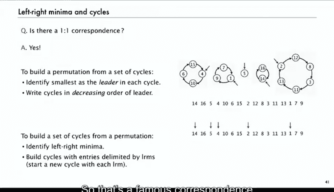

# 算法分析：29：左右极小值

在本节课中，我们将学习如何分析排列的特定属性，特别是“左右极小值”这一参数。我们将使用生成函数和组合构造的方法来计算随机排列中左右极小值的平均数量，并揭示其与排列中循环数量的深刻联系。

---

## 概述

上一节我们介绍了分析树结构参数的一般方法。本节中，我们将把这种方法应用到排列上，分析一个称为“左右极小值”的参数。这个参数与选择排序等基础算法相关，也是理解排列组合性质的一个经典例子。

## 左右极小值的定义

一个排列中的“左右极小值”是指，该元素比其左侧的所有元素都要小。

例如，在排列 `S O R T I N G E A` 中：
*   `S` 是第一个元素，因此是第一个极小值。
*   随后遇到 `O` 和 `R`，它们都比 `S` 大。
*   接着遇到 `I`，它比左侧的 `S, O, R` 都小，因此是第二个极小值。
*   以此类推，`G` 和 `E` 不是极小值，最后的 `A` 比左侧所有元素都小，是又一个极小值。
因此，该排列共有 5 个左右极小值。

在算法中，例如选择排序，这个数量对应于在查找最小元素过程中更新“当前最小值”变量的次数。

## 分析目标

我们的目标是计算：在一个大小为 `n` 的随机排列中，左右极小值数量的期望值。

以下是 `n=3` 和 `n=4` 时所有排列及其左右极小值数量的示例：
*   `n=3` 时，总累积成本为 11，平均值为 11/6 ≈ 1.833。
*   `n=4` 时，总累积成本为 50，平均值为 50/24 ≈ 2.083。

## 使用生成函数进行分析

我们将使用指数型累积生成函数。定义生成函数 **B(z)** 为：

**B(z) = Σ (对于所有排列P) [ LRM(P) * z^{|P|} / |P|! ]**

其中 `LRM(P)` 是排列 `P` 中左右极小值的数量，`|P|` 是排列的大小。

对于排列，`n!` 既是归一化因子，也是大小为 `n` 的排列总数。因此，如果我们从 **B(z)** 中提取 `z^n` 的系数，得到的就是 `B_n / n!`，这正是大小为 `n` 的排列中左右极小值的平均数量。

## 组合构造与方程推导

分析的关键在于找到一个合适的组合构造。对于排列，我们使用“星积”构造：给定一个大小为 `n` 的排列 `P`，我们可以通过插入一个新元素（并重新编号）来构造 `n+1` 个大小为 `n+1` 的新排列。

观察发现，在这 `n+1` 个新排列中：
*   有 `n` 个排列的左右极小值数量与原排列 `P` 相同。
*   有 `1` 个排列（即新元素 `1` 被放在末尾的排列）的左右极小值数量比原排列 `P` 多 1。

将这个构造应用到生成函数 **B(z)** 的求和定义中，我们可以推导出 **B(z)** 必须满足的函数方程：

**(n+1) * LRM(P) + 1** 对应于新构造排列的成本贡献。

经过代数化简（详细步骤涉及对求和的重组与已知生成函数的识别），我们得到：

**B(z) = (1/(1-z)) * log(1/(1-z))**

## 提取结果

函数 **log(1/(1-z))** 是调和数 `H_n` 的普通生成函数。而乘以 `1/(1-z)` 相当于对系数进行前缀和操作。

因此，从 **B(z)** 中提取 `z^n` 的系数，我们直接得到大小为 `n` 的排列中左右极小值的平均数量为：

**H_n = 1 + 1/2 + 1/3 + ... + 1/n**

这与我们之前计算的小数值 (`H_3≈1.833`, `H_4≈2.083`) 相符。

## 与排列循环数量的联系

一个有趣的现象是，随机排列中循环数量的平均值也是调和数 `H_n`。这是因为我们可以为“左右极小值”和“循环”建立一一对应（双射）关系。

对应规则如下：
1.  **从循环到排列**：找出每个循环中的最小元素（称为“领导者”）。按领导者从大到小的顺序写出所有循环，且不标记循环的起止。结果便是一个唯一的排列，其左右极小值正是这些领导者。
2.  **从排列到循环**：找出排列中的所有左右极小值。这些极小值就是循环的领导者。从一个领导者开始，向右读取直到遇到下一个更小的元素（即下一个领导者），这之间的所有元素（包括起始领导者）构成一个循环。

这个著名的对应关系直接证明了：在任意排列中，**左右极小值的数量等于循环的数量**。

## 总结

本节课中我们一起学习了：
1.  定义了排列的“左右极小值”参数，并理解了其算法背景。
2.  使用指数型累积生成函数 **B(z)** 和“星积”组合构造，推导出了生成函数方程。
3.  通过求解方程，得出随机排列中左右极小值数量的平均值为第 `n` 个调和数 **H_n**。
4.  揭示了一个重要的组合事实：通过一个精巧的双射，排列中左右极小值的数量恒等于其循环分解中的循环数量，这解释了二者平均值相同的原因。

这种方法——定义参数、建立生成函数、利用组合构造推导函数方程、求解并解释结果——是解析组合学中分析参数分布的核心策略。