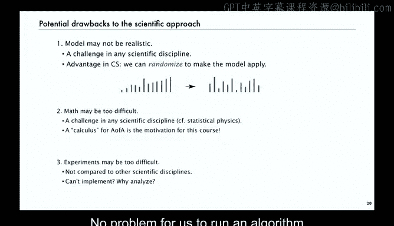
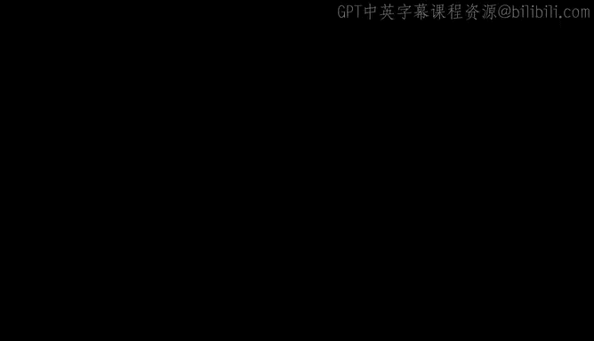

# 普林斯顿大学《算法分析｜Analysis of Algorithms》中英字幕 - P2：02_01_03_科学方法.zh_en - GPT中英字幕课程资源 - BV1YE421T7kf

Next， we're going to take a moment to describe in detail the scientific approach that we use in modern analysis of algorithms。

So again， just a note about notation in the theory of algorithms。

 when they're looking at upper bounds on worst case performance， they use these notations big。

 big omega and big theta to try to capture the order of growth。

 and that's what they use for classifying algorithms。If G of n is big O of F of n。

 it means that the ratio of G of n F n is bounded from above as n goes to infinity。If it's omega。

 it means it's bounded from below and if it's theta it means that it's bounded from both above and below so this one says there's a constant such that G of n is less than that constant times F of n。

 this one says there's two constants that it's in between so that allows classification according to functional growth as I mentioned merge sort is n log n and Quick sort is n squared。

So that's the notation that you often see throughout the literature describing the performance of algorithms。

But as I mentioned， Big O notation is dangerous， and I'll have more to say about that in just a minute。

So you can' it's not scientific to use the big O notation to try to compare algorithms。

 you can't say if you say the running time is big O and to see that's not of any use for predicting performance。

 it's an upper bound on the worst case， the actual performance may be much better than the worst case and it could be that even the actual bound is less than what's given by the big O notation。

 it's fine for a first cut of classifying algorithms， but not useful for comparing。

What we use instead is what's called the Tilde notation and so what we'll typically say is the running time of an algorithm is tilde a constant times。

 say some function of n where n is the input size that does provide an effective path for predicting performance and I'll show some examples of that later on。

 so we don't use the common big O big theta omega notation very much except in a specific technical sense that I'll talk about later on when we talk about asymptotic approximations。

So Big O notation is useful for a lot of reasons and it dates back a few centuries and we do use it in math。

 but it's a common error to think that the Big O notation is useful for predicting performance。

And I just want to make sure to nip that problem in the bud right away So this is what often happens to me when I give talks around the world on this topic。

 a typical exchange and say the Q&A for my talk depending on how formal it is somebody I'll say okay big O notation is dangerous you can't use it to predict performance and somebody will ask or shout out but an algorithm that is big O of n log n surely beach one is big O of n squared and then I trot out say the quick sort merge sort example and say well not by the definition big O is just an upper bound on the worst case and they'll say well so use the theta notation which says that it's in between and I say well maybe get rid of the upper bound but you still typically bounding the worst case is your input a worst case and even with that logic and with compelling example。

 a quick sort versus。Usly what happens is the questioner whispers to one of his colleagues， well。

 I'd still use the analog N algorithm wouldn't you and actually such people usually don't program much and shouldn't be recommending what practitioners do but surely we can do better than this。

 that's part of what analytic combatorques is all about。

There's another idea that's out there as well， and that's the concept of a galactic algorithm。

And I found this on friend's blog， Dick Lipton， who said。

 let's define an algorithm that will never be used as being galactic。

 and why will it never be used because no one would ever notice any effect about this algorithm in this galaxy？

Because any savings is going to happen for input size so large that couldn't happen in this galaxy。

 so an example of galactic algorithm and this one is actually maybe planetary or something it's actually close to the real world is Czelle's linear time triangulation algorithm。

 so the problem is to find a way to triangulate a polygon in linear time。

It was a surprising result and a theoretical tour to force to prove that it was possible to solve this problem in linear time。

 but the method is much too complicated for anyone to implement and if anyone did implement it the cost of the implementation would definitely exceed any savings until N is so large that it would take another galaxy to deal with it。

And。This is an interesting situation， I think one of the problems is that so many algorithms that are out there that are being published in the literature in this category after Lipton introduced the concept one of the contributors to his blog estimated that something like 75 to 95% of the papers in the theoretical Comp science conferences are galactic。

And I think the problem is that practitioners aren't necessarily aware that they're galactic and they maybe try to use them when a relatively simple analysis would say there's no point in a practitioner taking a look at this。

 papers should have asterisk on them or something。So I think it's okay for basic research to drive the agenda and there's nothing wrong with trying to find the algorithm with the best upper bound and worst case performance。

But we have to do something about the common error where people think that a galactic algorithm is actually useful in practice。

 There's a lot of denial out there。Here's another thing that often happens to me。

 this was an actual exchange with a very prominent theoretical computer scientist a few years ago。

 and he said in a talk， well， the algorithm A that actually is a pretty straightforward algorithm that's in widespread use is a bad algorithm。

 Google and other internet providers should be interested in my new algorithm， algorithm B。🤧。Oh。

And so in the question answer， I said， well， what's the matter with algorithm A。And he responded。

 it's not optimal， its running time has an extra log log n factor。And that's always a tip off for me。

 I say well， but your algorithm is very complicated， it takes 10 pages to describe。

 by the way we all know that log log n is less than6 in this universe。

 that's 2 to the 64th and so if n is2 to 64th is' less than 6 and。Not only that。

 it's just an upper bound。 Not only that your algorithm is so complicated。

 it's certain to run 10 to 100 times faster in any conceivable real world situation。

 Why should Google care about algorithm B， as you said。And then the response was， well。

 I like algorithm B。 I don't care about Google。 And again。

 that's fine to do research for the intellectual challenge。

 just don't say that some practitioner should be interested in it。 Surely we can do better than that。

So what I want to talk about specifically is the scientific approach。

 say the modern rendition of what Canuth taught us that is used for many。

 many algorithms in the fourth edition of my algorithms book， which is co-authored with Kevin W。

 so this is described in a lot of detail with examples in Section 1。4 of the book。Again。

 as Canoe said， we start with a complete implementation that we can test。

 and then therefore we'll be able to make hypotheses about the performance of that implementation and test them。

And then what we're going to do is maybe try to avoid some of the detail in canoeuth and we're going to analyze the algorithm by trying to find an abstract operation that is in the inner loop。

 that is it gets executed more times than any other operations。

And then we'll also need to develop some realistic model for the input to the program。

 that's still a sticking point， and then we'll just analyze the frequency of execution of that one operation for input size in and our hypothesis will be that the actual running time is proportional to a constant times that frequency。

That's it。 So the hypothesis might be wrong， but we can test it。 and we have the Tilde operation。

 and I'll show you specifically how we can go ahead and test it。 And actually。

 the unknown constant is an annoying thing to around， carry around。

 but not actually too bad because it does allow us to make specific mathematical calculations。So。

What we'll do then is once we have the hypothesis， we're going to validate the hypothesis by first of all。

 we want to generate some large inputs according to the model。 So for example。

 we'll look at sorting algorithms where the model is that the things are randomly ordered and distinct。

 And so it's easy to write a program to generate large randomly ordered distinct files。

 and then we can just run the program for a large input to calculate a。

 and actually we can even skip that step。 I'll show you that in a minute。

 But we definitely can get a that way。 an estimate of a。

 And then that gives us a model that we can use to predict performance for even larger inputs and check our hypothesis。

 that's the scientific approach to the analysis of algorithms。

 So really then later what we need to do also is find an application that actually uses realwor data and test。

Application context to validate the model as well。 That's actually the hardest part that's often overlooked nowadays。

And then as in any application scientific method， we'll refine and repeat and revise the model and the algorithm as necessary。

 or as we learn much about the problem， as I mentioned earlier。

 one of the great things that happens with this process is that often we learn things about the algorithm that allow us enable us to develop improved versions by doing this。

We have many， many examples of this for sorting and searching algorithms and graph algorithms and string processing and data compression and many。

 many other applications where we successfully apply this approach to develop good implementations and understand their performance。

So that's now what this course is going to be all about is this analysis of the frequency execution。

 That's where the math is。 And so， but I want to give this full context so people can understand why we're going to this trouble。

So as I mentioned， we don't use the big O notation or omega theta that much instead that's for the theory of algorithms。

 instead we're going to use the tilde notation and all the tilde notation means is that two functions geo n is tilde f of n if their ratio approaches1 as n approaches infinity and usually we have f of n is a constant times a standard function of n。

So that's the notation so we're just using Tilda and that's good that simplifies things a bit and then we're just left with these basic components。

 so one of the basic components of algorithm analysis involves programming so people who do analysis of algorithms need to be comfortable with implementing algorithms running them and be able to at least count operations。

 so need a good implementation now maybe somebody did did the implementation but still you want to have experience with it on your own computer to test various hypotheses that you might have。

Then we've got the mathematical challenge and that's again going to be most of our emphasis in this course where we develop a model。

 analyze the algorithm in the model and what we're going to talk about in this course is that really we need to do the math and that's the kind of math that I'm going to be talking about very soon in just a minute。

And then there's a scientific process of running the algorithm to solve a real problem and checking for agreement with the model。

 and so you can't do that， you can't really compare two algorithms until you've done all the rest of this。

 so it's very important to have that concept context to understand why we're so interested in getting this math done right without excessive detail。

Now there's definitely potential drawbacks still and you know the theory of algorithms still goes places where we can't go。

 number one is the model might not might not have a realistic model and that's actually a challenge in every scientific discipline now we do have a big advantage in computer science because we can randomize to make the model actually totally valid and I'll show an example in just a minute。

So if we don't have a realistic model， maybe we can get a realistic model by randomizing。

 that's a very powerful concept that if you don't get。

 if you're doing science that involves going to the moon or killing monkeys or something。

Second thing is the math might be too difficult， that's also a big challenge in any scientific discipline。

 statistical physics and many other areas， new developments in mathematics were involved in order to do the science and that's certainly going to be it here and really that's what analytic combinatorics is a calculus for analysis of algorithms is the true motivation for this course。

And thirdly， it might be that experiments are too difficult to really validate the model and again。

 that's not much of a point compared to any other scientific discipline no problem for us to run an algorithm a million times and do we do it a lot whereas if you had to feed a million mice you might have some restrictions or go to a million planets or whatever else。

 but it is a roadblock for a lot of people trying to study algorithms because actually they're trying to study galactic algorithms。

 it might be way too difficult to implement and if you can't implement it and why try to analyze it。

 it's fine for the intellectual challenge but again。

 there are people out there that are thinking that the algorithms that you're developing are useful in practice and really they should be validated scientifically before the poor working programr is faced with them。

So that's an outline of our approach to the analysis of algorithms。

