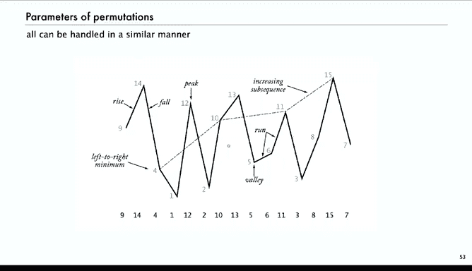

# 普林斯顿大学《算法分析｜Analysis of Algorithms》中英字幕 - P30：30_07_04_其他参数.zh_en - GPT中英字幕课程资源 - BV1YE421T7kf

Next we'll look at two more examples of parameters in permutations， again。

 just to gain some comfort with the basic method and also to get more familiarity with properties or permutations and there's many。

 many other examples in the book we're picking four parameters of permutations and there's another。🤧。

F or six or more in the book。 So say you want to know how many one cycles are there in a random permutation of size n。

So。For two， the average number of one cycles theres is just one because the。

Permtation has two one cycles has two and the one that's a two cycle is0。

 so the accumulated cost is 2 and if I by two we get one for three， we have either three one cycles。

 which is three to the accumulated costs。 We have three of them that have one one cycles so that adds another three to the cost So again。

 the total is accumulated cost is six。And then there's six of them， so the average is one。

 and you might start to see a pattern and sure enough for permutation of size 4。

 the total accumulated cost and you can count through it here。

 there's 241 cycles in all these permutations and there's 24 permutations， so the average is one。

So we're going to expect our result to show that the number of one cycles average expect the number of one cycles and a random of perutation to size n is1。

And to show that we're going to use precisely the same construction that we used for counting cycles。

 so again we put p plus1 into every position in the cycle。

 the difference in the analysis is if the original perm has psych1 of P1 cycles。

 how many are there in the set of constructed firms？

Well you have the same equation to start out with that is the whatever number of one cycles there are in the original there's p plus1 times that in all of these but then we have to adjust to add the new one cycle when we added our new element to make it a one cycle and then we have to subtract off for every one cycle that was there in this case the two we knocked it out by making it into a two cycle in one of the perms。

 so we have to subtract off cycle1 of p so that is a slightly different formula the number of one cycles in the set now is p times cycle1 of p plus1 instead of p plus1 times1 of p so just set plus1 is the difference between this equation and the one that we did for left to right minima and for cycles。

So let's look at what that happens to the analysis when we do that， so CGF。

 and then we apply the construction and again， the only difference is there was people that sorn before。

 and now it's P。呃。So now we don't have the ability to use the factor of P+1 to knock out the factor of P+1 in the denominator of P+1 factorial。

 so we have to knock that out in a different way and the easy way to do that is to just differentiate。

So if we differentiate z to the p plus1 over p to plus1 factorial。

 the P plus1 comes down and cancels and we just have z to the P over P factorial。

 and then our two terms are immediate。And now the second one is just the EGF for。

Premutations is 1 over1 minus z。In the first one， the P cancels out， and so that is just B Pri C。

So if you take the derivative of B of Z， if you look in the upper left， then first formula。

P cancels out with the P factorial。嗯呃。In the denominator。

 and then we're just left with an extra factor of Z， so it's a Z P prime of Z。

And then plus1 over1 minus z， and that's our answer。So now we have a differential equation。

 B prime of z equals 1 over1 minus z squared， and that's easy to solve， it's just1 over1 minus z。

And the coefficient zVN and that is one， so average number of one cycles in a random permutation is one。

Oh。So again， very straightforward， each step takes a little bit of experience to know when to differentiate and how to rearrange terms。

 but usually these types of arguments are quite elementary。呃。So， for example。

 in our students and rooms problem， everybody goes back to a random room。

 What's the average number of people who wind up in their own room。 Well。

 what we just proved is that it's one。Yeah。Now， just to test yourself your understanding of this method。

 it's worth awhile maybe to take the time to try to figure out the number of expected number of two cycles in a random permutation of size N。

 or then generalize that to the expected number of R cycles in a random permutation of size N。

Now the answers are one over two and one over R， and you can by solving these problems。

 you can get a little practice with manipulating these kinds of equations。

As our last example of studying parameters and permutations， we'll look at inversions。

An inversion in a permutation is a pair that's out of order。That's a little bit imprecise。

 a better way to look at it as I say， it's the sum of the for each entry。

 we sum up the number of elements that are larger and to the left。So for example。

 in the top right corner， one， two， four， three。The only pair that's out of order is three and four。

 so three has one larger element to its left， the four。

 all the rest of them have zero larger elements to the left。The one below that， 2，1，4。

3 has two inversions，1 and 2 and 3 and4 are out of order。 one has one larger element to its left。

3 has one larger elements to its left。The one below that， 3，1，4，2。

 that one has three inversions because one has one larger element to its left the three。

 and two has two larger elements to its left， the four and three。And again。

 for every one of these permutations we have written down off to the side the number of inversions。

 if you add all those numbers up， you get the accumulated cost for three， the accumulated cost is9。

 so the average number of inversions is one and a2。For four， the total accumulated cost is 72。

 so the average。So the cumd cost is 72 and the expected number of inversions is3。

So that's the quantity we want to study the number of inversions。

An application of this is to analyze another elementary sorting algorithm called insertion sort。

 and that's also the method of choice in some situations， we can read about it in algorithms。呃。

And so understanding its performance for random perutations is is useful in practical situations。

So what insertion sort does is。It goes through the array and for every position I。

 its job is to keep all the elements before I in sorted order。

And the way that it does that is when it gets a new element。

 it exchanges it with all the larger elements to its left。So in this case。

 when I equals 10 and it's pointing at the M， it knows that everything to its left is already sorted。

 but looking at the current element， its elements to its left is larger， so we exchange。

We keep exchanging as long as the element to its left is larger so M is still O is larger and n is larger。

 and when it gets to a point where the elements to its left is smaller。

 then it's inserted into its proper place in the array。So that's known as insertion sort。

The exchange has put the current element into place among the elements to its left。

And so the cost of this sort or number of exchanges is going to be the number of inversions in the permutation。

 so we want to know how many inversions there are in a random permutation in order to understand insertion sort。

So for example， insertion sort is often used in practice as when you use Quicksort recursive method like a quick sort or merge sort。

 when the files get small， those methods are less efficient than insertion sort。

 you want to switch to insertion sort， you want to analyze the size at which you should switch to insertion sort。

 you have to be able to answer this question。That's insertion sort。

 So what's the construction for inversion。 So now we're going to use a different construction。

 I didn't mention this one as one of the basic constructions for analytic combatorques。

 but it's' got the same transfer theorem and so forth there's the star。

And it's just an indication of the kind of freedom that we have in trying to understand combinatorial objects。

So in this construction， we're going to create a permutation that uses a six pointed star。

Permutation of size n -1， I'll create a permutation of size n by inserting n in every possible position。

 So here the7 goes from the rightmost down to the first position。

 Then there's no re numbering involved。 They all have the labels from one to 7 when you do that。

So now you notice that when as we move from left to right， we add one more inversion。So。

The first one， there's no additional inversions， the same number of inversions。

 but then each one as we move down， everybody to the right of seven。

 gets one more inversion added because now seven is to its left。And so we can calculate again。

 as before， if we know the number of inversions in the original permutation。

 then we know the number of inversions in the set of constructed permutations and it's。There's。

All the inversions in the original are still there in the constructed permutations。

 but then we have all these additional inversions 1 plus 2 plus 3 up to size of P。

 which is size of p plus1 times p over 2。So that's a number of inversions in the set of constructed perms。

Now we're going to use that equation in our typical construction。

 so now our accumulated generating function is on inversions。And again。

 rearranging the size of the sum by size of P s swaana grouping those together that gives that equivalent equation that we can now simplify。

It's got two terms in the first term the P1 cancels again against the Pless1 factorial and the second term。

 the P1 and both in that one also the P1 cancels so the first term is just z B of Z in the second term if you group by K it's just kz to the K because there's K factorial size and there's an extra z thrown out in the one half from P P1 over2。

So that simple equation， sulfur b of z is z b of z plus1 half that generating function is just a derivative of z to the K。

 so it z squared over1 by c squared。Now solve for B of Z and give another factor of 1 minus Z。

And again， that's one of our most elementary generating functions， coefficient of Z to VN。

 and that is the average number of inversions is n times n 1 over 4。

So that's the fourth derivation and that's enough and again if you want many more。

 there's many more in the book this again that checks against small values。

 there's lots of properties of permutations that have been studied in classical combatorics and that can be handled in similar manner。

 so for example， a rise in the permutation is when the value goes up。

 a fall is when the value goes down， a peak is when the value goes up and then down a valley is when the value goes down then up。

 a run is if you have successive values going up。

Left right minima we already talked about， an increasing sub sequenceence is some subset of the permutation where they go up。

And all of these properties can be handled in a similar manner， and again。

 the book contains several other derivations and wouldn't be productive to cover in lecture。

But so those four indicate a。An approach towards studying parameters of permutation that's effective and those that we looked at have actual applications to understanding the performance of important algorithms in practical situations。

