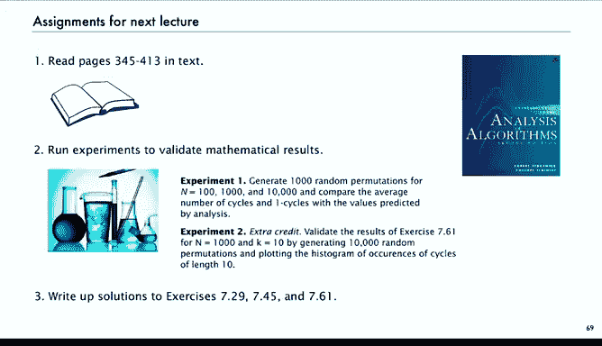

# 算法分析：P31：BGF与分布 📊

在本节课中，我们将学习如何使用解析组合学中的双变量生成函数方法来分析组合结构中的参数。我们将看到，这种方法比之前讨论的构造性推导更为简洁和强大，能够轻松地计算参数的平均值，甚至研究其完整分布。

## 概述

上一节我们介绍了通过构造性方法分析排列中循环数量的平均值。本节中，我们来看看如何使用解析组合学中的符号方法和双变量生成函数来更优雅地解决这类问题。这种方法不仅能简化计算，还能自然地扩展到对参数分布的深入分析。

## 双变量生成函数的基本思想

对于组合类，我们不仅关心对象的大小，还关心与之关联的参数（或成本）。双变量生成函数可以同时编码这两种信息。

*   对于标记类（如排列），其指数型双变量生成函数定义为：
    `B(z, u) = Σ_{对象ω} (z^{|ω|} / |ω|!) * u^{cost(ω)}`
    其中 `z` 标记大小，`u` 标记参数成本。

*   其核心恒等式是：大小为 `n`、参数值为 `k` 的对象数量 `A_{n,k}` 可以从生成函数中提取：
    `A_{n,k} = n! * [z^n u^k] B(z, u)`

## 从BGF计算参数平均值

一个关键技巧是，参数的平均值可以通过对BGF进行一个简单的操作得到。

*   参数的平均值计算公式为：
    `平均值 = [z^n] (∂B(z, u)/∂u |_{u=1})`
*   推导逻辑：对 `B(z, u)` 关于 `u` 求导并令 `u=1`，会得到系数为 `Σ_k k * A_{n,k}` 的生成函数，再除以 `n!` 即得平均值。

## 应用：排列的平均循环数

现在，我们使用BGF重新推导排列的平均循环数。

*   **符号方法构造**：一个排列是循环的集合。我们用变量 `u` 来标记每个循环。
    `排列 = SET( u * CYCLE(Z) )`
*   **通过转移定理得到BGF**：根据符号方法的转移定理，`CYCLE` 对应 `log(1/(1-z))`，`SET` 对应指数函数。因此，BGF 立即可以写出：
    `B(z, u) = exp( u * log(1/(1-z)) ) = (1/(1-z))^u`
*   **计算平均值**：我们要求 `∂B/∂u` 在 `u=1` 处的值。
    `∂B/∂u = (1/(1-z))^u * log(1/(1-z))`
    令 `u=1`，得到：
    `∂B/∂u |_{u=1} = (1/(1-z)) * log(1/(1-z))`
*   **提取系数**：我们知道 `[z^n] (1/(1-z)) = 1`，且 `log(1/(1-z))` 的系数是调和数 `H_n`。通过卷积，`(1/(1-z)) * log(1/(1-z))` 的 `z^n` 系数正是 `H_n`。因此，大小为 `n` 的排列的平均循环数就是第 `n` 个调和数 `H_n`。

可以看到，使用符号方法和BGF，我们无需任何复杂的构造和求和，几步就得到了结果。

## 另一个例子：指定长度的循环数

我们也可以轻松分析其他参数，例如长度为 `r` 的循环的平均数量。

*   **符号方法构造**：一个排列是所有循环的集合。我们可以将其表示为：非长度为 `r` 的循环的集合，加上被 `u` 标记的长度为 `r` 的循环的集合。
    `排列 = SET( CYCLE_{≠r}(Z) + u * CYCLE_{=r}(Z) )`
    其中 `CYCLE_{=r}(Z) = Z^r / r`。
*   **通过转移定理得到BGF**：
    `B(z, u) = exp( log(1/(1-z)) - z^r/r + u * (z^r/r) ) = (1/(1-z)) * exp( (u-1) * z^r / r )`
*   **计算平均值**：对 `u` 求导并令 `u=1`：
    `∂B/∂u |_{u=1} = (1/(1-z)) * (z^r / r)`
*   **提取系数**：当 `n ≥ r` 时，`[z^n] (1/(1-z)) * (z^r / r) = 1/r`。这意味着，在足够大的排列中，长度为 `r` 的循环的平均数量是 `1/r`。

## BGF与分布：第一类斯特林数

双变量生成函数的力量远不止于计算平均值。它包含了参数分布的完整信息。

*   排列中具有 `k` 个循环的计数被称为**第一类斯特林数**，记作 `[n k]`。
*   我们之前得到的BGF `B(z, u) = (1/(1-z))^u` 正是第一类斯特林数的指数生成函数：
    `B(z, u) = Σ_{n≥0} ( Σ_{k} [n k] u^k ) * (z^n / n!)`
*   从这个生成函数出发，可以推导出许多恒等式和递推关系。例如，将其视为 `u` 的函数，对固定的 `n`，系数 `[z^n/n!] B(z, u)` 是一个 `u` 的 `n` 次多项式：
    `[z^n/n!] (1/(1-z))^u = u(u+1)(u+2)...(u+n-1) / n!`
    这个多项式的系数正是第一类斯特林数。
*   在解析组合学中，还可以进一步研究当 `n` 很大时，循环数的**极限分布**。可以证明，在适当的缩放下，这个分布趋近于正态分布。

## 练习与下节预告

为了巩固理解，可以尝试以下练习：

以下是三个推荐的练习题目：
1.  **研究排列**：一个 `n` 个元素的排列是由这些元素的一个子集形成的序列（元素可重复使用）。请研究排列的组合解释和生成函数。
2.  **对合中的逆序数**：计算对合（满足 `p = p^{-1}` 的排列）中逆序的平均数量。
3.  **循环长度分布**：证明在随机排列中，长度为 `r` 的循环数渐近服从参数为 `1/r` 的泊松分布。

在下一讲之前，请阅读教材第七章。该章节内容详实，你可以选择性地深入阅读感兴趣的参数分析部分。始终建议通过生成随机排列并进行模拟实验，来验证我们推导出的数学结果（如平均循环数、指定长度循环数的分布等）。同时，练习将解题过程清晰地书写下来也是很好的学习方式。

## 总结

本节课中我们一起学习了：
1.  **双变量生成函数** 的概念，它同时编码了组合对象的大小和参数信息。
2.  如何利用BGF和简单的求导运算 `(∂/∂u)|_{u=1}` 来计算参数的**平均值**。
3.  **符号方法**与BGF的结合如何极大地简化分析过程，让我们能够直接从组合构造得到生成函数方程。
4.  BGF包含了参数的完整**分布**信息，例如第一类斯特林数，并且可用于研究参数的渐近分布。

这就是关于排列的BGF与分布分析。通过引入双变量生成函数和符号方法，我们获得了一个强大而统一的框架，用于分析组合结构中的各种参数，这将是第二部分课程中的重要工具。