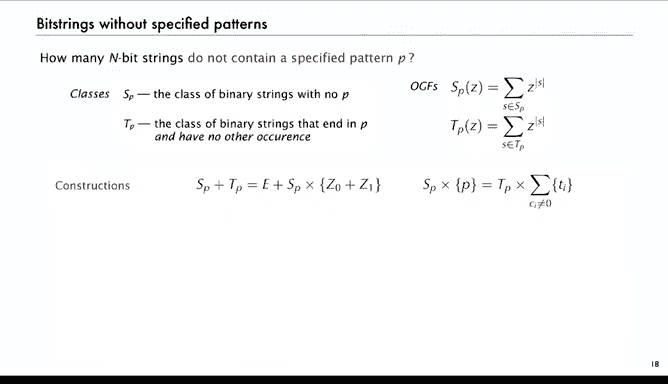
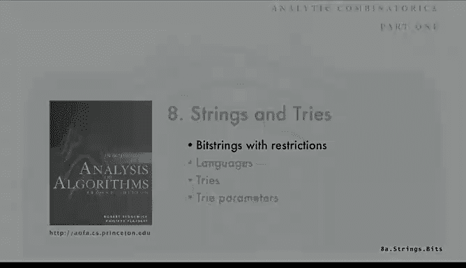

# 算法分析：8：受限比特串 🔢


在本节课中，我们将学习如何使用解析组合学的方法，分析包含特定限制或模式的随机比特串。我们将重点关注如何计算一个随机比特串中不出现特定模式（例如连续的零）的概率，以及首次出现该模式的期望等待时间。

---

## 符号方法回顾 📝

上一节我们介绍了符号方法的基本思想。本节中，我们来看看如何将其应用于比特串。

所有长度为 `n` 的二进制串的数量是 `2^n`。我们可以用符号方法构造这个组合类 `B`：一个二进制串是比特（0或1）的一个序列。

使用符号方法的转换定理，我们得到其普通生成函数（OGF）为：
```
B(z) = 1 / (1 - 2z)
```
`z^n` 的系数即为 `2^n`。

我们也可以用递归的方式来定义：一个比特串要么是空的，要么是一个比特后跟一个比特串。这能得到相同的结果。

---

## 无连续零的比特串 🔗

现在，我们考虑一个更具体的问题：有多少个长度为 `n` 的比特串**没有两个连续的零**？

我们可以这样构造此类比特串：
*   它是空的，**或者**
*   它是一个单独的零，**或者**
*   它是一个1，**或者**
*   它是一个“01”后跟一个“没有两个连续零的比特串”。

这个构造直接翻译成生成函数方程：
```
B0(z) = 1 + z + (z + z^2) * B0(z)
```
解这个方程，我们得到：
```
B0(z) = (1 + z) / (1 - z - z^2)
```
这个生成函数 `z^n` 的系数正是斐波那契数。通过分析分母多项式的最大根（即黄金比例 φ ≈ 1.618），我们可以得到系数的渐近表达式。

---

## 推广：无连续P个零的比特串 📈

上一节我们处理了无两个连续零的情况。本节中，我们将其推广到无连续 `P` 个零的情况。

构造方式类似：
*   一个“无连续 `P` 个零的串”是一个长度小于 `P` 的零串，后跟一个空串或一个1，再后跟一个“无连续 `P` 个零的串”。

这翻译成生成函数方程：
```
Bp(z) = (1 + z + ... + z^{p-1}) * (1 + Bp(z))
```
求解得到：
```
Bp(z) = (1 - z^p) / (1 - 2z + z^{p+1})
```
同样，`z^n` 的系数渐近于一个常数乘以 `α^n`，其中 `α` 是分母多项式 `1 - 2z + z^{p+1}` 的最大实根。

---

## 从计数到概率与期望 ⏳

我们不仅关心计数，更关心随机比特串的性质。通过评估生成函数，我们可以计算概率和期望。

以下是关键结论：
1.  **不存在连续P个零的概率**：在一个长度为 `n` 的随机比特串中，不出现连续 `P` 个零的概率近似为 `(α/2)^n`，其中 `α` 是上述多项式的最大根。
2.  **首次出现的期望等待时间**：在随机比特串中，首次出现连续 `P` 个零的位置的期望值是 `2^{p+1} - 2`。这是一个精确的公式。

对于不同的 `P` 值，结果差异很大：
*   `P=1`（无单个零）：期望等待时间仅为2，在长串中几乎不可能没有零。
*   `P=2`：期望等待时间约为6。
*   `P=3`：期望等待时间约为14。
*   `P=4`：期望等待时间约为30。
*   `P=6`：期望等待时间约为126，在100位的串中仍有相当概率不出现连续6个零。

这些统计数据可用于测试数据的随机性。

---

## 任意指定模式与自相关多项式 🧩

上一节我们分析了连续的零。本节中我们来看看更一般的模式，例如“001”。

一个反直觉的现象是：不同模式的等待时间不同。例如，在随机比特串中，首次出现“0001”的平均等待时间远短于首次出现“0000”的时间。

这是因为模式自身可能存在**重叠**或**自相关**。我们引入**自相关多项式**来刻画这一性质。

对于一个给定的模式 `P`（例如1010110），其自相关多项式通过将模式与自身滑动对齐来构造：每当模式尾部的若干位与头部的若干位匹配时，就在多项式中加入一项 `z^k`，其中 `k` 是滑动的距离。

例如，模式 `1010110` 的自相关多项式为 `1 + z^5 + z^7`。

---

## 处理任意模式的通用方法 🛠️

我们定义两个组合类：
*   `S_P`：完全不包含模式 `P` 的比特串。
*   `T_P`：以模式 `P` 结尾，且内部再无其他 `P` 的比特串。

基于对这两个类的观察，我们可以建立两个组合构造方程，并进而得到它们的生成函数方程：
1.  `S_P + T_P = ε + (S_P × {0,1})`
2.  `S_P × P(z) = T_P × Q(z)`，其中 `Q(z)` 就是模式 `P` 的自相关多项式。

解这个方程组，我们得到 `S_P` 的生成函数为：
```
S_P(z) = Q(z) / (z^p + (1-2z)Q(z))
```
其中 `p` 是模式长度，`Q(z)` 是其自相关多项式。

对于任何模式，我们都可以代入其 `Q(z)`，得到一个有理生成函数。分析其分母的最大根，就能得到不含该模式的比特串数量的渐近估计，以及相关的概率和期望值。

---

## 四比特模式示例 📊

所有可能的4比特模式可以根据其自相关多项式分为几类。下表展示了不同模式的等待时间差异：



| 模式 | 自相关多项式 Q(z) | 期望等待时间 (位) |
| :--- | :--- | :--- |
| 0000 | `1 + z + z^2 + z^3` | 30 |
| 1111 | `1 + z + z^2 + z^3` | 30 |
| 0001 | `1 + z^3` | 16 |
| 0011 | `1 + z^2` | 16 |
| 0111 | `1 + z` | 16 |
| 0010 | `1` | 16 |
| 0110 | `1` | 16 |
| 1011 | `1` | 16 |

可以看出，等待连续4个相同比特（0000或1111）所需的时间，大约是等待其他6种4比特模式的两倍。这意味着，在100位的随机串中，完全找不到0000的概率，比找不到0001的概率要高出约100倍。

---

## 总结 🎯

本节课中我们一起学习了：
1.  使用**符号方法**为受限比特串（如无连续零）建立生成函数。
2.  通过分析生成函数分母的**最大根**，得到计数的渐近结果。
3.  将生成函数在特定点求值，计算出**不存在某模式的概率**和**首次出现的期望等待时间**。
4.  引入了**自相关多项式**的概念，它编码了模式自我重叠的特性。
5.  建立了一个通用框架，可以处理**任意指定模式**的计数与概率问题，并发现不同模式的等待时间存在显著差异。




这些技术将组合对象的构造、生成函数的推导与渐近分析紧密结合，是解析组合学的经典应用。