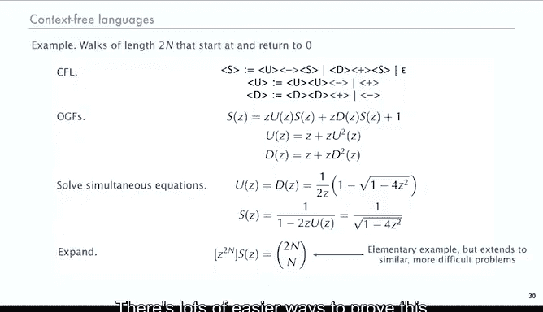
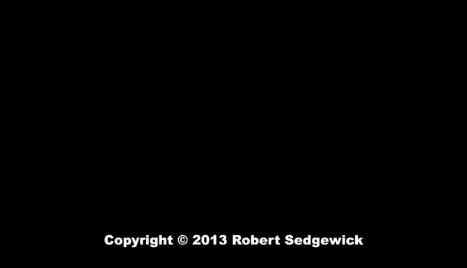

# 算法分析：33：符号方法与形式语言 🧮


在本节课中，我们将简要探讨符号方法与计算机科学中形式语言之间的关系。我们将看到，符号方法为计数形式语言中的字符串数量提供了一个系统性的框架。

---

## 符号方法与形式语言

上一节我们介绍了符号方法在组合结构计数中的应用。本节中，我们来看看符号方法与形式语言理论的联系。

一个形式语言是一个字符串的集合。一个自然的问题是：在一个给定的语言中，长度为 `n` 的字符串有多少个？答案是，我们可以使用普通生成函数（OGF）来枚举它们，并且本质上可以使用符号方法，或者将符号方法视为解决此类问题的一种途径。这是一种非常系统化的方法。

在计数时，一个关键问题是**歧义性**。通常，在形式语言中，我们只关心指定集合，而一个特定的字符串可能有不止一种推导方式。这是理解形式语言和构建编译器等的关键问题。如果存在多种推导字符串的方式，我们将计算所有可能的推导方式。因此，我们希望处理**无歧义**的语言。

---

## 正则表达式与有理生成函数

以下是正则表达式与生成函数的关系。

正则表达式使用连接（concatenation）、或（or）和星号（star）操作来指定形式语言。定理指出：如果你有两个正则表达式（RE）的枚举OGF，那么：
*   取“或”操作时，OGF是**和**。
*   取“连接”操作时，OGF是**积**。
*   取“星号”操作时，OGF是 `1/(1 - G(z))`。

这与符号方法的证明完全相同，只是记法不同，前提是正则表达式是无歧义的。

这表明，一个无歧义正则表达式的OGF是**有理的**（即两个多项式的比值）。因为无论你如何应用这些操作，最终得到的OGF都是两个多项式的比值。

另一种表述是：枚举正则语言的OGF是有理的。对于任何正则语言（例如，存在有限状态自动机的语言），存在一个著名的构造（克莱尼定理的细节）可以给出一个无歧义的正则表达式。如果存在无歧义的正则表达式，那么其OGF就是有理的。

这是一个思考枚举问题的有趣方式，因为人们可能更熟悉正则表达式，但需要注意歧义性问题。

**示例：不含连续两个0的二进制字符串**

用正则表达式语言表示，这是一个无歧义的推导：
```
RE = (1 + 01)* (ε + 0)
```
应用上述定理，对于星号部分得到 `1/(1 - (z + z^2))`，尾部部分就是 `(1 + z)`。最终得到的OGF与我们使用符号方法得到的结果相同，当然是一个有理函数（两个多项式的比值）。

**示例：表示3的倍数的二进制字符串**

这是一个著名的例子，可以使用具有三个状态的有限状态机来描述。可以为其推导出一个正则表达式。表示3的倍数的二进制字符串有多少个？我们可以将定理应用于该正则表达式，得到一个有理函数。经过简化，可以得到一个简单的多项式比值。这个生成函数可以通过部分分式展开，其系数渐近于 `(2^n - 1)/3`。这正是我们所期望的：总共有 `2^n` 个字符串（忽略前导零的细节），大约三分之一是3的倍数。

这是一个枚举正则语言的典型例子，它本质上就是符号方法，只是使用了不同的记法。

---

## 上下文无关语言与代数生成函数

类似地，对于上下文无关语言（CFG），我们使用非终结符以及“或”和“连接”操作。同样的思想也适用于符号方法，关键仍然是确保无歧义性。现在情况更复杂，因为我们有多个方程。文中讨论指出，枚举无歧义上下文无关文法的OGF是**代数的**。

代数函数是指满足一个系数为有理数的多项式方程的函数。这仅仅是从我们用来构建这些生成函数的基本规则自然推导出来的结果。

实际上，我们之前考虑的所有构造（使用不同记法）都是无歧义的上下文无关文法。

**示例：二叉树**

这是二叉树作为一种上下文无关文法的描述：
```
T = ○ + ○ T T
```
那么其OGF将满足 `T(z) = z + z * T(z)^2`，这是一个代数方程。

**示例：不含连续两个0的比特串**

用上下文无关文法表示它稍微复杂一些，但本质上并不难，只是记法不同。

由于歧义性，并非所有上下文无关文法都对应我们可以用这种方式枚举的组合类。同样，并非符号方法中考虑的所有构造都是上下文无关文法，因为我们除了连接和“或”之外还使用了许多其他操作。然而，在许多情况下它们是相同的，了解这一点是有价值的。

---

## 应用：随机游走的计数

以下是随机游走计数的例子。

随机游走是加号（`+`）和减号（`-`）字符的序列，在随机游走、所谓的赌徒破产问题以及某些排序算法的研究中都有应用。

从加号和减号字符序列的概念出发，会产生各种自然问题，例如：长度为 `n` 的不同游走有多少？或者，有多少长度为 `n` 的游走，其每个前缀中加号都多于减号（即始终保持在基线之上）？

在此背景下研究随机游走的关键是找到一种无歧义的分解方式。

*   定义类 `U`：游走始终保持在基线之上（加号始终多于减号）。
    *   构造方式：要么只是一个 `+`；要么是一个 `U`，后接另一个 `U`，然后是一个 `-`。
*   类似地，定义类 `D`：游走始终保持在基线之下。
*   利用 `U` 和 `D`，可以定义从零开始并在零结束的随机游走类 `S`：
    *   要么是一个 `U`，后接一个 `-`，然后是一个 `S`；
    *   要么是一个 `D`，后接一个 `+`，然后是一个 `S`；
    *   或者是空游走 `ε`。

这正好是一个使用这三种构造的上下文无关文法，它无歧义地分解了从原点开始并结束于原点的随机游走。

由于这是一个上下文无关语言，我们可以使用符号方法来得到生成函数方程。这次，我们有三个方程和三个未知数。联立求解这些方程（实际上类似于树的方程），最终结果是：此类游走的数量是 `C(2n, n)`（即第 `n` 个卡特兰数乘以某个因子）。虽然有很多更简单的方法可以证明这个结果，但这种方法可以推广到解决文本中讨论的许多更复杂的类似问题。

---

## 总结



本节课中，我们一起学习了符号方法与形式语言理论之间的联系。我们看到：
1.  对于**无歧义的正则表达式**，其枚举生成函数是**有理的**。
2.  对于**无歧义的上下文无关文法**，其枚举生成函数是**代数的**。
3.  符号方法为计数形式语言中的字符串提供了一个强大而系统化的框架，关键在于处理**歧义性**。
4.  我们通过**随机游走**的例子，展示了如何将组合结构分解为无歧义的上下文无关文法，并利用符号方法得到生成函数方程进行计数。



这为我们分析更复杂的算法和数据结构（例如接下来要看的**字典树**）奠定了坚实的基础。