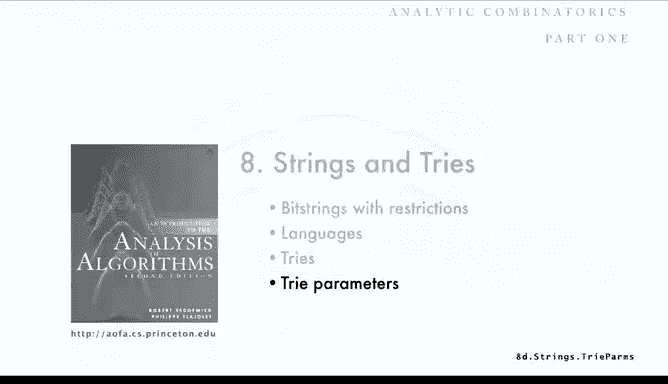

# 算法分析：35：字典树参数分析 📊


在本节课中，我们将学习如何分析字典树（Trie）的关键性能参数，包括空间占用、搜索成本和“领导者选举”路径长度。我们将从递归关系入手，推导出平均外部路径长度的精确公式，并揭示其背后有趣的渐近行为和周期性波动。

---

## 概述

字典树参数的分析是算法分析中最具挑战性也最有趣的部分之一。理解这些参数是评估当前许多大规模基础设施应用性能的基础。我们将重点关注三个核心参数：**空间占用**、**搜索成本**和**领导者选举路径长度**。本节将详细分析平均外部路径长度（即搜索成本），其他参数将作为练习。

---

## 字典树参数定义

在深入分析之前，我们先明确要分析的三个核心参数。

*   **空间占用**：这由字典树中**外部节点**的总数决定。如果你知道所表示的字符串数量，就能计算出额外（空）节点的数量。空节点的数量代表了实际使用的额外空间。
*   **搜索成本**：与二叉搜索树类似，搜索成本由**外部路径长度**决定，即从根节点到所有外部节点的距离之和。其平均值就是平均搜索成本。
*   **领导者选举**：如前所述，这是最右侧路径的长度。

值得注意的是，即使一半的节点是空的，也只会略微增加搜索成本。这是字典树高效的原因之一：存在大量空节点对搜索成本的影响并不大。

---

## 分析模型

为了进行分析，我们采用一个标准且易于处理的模型。

最常用的模型是：假设字典树是通过插入 **n** 个无限的随机比特串构建的。这些字符串最终会在某个位置产生差异，而字典树正是根据这些前导位的差异来区分它们。从分析的角度看，这是一个合理的模型，因为我们可以假设在每个节点，我们都以相等的概率随机向左或向右移动。研究表明，这个模型能很好地拟合真实数据。

---

## 建立递归关系

我们的分析起点与二叉搜索树的分析类似，但存在关键差异。

对于一个包含 **n** 个字符串的字典树，假设左边有 **k** 个字符串，右边则有 **n - k** 个。差异主要有两点：
1.  左边有 **k** 个节点的概率不同。对于二叉搜索树，这个概率是 `1/n`；而对于字典树，由于是随机比特串，这个概率服从二项分布。
2.  可能出现左边有 0 个节点、右边有 **n** 个节点的情况（反之亦然）。这是由字典树的定义直接导致的，它使得递归式稍微复杂一些。

由此，我们得到底部所示的递归式。当你有 **n** 个随机字符串时，其中 **k** 个以比特 0 开头的概率是 `(n choose k) / 2^n`。因此，字典树的外部路径长度 **C_n** 满足以下递归关系：

```
C_n = n + (1 / 2^n) * Σ (n choose k) * (C_k + C_{n-k})， 对 k 从 0 到 n 求和
```

需要注意的是，当 `k = 0` 时，右边会出现 `C_n` 项，这是处理时需要小心的一点。

*   **二叉搜索树**：左边有 **k** 个节点的概率是 `1/n`（均匀分布）。
*   **随机卡特兰树**：该概率服从卡特兰分布。
*   **字典树**：该概率服从**二项分布** `(n choose k) / 2^n`。

这个递归式是我们计算小数值或分布的基础，也是我们想要求解的目标。二项分布的特性（峰值在 `n/2` 附近）暗示字典树的结构通常是相当平衡的。

---

## 求解递归式：生成函数法

我们将使用指数生成函数来求解这个递归式。

将递归式两边除以 `n!`，然后对所有的 **n** 求和，我们得到指数生成函数 **C(z)** 满足的方程。利用 `n choose k` 产生的卷积形式，经过不太复杂的计算，可以验证以下公式：

```
C(z) = z * e^{z/2} * C(z/2) + (1 - z) * e^z
```

这是一个关于生成函数的简单方程，它是 `e^{z/2}` 和 `C(z/2)` 的卷积。虽然由于参数 `z/2` 的存在，它不能直接显式求解，但我们可以通过迭代来处理。

---

## 迭代求解与显式公式

通过反复将 `C(z/2)` 的方程代入自身，我们可以进行迭代。

经过几步迭代后，可以观察到模式：我们将得到 `z * e^z` 乘以一系列项的和，这些项涉及 `z/2, z/4, z/8, ...`。最终，在无穷迭代后（需要证明剩余项趋于零），我们得到了平均外部路径长度生成函数的显式公式。

从这个显式公式中提取 `z^n` 的系数（再乘以 `n!`），我们得到平均外部路径长度 **C_n** 的显式公式：

```
C_n / n = Σ_{j≥0} (1 - (1 - 1/2^j)^{n-1})
```

这个公式仍然包含一个无穷和，我们需要进一步处理它以理解其渐近行为。

---

## 渐近分析：揭示周期性

我们使用基本的分析方法来刻画这个和式的行为。更完整的解析刻画需要复分析方法（将在课程第二部分讨论）。

利用近似 `(1 - 1/2^j)^{n-1} ≈ e^{-n/2^j}`，我们关注以下和式：

```
Σ_{j≥0} (1 - e^{-n/2^j})
```

为了分析它，我们将和式在 `j = floor(log₂ n)` 处拆分为两部分：
*   当 `j < floor(log₂ n)` 时，`2^j` 远小于 `n`，`e^{-n/2^j}` 非常小，项 `(1 - e^{-n/2^j})` 接近 1。
*   当 `j ≥ floor(log₂ n)` 时，`2^j` 大于等于 `n`，`e^{-n/2^j}` 接近 1，项 `(1 - e^{-n/2^j})` 接近 0。

通过变量替换和合并，最终我们可以将 `C_n / n` 表示为：

```
C_n / n = log₂ n + F({log₂ n}) + o(1)
```

其中 `{log₂ n}` 表示 `log₂ n` 的小数部分。函数 `F(x)` 是一个在 0 到 1 之间平滑振荡的周期函数，但其振幅非常小（大约 `10^{-6}` 量级）。

这是一个令人惊奇的发现：一个看似自然的、涉及整数成本的递归关系，其解竟然包含一个微小的**周期性振荡项**。当我们学习到复分析和梅林变换时，会发现这种周期性在基于比特串性质的算法（如字典树）分析中经常出现，并且有完美的数学解释。

---

## 分析结果与应用

应用上述分析结果，并观察字典树得到的分布，可以发现它比二叉搜索树的分布更紧密地集中在中心（即更平衡）。

以下是此类分析得到的关键结果引用：
*   **额外空间**：大约有 **44%** 的外部节点是空的。
*   **期望搜索成本**：大约为 **n log₂ n**，即需要检查的比特数。这是一个非常有竞争力的、可接受的搜索成本。
*   **领导者选举**：这将作为一个练习。

---

## 总结




本节课中，我们一起深入分析了字典树的性能参数。我们从定义核心参数和建立分析模型开始，推导了平均外部路径长度的递归式，并利用生成函数法进行求解。通过渐近分析，我们不仅证明了搜索成本主要项为 `n log₂ n`，还揭示了一个隐藏的、振幅极小的周期性波动。最后，我们总结了字典树的空间和搜索效率，说明了其在处理大规模字符串数据时的实用性和竞争力。对于领导者选举路径长度的分析，则留给大家作为练习。