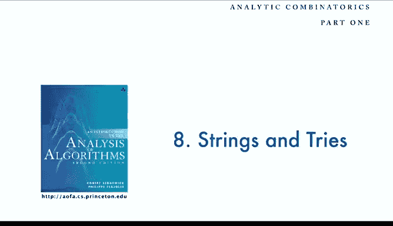

# 普林斯顿大学《算法分析｜Analysis of Algorithms》中英字幕 - P36：36_08_05_习题.zh_en - GPT中英字幕课程资源 - BV1YE421T7kf

And let's finish up with several exercises that you might do to cement your understanding of the material in this lecture。

So this is exercise 8。3 so how long a string of random bits should you take if you want to have an even chance that there's going to be 32 consecutive zeros in that string。

 so go ahead and calculate that number from the information given in this lecture。

And this is a fun type of problem that Philippe was very fond of。

 suppose that a monkey types randomly at a 32 character keyboard。

 what's the expected number of characters that he's going to type before he hits on the phrase the quick brown Fox jumpump over the lazy dog。

We can have more complicated questions like that that involve repetition in the pattern as well。

And then this is to check through the try analysis for the leader election algorithm。

 this is just go through the steps in that analysis for this simpler recurrence。

 which is the number of rounds in the leader election algorithm to see what the upthating term looks like for that。

So read chapter8 in the text， here are a couple experiments that you might do to validate the mathematical results in this lecture that are similar to what we've done before。

 so one is draw some random tries， see draw say10 random tries with 100 nodes and compare their shapes to random binary search trees or random Catalan trees。

Another thing is to run experiments for random tries to try to validate the analysis to get a plot like the one in the text。

 to show that the running time really is pretty close to analog log Ra I event。

And then write up solutions to those exercises from the book assignments。

To check your understanding the strings in triess。

