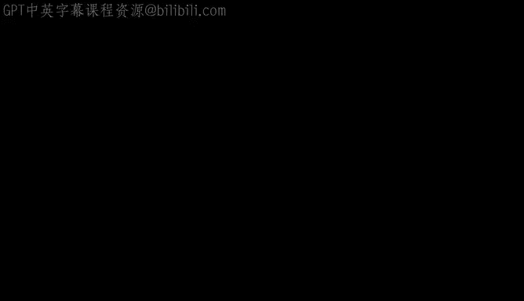
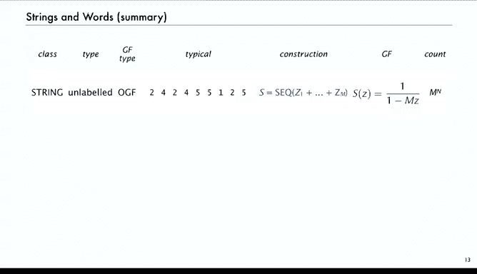
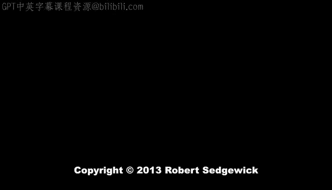

# 算法分析：37：词与映射

在本节课中，我们将学习组合数学中的“词”与“映射”概念。这是结束我们课程学习的合适主题，因为它将我们之前讨论过的许多内容联系在一起。我们将主要处理标记对象，因此会用到指数生成函数。虽然课程中无法涵盖书本中的所有例子，但我们会探讨解析组合学中的一些技术及其在算法分析中的应用。

## 什么是“词”？

首先，我们来明确组合数学意义上“词”的含义。为此，我们先回顾几个相关的组合对象。

例如，我们讨论过包含N位的二进制字符串的数量。字符串是0和1的序列。使用符号方法和普通生成函数，我们证明其数量为 `2^N`。这可以推广到从包含M个字符的字母表中抽取的字符串数量。在这种情况下，它是M个字符之一的序列，其生成函数为 `1 / (1 - Mz)`，因此数量为 `M^n`。

那么，这与“词”有何关系？我们稍后会讲到。现在，让我们看看标记对象。大小为n的标记集合有多少个？实际上，对于任意大小n，只有一个标记集合。我们不考虑顺序的重要性，所以只有一个集合，并且我们标记所有对象。

如果我们想取n个对象的标记集合的有序对，会得到什么？对于两个对象，你可以有{1}然后{2}，或者{2}然后{1}，或者空集和两个对象，或者两个对象和空集。在这种情况下，集合的顺序是重要的，标记对象可以以这些不同的方式落入集合中。因此，对于n个对象，有8种不同的有序对标记集合。答案就是 `2^n`，这与二进制字符串的数量相同，我们稍后会看到这种关系是如何建立的。

如果不是对，而是M个集合的序列呢？长度为M的、包含n个对象的标记集合序列有多少个？我们用“瓮”这个词来指代一个可以容纳标记对象的容器。从这个角度看，经典的理解方式是“球与瓮”问题。我们实际上讨论的是将n个球投入M个瓮的不同方式数量。

## 从符号方法到计数

上一节我们回顾了基本概念，本节我们来看看如何通过符号方法得到这些计数结果。这只是对第5讲内容的复习。

对于标记对象的组合类，我们可以执行一些基本操作：不相交副本、取有序对、以所有可能方式重新标记。然后，指数生成函数上的相应操作使我们能够从构造直接得到生成函数。

对于标记对象，我们将其扩展到长度为K的序列或任意长度的序列，生成函数上给出相应的变换。对于集合，我们除以 `K!`。因此，从一个类中取对象集合的生成函数是 `e^(该类的生成函数)`。还有循环等。这些是我们用于标记对象的基本操作，现在我们将用它们来研究球与瓮问题或“词”的问题。

## 组合定义与生成函数

在组合数学中，我们将一个“词”定义为包含n个对象的M个瓮的序列。它是将n个球投入M个瓮的配置方式数量。我们使用生成函数，它由M参数化，即序列中瓮的数量。

生成函数是所有可能对象（即球的配置方式）的 `Z^(对象大小) / (对象大小)!` 之和。通常，这汇总起来就得到了将n个球投入M个瓮的方式数量。

例如，这是9个球投入5个瓮的一种可能结果。它对应于九个事物的五个子集的序列。我们也可以直接写出子集。这些都是表示同一组合对象的不同方式。

但从符号方法来看，要找出这个生成函数或有多少种不同的方式，很简单：它是一个长度为M的对象集合序列，仅此而已。这意味着生成函数方程立即是 `(e^Z)^M` 或 `e^(MZ)`。因此，不同配置的数量是 `n!` 乘以 `Z^n` 的系数，即 `M^n`。

这个 `M^n` 与从包含M个字符的字母表中抽取的、长度为n的字符串数量相同。实际上，词和字符串之间存在一一对应关系。

字符串是我们上次讨论的、从M字符字母表中抽取的n个字符的序列。对于字符串中的每个字符，有M种可能性，因此有 `M^n` 个不同的字符串。词是包含n个对象的标记集合的序列，也有 `M^n` 个词。

那么对应关系是什么？很简单：我们看第二个集合，例如，它对应于字符串中第二个字符出现的位置。就这么简单。没有三，所以第三个集合是空的。一在位置7，所以第一个集合包含7。五在位置5、6和9。四在位置2和4。这只是一个一一对应关系，词告诉我们字符在字符串中出现的位置。

在词中，如果你看第K个集合，对于词中的每个i，字符串中的第i个字符是K。反之，如果你看字符串，如果字符串中的第i个字符是K，那么你将i放入词中的第K个集合。所以，词只是字母在字符串中出现位置的索引。这就是对应关系。

这非常熟悉，我们之前处理过字符串，现在我们将处理词，并且有这种一一对应关系。这只是另一种看待方式。对于二进制字符串，将八个二进制字符串视为词：第一个表示所有三个字符都是零，没有一；最后一个表示没有零，所有三个字符都是一，依此类推。区别是什么？没有区别，只是观点不同。

上一讲我们看字符串时，关心的是字符序列以及序列中相邻字符之间的关系，寻找字符串中的模式等。这次我们感兴趣的是索引集合很重要的应用，例如有多少个零、多少个一等。但本质上，它们是同一个对象。

对于字符串，我们使用普通生成函数来枚举。对于词，我们将使用指数生成函数。这是观点和分析变体所用技术的差异。

## 总结

本节课中，我们一起学习了组合数学中的“词”概念。我们回顾了字符串作为未标记对象，使用普通生成函数枚举，典型字符串是字符序列，生成函数为 `1/(1-Mz)`，数量为 `M^n`。

对于词，我们将其视为标记对象并使用指数生成函数。我们看到了不同的表示方式，当进行序列操作时，我们进行星积并以所有可能方式重新标记。不同词的数量是 `e^(MZ)`，但我们得到了相同的结果。在本讲中，我们将主要关注球与瓮的表示方式。

这是一个关于组合数学中“词”的简要介绍。