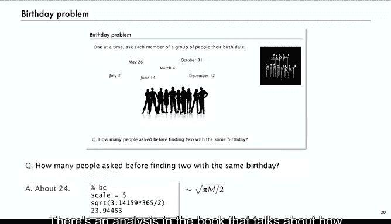

# 普林斯顿大学《算法分析｜Analysis of Algorithms》中英字幕 - P38：38_09_02_生日问题.zh_en - GPT中英字幕课程资源 - BV1YE421T7kf

Now we're going to look at a classical combinatorial problem called the birthday problem that you've probably heard in one form or another。

 but we'll look at it in the context of analytic combinatorics。

So the idea is that you have a group of people and one by one。

 you ask each member of their group their birth。And the question is， how many people should you ask。

 will you ask before you find two that have the same birthday？Well， by the time you get to 365。

 then you'll have to get and the next one will have to have the same birthday as someone else。

 but usually it'll happen much earlier， so the question is what can we expect on average。

 if say the birthdays are random？So a way to look at this as a ball and urn problem is just we've got am urns in this case it'd be 365 urns and we ask the birthday and a person goes into the corresponding urn and then so each ball goes into a random urn and then the question is how long until summer urn gets two balls so in this case the sixth one is where we stop。

So if the balls can randomearns， then the question is how long until what summer and gets two balls？

So let's look at how to analyze that using the symbolic method。

 so to do that we'll talk about a birthday sequence。

 so that's a word where no set has more than one element， so that is each。

Each urn has either no elements or just one， and so that's going to be the basis of the analysis and the first question is how many different birthday sequences are there？

So again， if so am is our parameter， that's the number of urns。

 we want to know the class of birthday sequences and we'll have a generating function for that class and again it's a string that has no duplicate letters or it's a word where everybody's got either zero or one occurrence。

So what's the construction for building birthday sequences well it's pretty simple， we have M urns。

 we have a sequence of them and every urn is either empty or has one element。That's the。

Directly construction for birthday sequences。So with the symbolic method。

 that translates immediately to the generating function for e goes to1 es to z sequence of M of them just raises that to the empty power。

So the EGF equation for birthday sequences is1 plus z to the M。

And then the counting sequence is a coefficient of n factorial in that。

 so it's sorry n factorial times coefficient is z to the n in that which is n factorial times m choose n。

 which the n factorial cancel， so it's n factorial or M minus n factorial or the product of mm minus1 down to M minus n plus1 that's the number of different birthday sequences。

So with that we can use to solve the birthday problem， so with this logic。

 so we just showed that the number of in character。

Words where no character is repeated is m factorial over m minus n factorial。

 so again n's got to be less than m in this but so that's the number that's what we just showed so thats if we divide by m to the n。

 that's the probability that no character is repeated in a random M word of length n it's a number that there were nones repeated divided by the total number possible。

Or another way to look at that is if we take them one at a time。

 that's the same as the probability that if we take a sequence of characters or throw a sequence of balls in the urn。

 it's the same as the probability that the first time we get a repeat position it's bigger than n。

Because probably the first end that there's no repeat is exactly that。

 so it's a probability that the first repeat position is bigger than n。So now if we just sum that。

 we get the expected position of the first repeat。Some and it only goes up to M because we're going to get a repeat by the time we get to M。

So that's a familiar sum， that's the reminisition Q function that we looked at in lecture4。

 and the result is squared of pi m over 2。Expected position of the first repeat is squared root of pi m over 2。

 and that's that analysis completes the analysis of the birthday problem。So。In our original problem。

 if we had ask people their birthdays or the serena 65 days in a year。

 how many people do you have to ask before finding two with the same birthday， well。

 you just have to compute squared root of pi times 365 over 2， and it's about 24。

So in a class of size 24， I've asked people one at a time， a class of bigger than 24， you got a。

A reasonable chance of finding the average number of people you have to ask before。

 finding two of the same birthdays is 24。There's an analysis in the book that talks about the。

How many you have to ask to have a 50% chance that you have up to the same birthday。

 it's about in the same range although that's a different problem。

So that's analytic combinators with words to take a look at the birthday problem。

