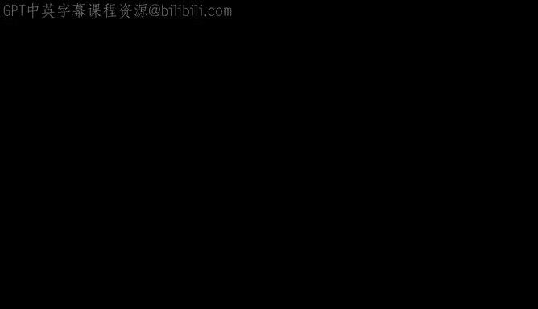
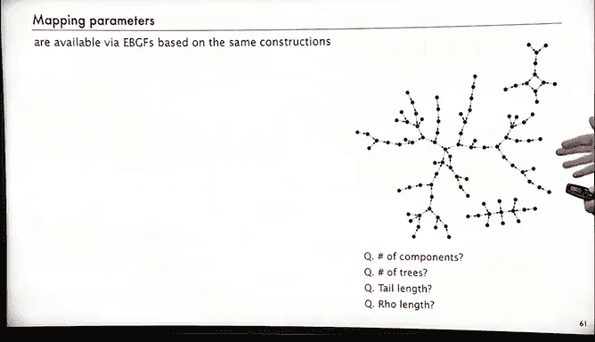
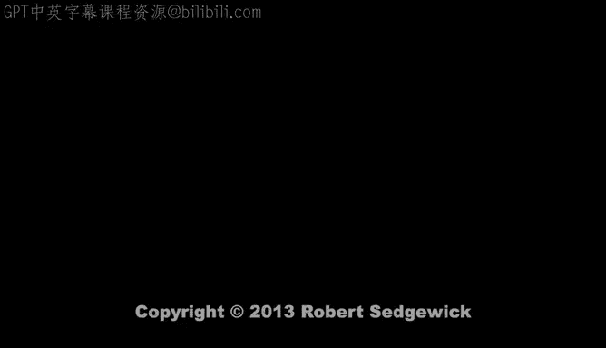

# 算法分析：P41：映射



## 概述
在本节课中，我们将要学习一种称为“映射”的组合结构。映射与许多我们已研究过的内容相关，并且是解析组合学中的一个典型范例。我们将从简单的凯莱树开始，逐步深入到更复杂的结构，如映射中的连通分量，并探讨其在实际应用中的意义。

## 凯莱树 🌳

上一节我们介绍了映射的基本概念，本节中我们来看看一个更简单的相关结构：凯莱树。

凯莱树是一种带标签、有根、无序的树。带标签意味着所有节点都有标签；有根意味着有一个特定的根节点；无序意味着我们不关心根节点子节点的顺序。

对于三个节点的凯莱树，共有九种不同的结构。例如，节点标签为 `1, 2, 3` 的树，其根节点可以是其中任何一个，但根节点子树的顺序不重要。

凯莱树的数量公式是一个经典结果：
```
凯莱树数量 = n^(n-1)
```
这个结果并非显而易见，我们将使用一种称为**拉格朗日反演**的技术来推导它。

## 拉格朗日反演定理 🔄

为了分析凯莱树和更复杂的映射结构，我们需要一个强大的数学工具：拉格朗日反演定理。

拉格朗日反演是计算函数反演的一种经典方法。它是一个重要的定理，在解析组合学中常作为从生成函数提取系数的“转换定理”。

**定理描述如下：**
设生成函数 `G(z)` 满足方程 `z = f(G(z))`，其中 `f(0)=0` 且 `f'(0)≠0`。那么，`G(z)` 中 `z^n` 的系数 `G_n` 为：
```
G_n = (1/n) * [u^(n-1)] ( (u / f(u))^n )
```
符号 `[u^(n-1)]` 表示提取 `u^(n-1)` 项的系数。

更一般的形式是，对于任意函数 `H(u)`，`H(G(z))` 中 `z^n` 的系数为：
```
[z^n] H(G(z)) = (1/n) * [u^(n-1)] ( H'(u) * (u / f(u))^n )
```

我们将在后续分析中直接应用这个定理。

## 应用：分析凯莱树 📊

现在，让我们应用拉格朗日反演定理来分析凯莱树。

凯莱树的类对应于带标签、有根、无序的树。使用符号方法，其构造是：一棵树是一个根节点连接到一个树的集合（顺序无关）。这直接翻译成指数生成函数方程：
```
C(z) = z * e^{C(z)}
```
这个函数被称为**凯莱函数**。我们可以将其重写为 `z = C(z) / e^{C(z)}`。这与拉格朗日反演的形式 `z = f(G(z))` 相符，其中 `f(u) = u / e^u`。

根据定理，`C(z)` 中 `z^n` 的系数 `C_n` 为：
```
C_n = (1/n) * [u^(n-1)] ( e^{u*n} )
```
计算 `e^{u*n}` 中 `u^(n-1)` 的系数，我们得到 `n^(n-1) / (n-1)!`。因此，`n` 个节点的凯莱树数量为 `n^(n-1)`，这与我们之前提到的公式一致。

## 映射的连通分量 🔗

上一节我们分析了孤立的树，本节中我们来看看映射的核心结构：连通分量。

一个映射的连通分量是一个“树的环”（cycle of trees）。也就是说，从任何节点出发，沿着箭头（函数值）前进，最终都会进入一个循环。整个连通分量由一个环和挂在环节点上的树（凯莱树）组成。

以下是使用符号方法和拉格朗日反演分析连通分量数量的步骤：

1.  **构造**：一个连通分量是凯莱树构成的环。
2.  **生成函数**：根据符号方法，环的构造对应于 `log(1/(1 - C(z)))`，其中 `C(z)` 是凯莱树的EGF。
3.  **应用拉格朗日反演**：我们有 `f(u) = u / e^u`（来自凯莱函数），并且我们关心的函数是 `H(u) = log(1/(1 - u))`。使用定理的扩展形式，我们可以提取系数。
4.  **结果**：经过计算，包含 `n` 个节点的映射中，连通分量的数量公式为：
    ```
    连通分量数量 ≈ n^n * sqrt(π / (2n))
    ```
    因此，一个随机映射是连通的概率约为 `sqrt(2π/n)`。

这个分析展示了如何将符号方法与拉格朗日反演结合，来研究复杂组合结构的性质。

## 完整映射与路径长度 🛤️

现在，我们来看完整的映射以及其中一个关键参数：路径长度。

一个完整的映射是连通分量的集合。因此，其生成函数是 `1 / (1 - C(z))`。应用拉格朗日反演可以验证，`n` 个节点上的映射总数确实是 `n^n`，这与直接计数（每个节点有 `n` 种选择）的结果一致。

**路径长度**是一个有趣的概念。对于映射中的一个给定起点，不断应用该映射函数（即 `x -> f(x)`），直到值首次重复，所经历的步数称为该起点的路径长度。在映射中，从任何点出发最终都会进入一个环，路径长度就是进入环之前走过的“尾巴”长度。

计算路径长度有一个著名的“弗洛伊德判圈算法”（龟兔赛跑算法），它不需要额外存储空间：
*   维护两个变量 `A` 和 `B`，初始值相同。
*   每次迭代，`A` 前进一步（计算一次 `f`），`B` 前进两步（计算两次 `f`）。
*   当 `A` 和 `B` 的值相等时，说明它们相遇于环中。相遇时的迭代次数与路径长度相关。



对于一个随机映射，平均路径长度的渐近公式是：
```
平均路径长度 ≈ sqrt(πn / 2)
```

## 实际应用：波拉德ρ因数分解算法 🔢

映射的研究并非纯理论，它在密码学和算法中有直接应用，一个著名的例子是**波拉德ρ因数分解算法**。

该算法用于分解大整数 `N`，其核心思想是：
1.  选择一个随机二次函数 `f(x) = (x^2 + c) mod N` 和一个随机起始值 `x0`。
2.  使用弗洛伊德判圈算法，迭代计算序列 `x_{i+1} = f(x_i)`，寻找值重复的循环。
3.  当找到满足 `gcd(|x_i - x_j|, N) > 1` 的一对值 `(x_i, x_j)` 时，就找到了 `N` 的一个非平凡因子。

**为什么映射分析与此相关？**
算法中迭代的函数 `f(x)` 行为类似于一个随机映射。虽然 `f(x)` 是确定性的，但由于模运算和随机起始值，其轨迹在统计上可被建模为随机映射。根据我们对随机映射的分析，其平均路径长度约为 `sqrt(πN / 2)`。因此，波拉德算法**期望在约 `sqrt(N)` 量级的步数内**找到一个因子，这比试除法（需要 `O(N)` 步）快得多。

这个例子生动地说明了，对映射等组合结构的数学分析，能够直接指导高效算法的设计与性能预测。

## 总结
本节课中我们一起学习了：
1.  **映射**的基本定义：一个从 `n` 个元素到自身的函数，对应一个有向图结构。
2.  **凯莱树**：作为映射的基础构件，其数量由公式 `n^(n-1)` 给出。
3.  **拉格朗日反演定理**：一个从生成函数提取系数的强大工具，我们用它分析了凯莱树和映射的生成函数。
4.  **映射的分解**：映射可分解为连通分量，每个连通分量是“树的环”。
5.  **路径长度**：在映射中迭代函数直到出现循环的步数，其平均值为 `sqrt(πn / 2)`。
6.  **实际应用**：以波拉德ρ因数分解算法为例，展示了映射分析在算法设计和密码学中的重要作用。



映射是一个迷人的组合结构，它将简单的概念（一个序列）与丰富的图论性质、深刻的解析方法以及实际的计算应用紧密联系在一起。