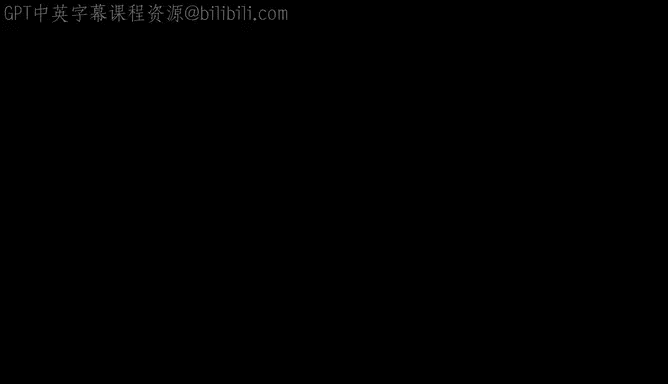
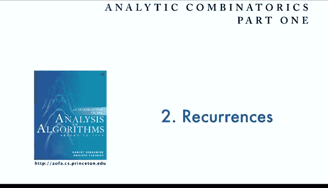

# 普林斯顿大学《算法分析｜Analysis of Algorithms》中英字幕 - P5：05_02_01_计算数值.zh_en - GPT中英字幕课程资源 - BV1YE421T7kf

Today we're going to talk about recurrence relations。

 which is a first step towards developing mathematical models for the performance of computer programs。

 As we saw when we covered the analysis of Quicksortt in the last lecture。

To begin we're going to look at the idea of using the computer to compute values of recurrence relations。

 this is very important for us as unlike many other mathematical disciplines。

 we have the ability to be able to quickly check our answers and maybe develop hypotheses about the answers that we're looking for。

So， but first of all， what is a recurrence， Well， it's simply defined。

 It's an equation that defines a sequence recursively。

That's easily understood by computer scientists， and just as a simple example。

 here's the Fibonacci numbers recurrence， which is familiar to mathematicians as well。

So the recurrence relation is f sub n equals f sub n minus1 plus f sub n minus2。

 so it's defined recursively， each term in the sequence is defined in terms of previous terms in the sequence。

But it's very important as every programmer knows， in a recursive program you need to specify the initial conditions。

 also in a recurrence relation， you need to carefully specify initial conditions and make sure that things are defined for all values of n。

In the case of the Fibonacci numbers， we define f0 to be 0 and F1 to be 1。

 and then insist that the equation hold for n greater than or equal to 2。So F sub2 is0 plus1 is1。

 F sub 3 is 1 plus 1 is 2 and so forth。 we get each term in the sequence by adding the previous two。

So that's an example of a recurrence relation。So now the question that naturally comes up is if we're given the recurrence relation。

 can we come up with a simple formula for describing FN as a function of n as a simple function of n。

 that's the kind of question that we're going to be addressing。Now， as we saw in the last lecture。

 recurrences directly model costs and programs。 For example， we talked about Quicksort。

 and it's a much more complicated recurrence， but it still has the same property that every term in the sequence。

 In this case， the sequence defines the running time of Quick sort。

 the number compares taken by Quicks。 Every term in the sequence is defined in terms of earlier terms in the sequence。

In this case the result is not integers and you can work out that C00 is specified， C1 is 2。

 and so forth， that's the number of comparisons used by Quicksortt to sort n elements and we remember we derive the recurrence from the program。

 it's a mathematical model of the running time of the program specifically the number of comparisons taken to sort a randomly ordered sequence of array of n distinctist elements。

Now a common sense rule anytime you're addressed faced with a recurrence nowadays is just to use the computer to compute values to see if you can understand what the values are and what's going on it's even better to do that before doing the math as it might tell you something that might be difficult to discover with math and it's so easy to do so first thing you might say is why not use a recursive program while we teach now in every elementary programming course that you don't want to do this it's a very bad idea to try to compute values of a recurrence like this with a recursive program because it takes exponential time。

That is to compute F of 50， we have to compute 49 and 48 to compute 49， 48 and 47 and so forth。

 and if you look at this table， you'll see that we're recomputing values all the time F of 48 twice F of 47。

 three times F of 46， five times and so forth， actually it takes exponential time to compute this so it's not going to complete even for F50 it's much much too slow。

So it would be nice to think about using a recursive program but we don't do that in practice instead what we do is save all the values in an array and so we'll need an array entry for every value that we want to compute。

 but nowadays that's no problem， so in this case if you want to compute F of50 and make an array of size 51。

 set the first two values according to the initial conditions and then simply go ahead and compute for every value in the sequence。

 its value from the previous two values。So that's a common sense way to deal with any recurrence。

 just use an array。Now。What we'll do is maybe a little more complete and I don't want to make this a course on modern programming techniques but I might as well use modern code so that we can leverage off of all the code that we've developed for our algorithms and introduction of programming and Java courses so if you go to the algorithm's fourthth edition book site you'll see to get started link that you can go ahead and use to download some standard library packages that are available for average programsrs to write these kinds of programs using a modern model this is not required but many people will be familiar with this model so it's the one that I'm going to use for the code that I cover in this course and this code is easily translated to other environments and languages so I'm not going to dwell on that。

So nowadays in a modern approach， here's this code that goes ahead and fills up an array with size N or size maxN with the Fibonacci numbers but this is a modern approach where we use a data type。

 and the client program will go ahead and build this array with a constructor and then ask for values out of the array。

 again this is not the place to talk about details of programming with data types but this is a very straightforward way to approach this problem and the reason that we use it is that we can reuse code or write code that we can use for different sequences just by saying that the only way that we're going to evaluate with。

deal with what the sequence is is to use this eval function to get out of particular value。

 and then we can write code that will print out values for any sequence， so this code， for example。

So again， in this case with this code not that much code。

 we want to get the first 15 Fibonacci numbers that print it out for us。

 and you can in your own programming environment do whatever you want to get that result and that's an exercise worth doing。

Now more interesting， let's look at the quick sort recurrence now remember we did some algebra to show that we can make the quick sort recurrence a very simple linear recurrence rather than the one involving the sun and so this is the corresponding code for the quick sort recurrence to using that version of the recurrence we can。

In the constructor， create an array， fill it up with the first n values just using that recurrence。

 so it's just dividing by n and then aval will give us the value of that recurrence。

 so the same code will print out the first 15 values of the quick sort sequence in that way。

So that's a good first start so we can get some idea of what these numbers are。

 but actually often what we're want to do and I'll have plenty of examples。

 some examples in this lecture is we just want to plot the initial values。

 we want to draw the curve to get some idea。And so this code here uses our standard library for drawing things within a window on your computer to do the plot and I'll have some examples later on that use this kind of code to just draw the value of each recurrence and on the X axis and the value of the recurrence on the Y axis scale to the largest value。

 that's what this code does， so in the case of quick sort if we use a call on this show method instead of printing out the values then you get the curve like that。

 which is the curve for N log N in this case。So that type of code is a good starting point and if you don't want to use my Java code。

 it's definitely worthwhile for you to use whatever programming environment you're comfortable with to be sure that you can compute values of any recurrence efficiently and also to be able to develop plots like this。

 and you'll get a good feeling for why we want to do that in just a minute。

So that's computing values of a recurrence。

