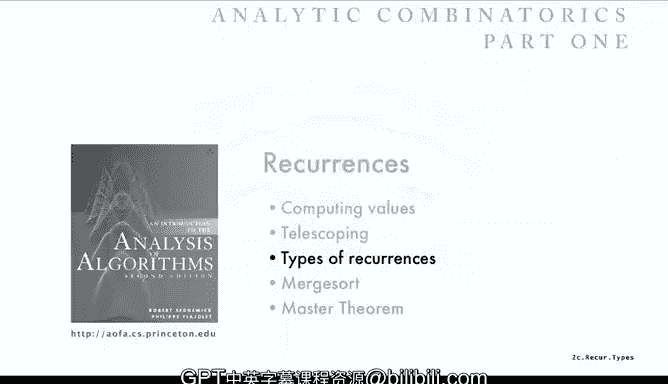
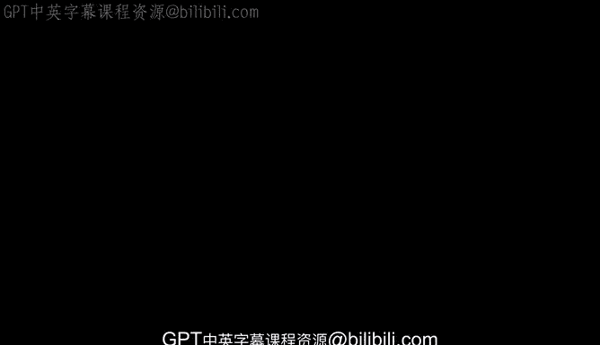

# 普林斯顿大学《算法分析｜Analysis of Algorithms》中英字幕 - P7：07_02_03_递归关系类型.zh_en - GPT中英字幕课程资源 - BV1YE421T7kf

Next， we'll take a look at various different types of recurrences that are more complicated than the linear first order that we just saw just to get some idea of the types of things that can arise when we're faced with recurrence relation in general to solve。

So simplest one we just looked at is a so called linear first order recurrence。

 linear just means that we don't multiply a sub n times a and a minus1 or anything like that we just use。

Coefics that are not evolving our unknowns。And first order means that on the right hand side。

 we just have one term A minus1。So here's nonlinear where we're dividing a minus1 into a constant。

 so that's not just a linear combination of it， it's dividing。

So it's first order non nonlinear and actually we'll talk about that one。

 So here's second order linear。Its linear combination of AN minus1 and AN minus2。

 the coefficients can involve N's and constants， but not multiplying or dividing with our unknowns。

This is an example of a nonlinear second order where it's a function of AN minus1 and A minus2。

 but we're multiplying and taking square roots or whatever else。

 these types of things can be very're easy to write down and they're even easy to write computer programs to compute values。

 but doing the math behind some of these can be quite a challenge。So variable coefficients。

 that's the one that we started with where we don't use constants。

 but we do use functions of n and those arise a lot in the analysis of algorithms。

And then there's higher order which go back way further than just the first two terms， for example。

 the quick sort is an example of that where it's a full history， that is every value。

 every term in the sequence depends on all the previous terms in the sequence。That's a full history。

 and then there's a special case that arises quite often in the analysis of algorithms and that's the so-called divide and conquer where a sub N depends on terms。

 say about halfway back in the sequence and well quite a bit to say about that in just a bit and those are very important in the analysis of algorithms。

So what about nonlinear first order recurrences Well those are familiar actually to people who do numerical calculations and a very famous example of that is Newton's method for computing roots of functions and I'll just do an example for computing the square root of  two。

Newton's method says to in order to compute the square root of two。

 what you do is start with some initial estimate， like start with two。

And then take the average of your current value and two over your current value and use that as your next estimate。

 that's defining a sequence and you can see from this formula if you get close to the square root of  two。

 where if you get exactly the square root of two， two over the square root of two is square root of 2 plus square root of 2 divided by  two is equal to square root of two so you should converge on the value of square root of  two。

 that's Newton's method。And I can write the code to compute the square root of2 this way。

 just another sequence in the code that I gave for Quickor Fibonacci numbers。

 and if you print out values for that you see it gets very close to the square root of2。

 actually very quickly。It's actually got quadratic convergence。

 the number of significant digits doubles on each iteration。

 it's a very efficient way to compute roots and it applies to lots of other functions。

 not just square root。So that's nonlinear first order recurrence and again。

 doing the math to prove that this happens is certainly the analysis of algorithms。

 it' like analyzing this algorithm， but it's of a nature。

 the recurrences a quite different nature than the kind that we're going to largely be considering in this course。

So high order linear recurrences those are something that come up a lot and in the next lecture we're going to show a systematic solution that uses generating functions for solving recurrences like this and then actually later on we're going to examine them from even more general point of view。

 but here's an example， so this is a。Second order， linear recurrence with constant coefficients。

 like the Fibonacci numbers。And so the idea is that it's hard to telescope this one。

 you could try to telescope it， but very soon you'd have a lot of terms and maybe not so much of an idea of where it's going to go so easily。

So one way to see how such an equation can be solved， and again， this is kind of a magic step。

 but I'll show next lecture how this becomes systematic。But is to say， well。

 I think that it's going to grow like some number to the anth power。So I'm going to say。

 let's say that A N equals x to the N。So if AN is going to be equal to x to the n。

 then it would have to be the case that we have x to the n equals 5 x to the n minus1 minus6 x to the n minus2。

And that kind of equation is a good thing for us because it means we can get rid of the n by just dividing by x to the n minus2。

So now we've just got a quadratic equation and we've known since middle school how to solve quadratic equations。

 so that factors to x minus2 times x minus3， and it means that。

Both2 to the n and3 to the n are solutions to this and actually it's not too much of a step to see that the final solution must be of the form a sub n equals some constant times 3 to the n plus some other constant times 2 to theN and again I'm not going to go through the proof of these posts because I'll give a very systematic way for doing it in just the next lecture。

But you can believe from these manipulations that that's what's got to happen and so now what we have to do is find those two constants Well those two constants are easy to find because the initial conditions we have two constants that we need and we have two initial conditions so we can just plug in for a0 and A1 and it says that we must have that0 which is a0 is equal to c0 plus c1 and that1 which is a1 must be3 C0 plus 2 c1。

So those are simultaneous equations in C0 and C1， and then the solution is C0 equals 1。

 C1 equals minus1，1 plus minus1 is0，3 times 1 plus 2 times minus1，3 minus2 is a 1。

 and then that's the solution。A sub n equals 3 to the n minus 2 to the n is a solution to that equation。

And plug it in to check that that's the answer， but that definitely works in this case。

 and that kind of technique is going to work for any second order。

 linear recurrence with constant coefficients， like the Fibonacci numbers。

Fac number is the same setup， but the coefficients are both1。

 so then we get postulate and a equals x to the n， we get xm minus1 x minus2。

 which gives us this quadratic equation， x squared minus x minus1 equals 0。

Solution to that using the quadratic equation minus b plus minus squared of b squared minus4AC is going to have a squared to 5 in it。

 b squared is14 a is minus4 minus4 ACs plus 4，1 plus4 is5 and so it works out from the quadratic equation that that equation factors in terms of those two roots。

 one plus the squared to5 over 2 and one minus the squared to5 over2 in this one one plus the squared to5 over  two is very famous number known as the golden ratio and maybe will come back to that at some point has all kinds of interesting properties but in the current context is just a root of that quadratic equation。

So again， just as before， the solution must be linear combination of these two terms。

 C0 times v to the n plus C1 times v hat to the N。And how do we find out those coefficients same way we just plug in a0 equals0 has to be0 plus c1 and a1 equals 1 has to be P C0 plus Phi hat C1 solve those two equations and you find out that the C0 is1 over squared of5 and c1 is minus1 over square root of 5 and that's a solution so that's what we're after is given the recurrence we have a simple equation for the n term that's solving the recurrence。

And again， we can do that systematically for any such recurrence。

 and this will come up another couple of times in the next few lectures。

So this procedure in a sense it amounts to an algorithm。

 so that is given any recurrence we can go through this and come up with a solution and that's ideal actually there's one case that we didn't consider and that is what if the roots are the same。

If the roots are the same， then we get an n times the root to the nth term in there and that's discussed in the text。

 but I'm not going to talk about now because again。

 we're going to do this with generating functions next time。

So what you wind up is needing to compute roots of equations quickly in this extent to higher order recurrences and so that's an example nowadays where you use a symbolic math package to go ahead and compute the roots and this is computing these with sage but you can use mathematic or maple or other packages not to go ahead and compute roots that's where you do it nowadays so we have an algorithm for solving。

嗯。It higher order recurrences with constant coefficients。 and we'll develop this more fully。

 more fully later on。The other point that I didn't mention is the roots might be complex， and again。

 rather than go through it in this context， we'll see what happens when we talk about it in the contents of generating functions。

Okay， the last thing that I just want to mention is that a lot of times we get recursive programs that map directly to recurrences of the divide and conquer style and those are not traditionally found in studies of recurrence in mathematics。

 that's something that's really brought to the table by computer algorithms and we'll look at those in some detail later in this lecture。

 that's generally the types of recurrences that come up in the analysis of algorithms。

