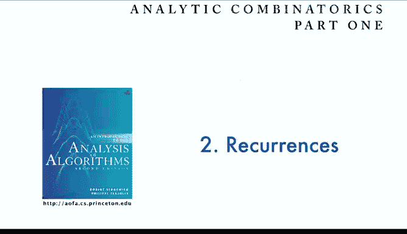
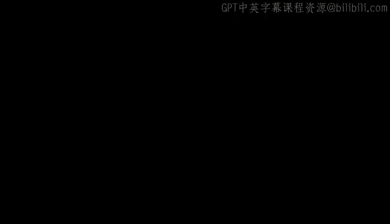

# 算法分析：09：主定理 🧮

在本节课中，我们将学习分治算法分析的核心工具——主定理。我们将了解主定理如何描述一类特定递归关系的渐近解，并通过经典算法实例来掌握其应用。

---

## 概述

主定理是分析分治算法时间复杂度的强大工具。许多高效算法都遵循一个通用模式：将规模为 `n` 的问题分解为若干子问题，递归求解，最后合并结果。主定理为这类递归关系提供了简洁的渐近解。

## 分治算法的一般形式

上一节我们介绍了递归关系的求解方法，本节中我们来看看分治算法的标准递归形式。一个典型的分治算法包含以下步骤：

1.  **分解**：将规模为 `n` 的问题划分为 `α` 个规模为 `n/β` 的子问题。
2.  **解决**：递归地求解每个子问题。
3.  **合并**：将子问题的解合并，得到原问题的解。此步骤会产生额外的开销。

合并步骤的额外开销通常可以表示为 `Θ(n^γ * (log n)^δ)` 的形式，其中 `γ` 和 `δ` 是常数。我们主要关注增长阶，因此忽略常数因子。

以下是几个经典的分治算法示例：

*   **归并排序**：`α = 2`， `β = 2`， 额外开销为 `Θ(n)`， 即 `γ = 1`， `δ = 0`。
*   **Batcher排序网络**：类似于归并排序，但额外开销为 `Θ(n log n)`， 即 `γ = 1`， `δ = 1`。
*   **Karatsuba乘法算法**：将大整数乘法分解为3个 `n/2` 规模的子问题，额外开销为 `Θ(n)`， 即 `α = 3`， `β = 2`， `γ = 1`， `δ = 0`。
*   **Strassen矩阵乘法算法**：将矩阵乘法分解为7个 `n/2` 规模的子问题，额外开销为 `Θ(n^2)`， 即 `α = 7`， `β = 2`， `γ = 2`， `δ = 0`。

这些算法都遵循相同的递归模式，其递归关系可以写作：
`T(n) = α * T(n/β + O(1)) + Θ(n^γ * (log n)^δ)`

## 主定理的三种情况

主定理的解取决于额外开销的指数 `γ` 与 `log_β(α)` 之间的关系。`log_β(α)` 可以理解为递归树中叶节点数量的对数阶。

以下是主定理的三种情况：

**情况一：叶子成本主导**
如果 `γ < log_β(α)`，意味着合并开销的增长速度慢于子问题数量的增长速度。总运行时间由递归树底层的叶子节点总成本决定。
解为：`T(n) = Θ(n^(log_β(α)))`

**情况二：各层成本平衡**
如果 `γ = log_β(α)`，意味着合并开销的增长速度与子问题数量的增长速度相平衡。递归树每一层的总成本大致相同。
解为：`T(n) = Θ(n^(log_β(α)) * (log n)^(δ+1))`

**情况三：根成本主导**
如果 `γ > log_β(α)`，意味着合并开销的增长速度快于子问题数量的增长速度。总运行时间由递归树顶层的根节点成本决定。
解为：`T(n) = Θ(n^γ * (log n)^δ)`

## 应用示例

让我们将主定理应用于之前的算法示例：

*   **归并排序**：`γ=1`， `log_2(2)=1`， 属于情况二 (`γ = log_β(α)`)，且 `δ=0`。因此 `T(n) = Θ(n log n)`。
*   **Batcher网络**：`γ=1`， `log_2(2)=1`， 属于情况二，且 `δ=1`。因此 `T(n) = Θ(n (log n)^2)`。
*   **Karatsuba乘法**：`γ=1`， `log_2(3)≈1.585`， 属于情况一 (`γ < log_β(α)`)。因此 `T(n) = Θ(n^(log_2(3))) ≈ Θ(n^1.585)`， 优于普通算法的 `Θ(n^2)`。
*   **Strassen算法**：`γ=2`， `log_2(7)≈2.807`， 属于情况一 (`γ < log_β(α)`)。因此 `T(n) = Θ(n^(log_2(7))) ≈ Θ(n^2.807)`， 优于普通算法的 `Θ(n^3)`。

## 总结与拓展

本节课中我们一起学习了分治算法的主定理。主定理通过比较合并步骤的代价 (`γ`) 与子问题增殖因子 (`log_β(α)`) 之间的关系，为我们提供了一种快速确定算法渐近复杂度的有效方法。

主定理存在许多更一般的版本，可以处理合并代价更复杂的函数形式。在算法理论中，理解这些渐近增长率对于比较算法性能和探索计算极限至关重要。近期，通过解析组合数学的方法，甚至可以对解中的振荡行为给出完整的描述。

---

## 练习

为了巩固对本节内容的理解并为后续课程做好准备，请完成以下练习：

**练习 2.17：2-3树**
Yao的一篇论文证明了2-3树的某个性质，该性质由以下递归式描述。请尝试求解此递归式。
`A_{2n} = A_n + A_{n-1} - 1/(2n) * (A_{n-1} - A_{n-2})` （需根据原文上下文理解具体形式）
这是一个复杂的一阶递归，其解具有实际意义。

**三分治算法分析**
考虑递归式 `a_n = 3 * a_{floor(n/3)} + n`。这类似于将问题分为三部分进行归并排序。
请使用分析二分治（归并排序）时的方法论：
1.  探究该递归式中可能存在的周期性。
2.  分析此类算法的性能表现。
3.  思考如何比较此类三分治算法与二分治算法。

建议阅读教材中关于递归关系的章节，完成2-3树的练习，并尝试绘制序列值以辅助分析三分治的情况。这些工作将帮助你扎实掌握目前已学内容。