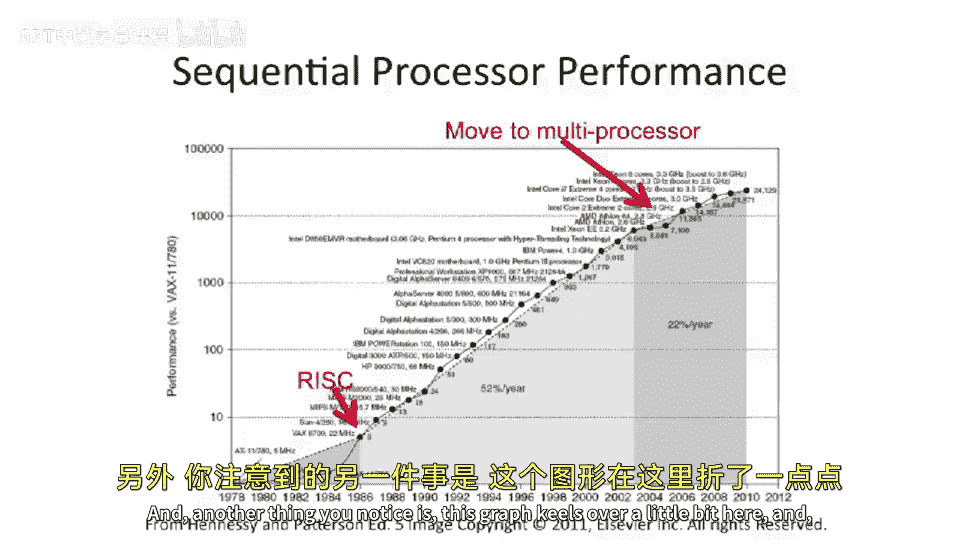

# 003：课程动机与概述

在本节课中，我们将要学习计算机体系结构的基本定义、它在技术栈中的位置、其历史演变以及驱动其发展的核心动力。我们将看到，计算机体系结构是连接人类应用需求与底层物理实现的关键桥梁。

## 什么是计算机体系结构？🤔

计算机体系结构的目标是，将人类想要完成的应用（例如计算电子表格、玩视频游戏、播放音乐）映射到物理世界中去实现。

这里的“物理”指的是构成世界的粒子及其相互作用，例如光子的运动。我们需要将人类的需求翻译成物理世界能够执行的操作。

然而，从应用直接到物理实现存在一个巨大的鸿沟。物理世界充满了粒子和机械系统，如果没有一定层次的抽象，直接从应用跳到物理实现是非常困难的。

从最广义上讲，计算机体系结构试图建立一系列抽象层和实现层，以弥合这个鸿沟。通过构建更小的抽象层，我们可以解决部分问题，而无需在中间环节改动所有东西。这样，即使物理技术或应用需求发生微小变化，我们也能复用之前完成的大量工作。

计算机体系结构就是研究这些层次，并探索如何将物理实现转化为人类所需应用的学科。

## 抽象的必要性与现代计算层次 🏗️

在自然界中，直接从应用跳到物理的例子很少。指南针是一个巧妙的设备，它直接将物理现象（地磁场）转化为应用（指示方向）。书籍或许也算一个例子，但除此之外，人们通常会在中间构建大量的抽象层。

另一个要点是，我们需要高效地利用制造技术。这意味着当底层物理技术发生变化时（例如晶体管尺寸缩小，或从硅材料转向砷化镓），我们希望仍然能够复用多年来在其他层次上完成的工作。

让我们看看现代计算系统中的抽象层次：

1.  **物理层**：粒子相互作用的基本物理定律。
2.  **器件层**：由物理定律构建出的器件，例如各种晶体管（MOSFETs, BJTs）。
3.  **电路层**：由器件构建出更大的电路。
4.  **逻辑门层**：由电路构建出逻辑门。
5.  **寄存器传输语言层**：即我们的硬件描述语言（如Verilog/VHDL）编码层次。
6.  **微体系结构层**：如何具体实现一个芯片。
7.  **指令集体系结构层**：提供可移植性，是本课程的核心之一。
8.  **操作系统与虚拟机层**
9.  **编程语言层**
10. **算法层**
11. **应用层**：最终应用程序员所在的层次。

在本课程中，我们将主要关注中间这三个层次：**指令集体系结构**（有时称为“大A”计算机体系结构）、**微体系结构**（有时称为计算机组成）以及**寄存器传输语言**。我们也会略微涉及上下相邻的层次，例如操作系统、虚拟机的影响，以及底层技术和逻辑门如何影响计算系统。

## 体系结构的动态性与反馈循环 🔄

计算机体系结构是不断变化的，因为不同的约束条件和应用需求在变化。

新的应用（例如20年前不存在的智能手机）会提出新的需求，这些需求反过来会推动体系结构的改变。例如，如果需要大量视频处理，就可能增加专门的视频处理指令。

同样，技术约束也会自下而上地推动变革。例如，晶体管尺寸缩小可能让晶体管本身更快，但互连线却可能变慢，这就会影响计算机体系结构的设计。

很多时候，新技术使得新的体系结构成为可能。例如，晶体管数量突然翻倍，使得以前不切实际的微体系结构设计变得可行，因为可以在单芯片上集成更多计算单元。

重要的是，计算机体系结构并非在真空中进行。它实际上会向上和向下反馈，影响技术的研究方向以及可能实现的新应用。计算机体系结构设计师在这个抽象层栈中处于关键位置，能够向上和向下施加影响，而不仅仅是被动接受给定的技术，尽管这可能需要数年时间。

## 历史视角：从真空管到无处不在的计算 📜

为了更具体地了解本课程的内容，让我们通过一点历史来展开。

以普林斯顿为例，我们回顾上世纪40年代末50年代初的计算机。下图是IAS机（高等研究院机器），由约翰·冯·诺依曼设计，大约在1952年于普林斯顿建成。

这台机器使用**真空管**建造。在晶体管出现之前，这些像灯泡一样的玻璃管内都有可以开关的部件，其功能与晶体管类似。事实上，在真空管之前，人们甚至使用**机电继电器**（例如老式转盘电话中的机械开关）来建造计算机。更早之前，还有纯**机械系统**，如机械加法器。

从50年代快进到今天，计算的面貌已截然不同。IAS机有一个房间那么大，而如今，计算设备形态多样：传感器网络节点、高级相机、智能手机、移动音频播放器、笔记本电脑、自动驾驶汽车、大型服务器、游戏机等等。路由器、无人飞行器、GPS设备、电子书、平板电脑、机顶盒……这个列表还在不断延长。

我想强调的是，计算机体系结构拥有非常丰富的历史，并且这段历史仍在延续，与今天息息相关。我们研究的并非无人问津的过时学问。虽然人们可能不再像过去那样一味追求更快的台式机，但他们仍然想要更快的智能手机、随时可用的语音识别，或者在科学应用中模拟以前无法处理的复杂健康系统。因此，计算机体系结构在今天依然非常重要。

## 性能增长曲线与核心挑战 📈

下图来自 Hennessy 和 Patterson 的《计算机体系结构：量化研究方法》，它揭示了计算机体系结构中一个非常根本的、驱动我们行业发展的现象。

这是一个对数坐标图，展示了不同处理器设计随时间推移的性能变化。我们可以看到，这大致是一条直线，而在对数坐标上的直线意味着**性能呈指数级增长**。

这种指数级增长来自两方面：一是底层**晶体管技术**的不断进步，二是**计算机体系结构**的不断改进。需要指出的是，即使晶体管变得更好，很多时候我们只是获得了更多的晶体管，而非晶体管本身指数级地变快。计算机体系结构设计师的任务，就是找出如何将大量增加的晶体管转化为更高的性能。

这通常被称为**摩尔定律**。戈登·摩尔最初指出，每18到24个月，以相同成本能获得的晶体管数量将翻倍。人们后来常将其理解为计算机性能每年翻倍，但这并非原意。

有趣的是，如果追溯到晶体管技术之前，将真空管和继电器技术的数据也画在这张图上，它们大致也符合这条指数增长曲线。

## 转折点：RISC与多核时代 ⚡

图中有两个转折点值得关注。

第一个转折点（图中斜率略有变化）发生在**精简指令集计算机**（RISC）被引入时，这带来了一次性能提升。

第二个更明显的转折点（图中曲线在此处趋于平缓）是我们本课程将重点讨论的。大约在2003年至2007年间（常以2005年为标志），**单线程程序的顺序性能**增长开始遇到严重瓶颈。

然而，处理器的整体性能至今仍在继续提升。这是因为我们转向了**多核处理器**（单芯片上集成多个核心）。人们希望，通过有效地**并行化**我们的程序，整体性能的增长曲线能够延续下去，而不是像顺序性能那样趋于平缓。如果计算机突然停止变快，对整个计算机体系结构领域和计算产业都将是巨大的打击。

## 总结 🎯

本节课中，我们一起学习了计算机体系结构的核心定义：它作为连接人类应用与底层物理实现的桥梁，通过构建一系列抽象层来解决巨大的语义鸿沟。我们回顾了从物理层到应用层的现代计算层次，明确了本课程将聚焦于指令集架构、微体系结构和寄存器传输语言。我们还看到，体系结构是动态发展的，受到应用需求自上而下和技术约束自下而上的双重驱动，并在此过程中形成反馈循环。通过历史视角，我们了解了计算技术从真空管到无处不在的演变。最后，我们分析了驱动行业发展的性能指数增长曲线（摩尔定律），并指出了当前时代面临的核心挑战：顺序性能增长放缓与向多核并行计算的转型。理解这些动机，为我们深入学习计算机体系结构的具体原理和技术奠定了坚实基础。