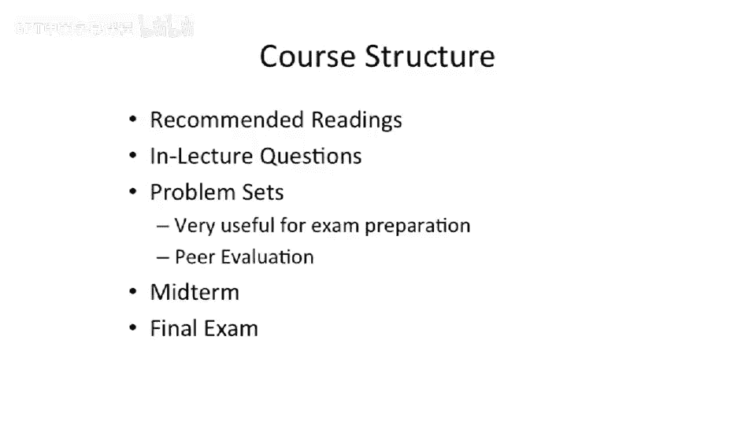

# 004：课程结构与内容概述

在本节课中，我们将学习《计算机体系结构》课程的整体结构与核心内容。我们将了解课程的组织形式、评估方式，并对比计算机组成原理课程，明确本课程将探讨的现代高性能处理器设计的两大核心思想。

## 课程结构

课程包含推荐阅读材料、课堂提问、若干次作业、一次期中考试和一次期末考试。

以下是课程评估的具体组成部分：

*   **推荐阅读**：提供额外的学习资料。
*   **课堂提问**：在视频或讲座中会出现互动问题。
*   **作业**：学期中将布置若干次作业。这些作业对于复习和备考非常有用。掌握作业内容将使考试相对容易。由于许多问题具有开放性，评分可能会采用人工评阅方式。
*   **考试**：包含一次期中考试和一次期末考试。

关于课程协作，需要明确以下原则：

*   **鼓励协作**：鼓励讨论课程的整体概念和思想。
*   **独立完成**：作业、期中考试和期末考试必须独立完成。禁止讨论具体的考试题目或作业问题本身。例如，可以讨论缓存的工作原理这一概念，但不能协作解决某次作业中具体的缓存题目。

## 课程内容：从基础到前沿

上一节我们介绍了课程的组织形式，本节中我们来看看课程的具体技术内容。首先，让我们对比一下你可能已经学过的计算机组成原理课程。

在计算机组成原理课程中，你学习了如何构建一个基础处理器。例如，下图展示的伯克利RISC-I处理器：

这是一个包含约5万个晶体管的两级流水线处理器。你应该已经掌握了以下基础知识：
*   基本的缓存概念
*   流水线技术
*   内存系统的基本知识
*   数字逻辑的工作原理

**对比之下，本课程的目标是学习如何设计尖端的现代微处理器。**

我们将学习如何设计类似下图所示的英特尔酷睿i7处理器：

这款处理器包含约7亿个晶体管。从性能和复杂度来看，组成原理课程中的小型处理器（上图中的小方框）与现代大型高性能处理器（酷睿i7）的差距，就如同小方框与整个大图的对比。本课程将聚焦于构建大型、高性能的处理器。

## 高性能处理器的两大核心思想

在深入课程内容列表之前，我们先简要探讨实现处理器高性能的两大核心思想。

1.  **利用并行性**：发掘程序中的并发性，利用更多晶体管同时执行更多任务，从而加速计算系统。并行性有显式和隐式之分。
    *   **指令级并行** 就是一种完全隐式的并行，程序员无需做任何额外工作。

2.  **减少工作量**：通过优化，减少执行任务所需的步骤或组件。
    *   **软件系统优化**：例如，编译器优化（如GCC的 `-O3` 选项）可以移除冗余或无用的指令。
    *   **硬件系统优化**：缓存就是一个典型例子。它将数据放置在离处理器更近的位置，减少了访问主内存的漫长等待，本质上就是“减少了取数据所需的工作量”。

本课程将围绕应用这两大思想展开。

## 课程技术内容详解

现在，让我们深入本课程将涵盖的具体技术内容，并将其归类到上述两大思想中。

以下是课程的核心技术模块：

*   **指令级并行**：这是课程前半部分的重点。我们将学习超标量处理器（能同时执行多条指令）和超长指令字处理器，并探讨如何构建深度流水线处理器以挖掘流水线并行。
*   **高级内存与缓存系统**：这部分主要关于“减少工作量”。我们将研究如何构建能将数据拉得更近、或具有更高带宽的内存系统，并探讨其中的实现问题。
*   **数据级并行**：这部分涉及更显式的并行。我们将讨论向量计算机和图形处理器单元。
*   **显式线程级并行**：这是课程后半部分的重点。我们将学习多线程技术、多处理器系统（多芯片、多核、众核系统）以及如何互连这些处理器。

课程内容大致按以下节奏展开：前三分之一聚焦指令级并行；中间三分之一讨论缓存和数据级并行；最后三分之一深入线程级并行。

## 总结

本节课中，我们一起学习了《计算机体系结构》课程的结构与核心内容。我们明确了课程包含作业与考试，并理解了独立完成与协作讨论的界限。更重要的是，我们对比了基础处理器设计与现代高性能处理器设计的差异，并掌握了驱动性能提升的两大核心思想：**利用并行性**和**减少工作量**。后续课程将围绕指令级并行、高级缓存、数据级并行和线程级并行等具体技术，深入探讨如何应用这些思想来设计复杂的现代微处理器。