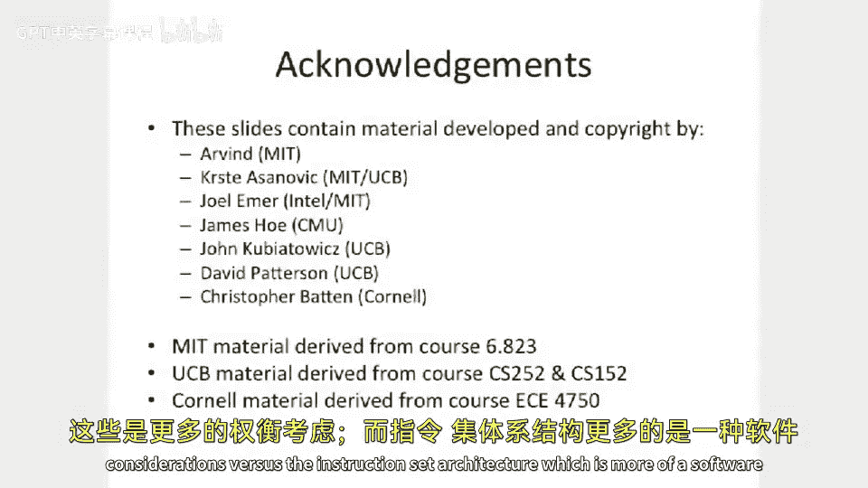

# 005：架构与微架构 🏗️

在本节课中，我们将学习计算机体系结构中的一个核心概念：**架构**与**微架构**的区别。我们将探讨什么是指令集架构，什么是微架构，以及它们之间的关系和设计权衡。

---

## 架构与微架构的定义

上一节我们介绍了课程概述，本节中我们来看看架构与微架构的基本定义。

**架构**，有时也称为**大A架构**或**指令集架构**，是提供给软件的一个抽象层。它定义了程序员可见的状态、基本操作以及机器的执行语义，旨在保持长期稳定。

**微架构**，也称为**组织**，关注的是如何具体实现一个给定的指令集架构。它涉及各种设计权衡，如性能、功耗、成本等。

计算机体系结构的核心是关于**权衡**。在架构层面和微架构层面做出的不同设计决策，会相互影响，最终决定处理器的特性。

---

## 指令集架构的组成

指令集架构为程序员提供了一个抽象的机器模型。它主要包含以下几个部分：

以下是构成指令集架构的核心要素：

1.  **程序员可见状态**：例如，机器有多少内存、有多少寄存器。
2.  **基本操作**：即**指令**。它定义了计算机可以执行的基本操作及其精确语义。例如，加法指令 `ADD` 的语义可以描述为：`R1 = R2 + R3`。
3.  **执行语义**：不仅包括指令如何执行，还包括整个机器的行为，例如如何处理I/O中断。
4.  **数据类型与字长**：定义了处理器操作的基本数据单元的大小和类型。例如，是操作8位的字节、32位的字，还是64位的双字。数据类型也包括如浮点数这样的复杂格式。

---

## 微架构的权衡示例

理解了指令集架构是什么之后，我们来看看在实现它时，微架构层面可以进行哪些不同的设计。

以下是一些在微架构层面常见的权衡与设计选择：

*   **流水线深度与数量**：处理器是单流水线还是多流水线（如6路）？
*   **芯片面积与功耗**：芯片的硅片面积多大？峰值功耗是多少？
*   **执行顺序**：指令是按程序顺序执行（**顺序执行**），还是可以打乱顺序执行以挖掘并行性（**乱序执行**）？
*   **数据通路宽度**：对于一个64位的加法器，是直接用64位全加器实现，还是用多个8位加法器通过微序列操作拼接而成？

这些不同的选择，使得同一指令集架构（如x86）可以有高性能的桌面版处理器和低功耗的移动版处理器等多种实现。

---

## 历史背景：为何区分架构与微架构？

这种区分并非凭空产生，而是软件发展的需求推动形成的。

在20世纪40年代末到50年代初，软件主要用汇编语言或机器码编写。到了50年代中期，随着高级语言（如1956年的Fortran）以及汇编器、加载器、编译器等一系列工具的出现，程序的可移植性变得重要。

当时，IBM有多个互不兼容的产品线（如用于科学计算的701和用于商业计算的1401）。为了统一软件生态，同时又能为不同市场（科学计算、商业计算）提供不同成本/性能的硬件，IBM在60年代提出了**IBM System/360**。这是第一个被明确设计为**指令集架构**的典范。它定义了一个统一的编程模型，然后通过不同的微架构实现（如低端的Model 30和高端的Model 70）来满足不同需求。这一成功奠定了架构与微架构分离的基础。

---

## 实例分析：IBM System/360及其演进

让我们以IBM System/360为例，具体看看架构的持久性和微架构的多样性。

**IBM System/360 架构规范**：
*   16个32位通用寄存器。
*   4个浮点寄存器。
*   24位寻址空间（在当时非常巨大）。
*   定义了8位字节、16位半字、32位字、64位双字等数据类型（正是360确立了8位字节的标准）。

**早期的微架构实现对比（Model 30 vs Model 70）**：
*   **内存**：Model 30为8-64 KB，Model 70为256-512 KB。
*   **数据通路**：Model 30使用8位数据通路，执行64位操作需要多次微操作；Model 70则拥有完整的64位数据通路。
*   这种设计使得同一套软件可以在性能差异巨大的硬件上运行。

**架构的生命力**：System/360的架构经过演进（System/370, z/Architecture），一直延续至今。例如，现代的**IBM z11**处理器：
*   运行频率达5.2 GHz，拥有14亿晶体管。
*   支持多核、乱序执行、大容量缓存等先进微架构特性。
*   **关键**：它仍然兼容最初为System/360编写的软件。

---

## 现代处理器中的架构与微架构

在现代处理器中，架构与微架构的关系更加清晰。

**同一架构，不同微架构**：
例如，**AMD Phenom X4**和**Intel Atom**处理器都采用x86指令集架构，但微架构截然不同：
*   Phenom X4：4核，125W，乱序执行，大缓存，面向高性能。
*   Atom：单核，2W，顺序执行，小缓存，面向低功耗移动设备。

**不同架构，不同微架构**：
例如，采用x86架构的**Phenom X4**与采用POWER架构的**IBM Power 7**。它们指令集不同，软件不兼容，微架构设计（如解码宽度、缓存层次）也针对各自架构和目标市场进行了优化。

**不同架构，相似微架构**：
有时，出于相似的性能目标和工艺技术，为不同指令集架构（如PowerPC和x86）设计的处理器，可能在微架构层面（如流水线宽度、缓存大小）有相似之处。但这更多是一种巧合，核心的编程模型（架构）仍是不同的。

---

## 总结 🎯

本节课中我们一起学习了计算机体系结构中**架构**与**微架构**的核心区别。
*   **指令集架构**是软件看到的稳定抽象接口，定义了状态、指令和数据类型。
*   **微架构**是硬件实现的具体方式，充满了性能、功耗、面积等方面的**权衡**。
*   这种分离使得软件能够长期兼容，而硬件可以不断创新。从IBM System/360到现代的x86和ARM生态系统，这一原则始终是计算机产业发展的基石。