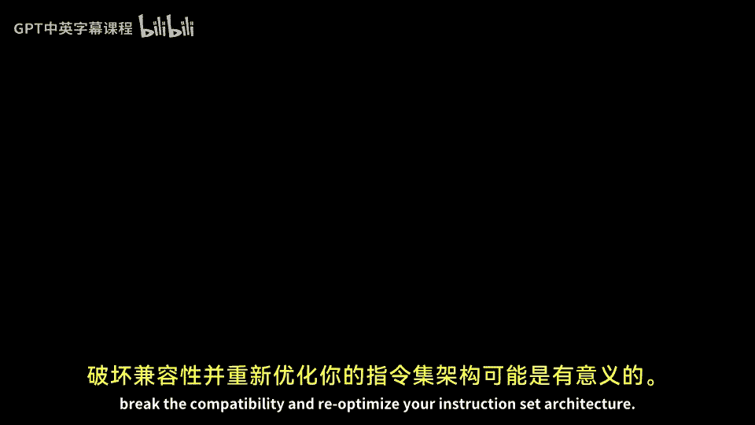

# 007：指令集架构特性详解 🧠

在本节课中，我们将要学习指令集架构（ISA）除基本机器模型之外的其他关键特性。我们将探讨指令的分类、内存寻址模式、数据类型、指令编码方式，并分析几个现实世界中的ISA实例，以理解其设计背后的权衡与考量。

## 指令的分类 📋

上一节我们介绍了不同的机器模型，本节中我们来看看指令集架构中包含哪些基本操作。以下是常见的指令类别：

*   **数据传送指令**：例如加载（load）、存储（store）、与控制寄存器之间的数据移动。MIPS架构就包含这类指令。
*   **算术逻辑单元指令**：例如加法、减法、乘法、除法。`set less than` 是一个有趣的比较操作指令，用于比较两个值的大小。
*   **控制流指令**：例如分支（branch）、跳转（jump）、陷阱（trap）。
*   **浮点指令**：用于浮点数的加、减、乘、除以及比较操作。例如 `c.lt.d` 是双精度浮点数的小于比较指令。
*   **转换指令**：用于在不同数据类型间转换，例如将单精度浮点数转换为整数。
*   **多媒体指令（SIMD）**：即单指令多数据指令，我们将在后续讨论数据级并行和向量单元时详细讲解。
*   **复杂专用指令**：某些ISA包含非常复杂的专用指令。例如，x86架构中的 `rep movsb` 是一条字符串复制指令，其功能类似于C语言中的 `strcpy`。历史上，VAX架构甚至有过能在单条指令内完成整个快速傅里叶变换（FFT）的指令。

不同的ISA架构师会做出不同的选择，决定将哪些指令纳入指令集，哪些则留给软件实现。

## 内存寻址模式 🗺️

指令集架构师需要考虑的另一个特性是如何访问内存，即有哪些可用的寻址模式。以下是几种主要的寻址模式：

*   **寄存器寻址**：操作数仅来自寄存器，结果也存入寄存器。例如指令 `add r4, r2, r3` 表示将寄存器r2和r3的值相加，结果存入r4。这种模式本身可能不访问内存。
*   **立即数寻址**：指令中直接包含一个常数（立即数）作为操作数。例如 `addi r1, r2, 5` 表示将寄存器r2的值加上常数5，结果存入r1。
*   **位移寻址**：将一个寄存器的值与一个常数（位移量）相加，得到内存地址，然后访问该地址的数据。这是非常常见的模式。
*   **寄存器间接寻址**：类似于位移寻址，但位移量为0。内存地址完全由一个寄存器的值指定。例如MIPS的 `lw r1, 0(r2)`。
*   **绝对寻址**：直接使用一个常数作为内存地址进行访问。在现代架构中不常见。
*   **内存间接寻址**：一个寄存器中存储的是一个地址（A），从内存中读取地址A处的数据，这个数据本身又是另一个地址（B），最终访问地址B处的数据。这是一种双重间接寻址，VAX等架构支持此模式。
*   **PC相对寻址**：以程序计数器（PC）的当前值为基址，加上一个位移量来形成内存地址。这对于位置无关代码非常有用。
*   **比例变址寻址**：x86架构支持这种模式，形式如 `[base + index*scale + displacement]`。这对于数组访问特别高效，例如访问一个4字节整数数组时，可以将比例因子设为4，这样索引寄存器每次加1就能正确遍历数组元素。比例因子通常是2的幂，因为乘以2的幂可以通过移位操作高效实现。

## 数据类型与大小 🔢

ISA还需要定义所支持的数据类型及其大小。主要的数据类型包括：

*   **二进制整数**：可以是无符号或有符号整数。有符号整数又分为原码、反码和补码表示，现代计算机普遍采用**补码**。
*   **二进制编码十进制**：用4位二进制数表示一个十进制数字，常用于需要精确十进制计算的场景，如商业软件。
*   **浮点数**：现代计算机普遍遵循 **IEEE 754** 标准。历史上不同架构（如Cray超级计算机、Intel x87的80位扩展精度格式）有不同的浮点数格式，它们在尾数和指数的位数分配上有所不同，从而在数值范围和精度之间做出不同权衡。
*   **打包向量数据**：如MMX指令使用的数据类型，将多个较短的数据元素打包在一个较宽的寄存器中，以便进行SIMD操作。
*   **地址类型**：一些老式计算机架构将地址视为独立的数据类型，拥有专用的地址寄存器，这为数据提供了隐式的类型信息。

数据的大小（宽度）也是一个关键特性，常见的宽度有8位（字节）、16位（半字）、32位（字）、64位（双字）等，构成了机器的默认字长。

## 指令编码方式 🧩

如何对指令进行二进制编码是ISA设计的核心问题之一，主要分为固定长度和可变长度两种阵营：

*   **固定长度指令**：大多数RISC架构采用此方式，如MIPS、PowerPC、SPARC、ARM（AArch64）。以MIPS为例，每条指令都是 **32位（4字节）**。优点是解码简单，但代码密度可能较低。
*   **可变长度指令**：许多CISC架构采用此方式，如x86、IBM 360、Motorola 68k、VAX。以x86为例，指令长度可在 **1到18字节** 之间变化。优点是可以对常用短指令进行“手动哈夫曼编码”，提高代码密度，但解码电路更复杂。
*   **混合/压缩格式**：一些架构尝试折中。例如 **MIPS16** 和 **ARM Thumb**，它们同时支持16位（2字节）和32位（4字节）两种长度的指令，以在代码密度和性能间取得平衡。
*   **指令压缩**：如PowerPC VLE，代码在内存中以压缩格式存储，进入缓存或处理器时才解压。
*   **超长指令字**：如VLIW架构，将多条固定长度的指令打包成一个固定长度的“指令束”，显式指定多条指令在同一周期并行执行。TI的某些DSP处理器就采用VLIW。

## 现实世界ISA实例分析 🌍

了解了这些特性后，让我们分析几个具体的指令集架构：

*   **Alpha**：寄存器-寄存器架构，三操作数，无显式内存操作数。64位默认数据宽度，64位寻址，主要用于工作站。
*   **ARM**：寄存器-寄存器架构，三操作数。最初为32位，现有64位版本。拥有16个通用寄存器，广泛应用于手机和嵌入式设备。
*   **MIPS**：寄存器-寄存器架构，三操作数。32位默认数据宽度，32个通用寄存器。用于工作站和嵌入式系统，也是本课程的主要示例。
*   **SPARC**：受伯克利RISC项目影响，采用**寄存器窗口**技术。在执行函数调用时，硬件自动将一组寄存器换出到内存，并换入一组新寄存器，旨在弥补早期编译器寄存器分配技术的不足。
*   **VAX**：内存-内存架构，最多三操作数且均可来自内存。寄存器数量较少。
*   **Motorola 6800**：累加器架构，通常只有一个操作数可来自内存。8位数据通路，主要用于微控制器。

## 影响ISA设计的因素 ⚙️

指令集架构的多样性源于多种影响因素：

1.  **技术影响**：晶体管数量、存储成本。存储有限时倾向于紧凑编码（可变长度）；晶体管稀缺时（RISC理念诞生初期）倾向于简化指令以降低硬件复杂度；晶体管丰富时则可考虑添加复杂指令或多核特性。
2.  **应用影响**：目标应用领域决定了需要哪些专用指令。例如，数字信号处理器（DSP）会加入专用的DSP指令。
3.  **软件/编译器技术影响**：SPARC的寄存器窗口是一个典型例子，它源于当时编译器寄存器分配技术的不成熟，需要硬件辅助。随着编译技术的进步，这类硬件辅助特性在新架构中已不再流行。

尽管为了保持二进制兼容性，ISA通常倾向于稳定，但在技术、应用和软件环境发生重大变革时，重新优化甚至打破兼容性设计新的ISA也可能是合理的选择。

## 总结 📝

本节课中我们一起学习了指令集架构的核心特性。我们探讨了不同类型的指令、多种内存寻址模式、支持的数据类型以及固定长度与可变长度指令编码的权衡。通过分析Alpha、ARM、MIPS、SPARC、VAX等具体架构，我们看到了不同的设计选择。最后，我们理解了技术、目标应用和软件编译器的发展是如何深刻塑造指令集架构设计的。ISA是硬件与软件之间的关键契约，其设计是计算机系统设计中多方权衡的艺术。