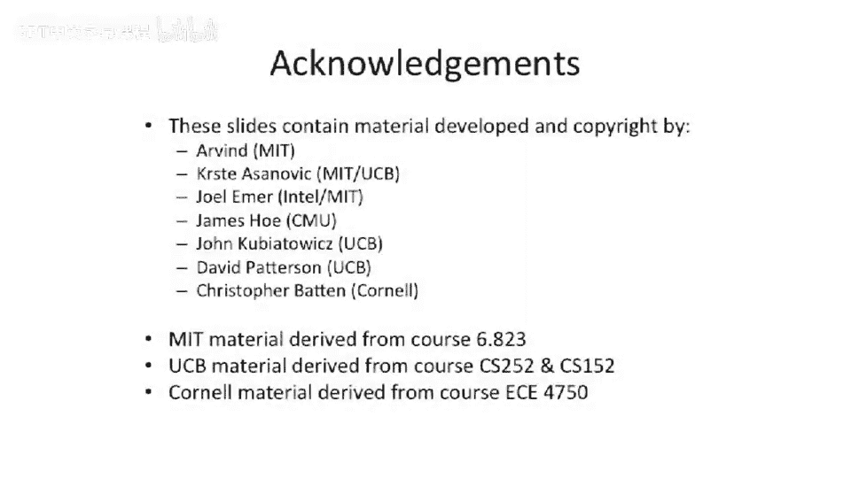
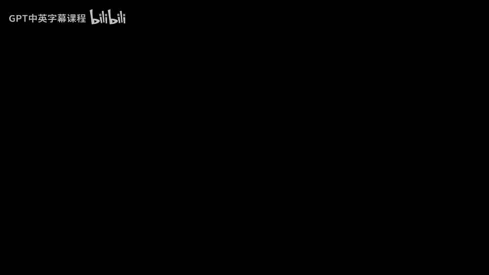

# 008：课程回顾与下节预告 🧠

在本节课中，我们将对计算机体系结构课程的核心内容进行简要回顾，并了解下一讲的学习方向。

## 课程回顾

上一节我们介绍了计算机体系结构课程的整体框架。本节中，我们来具体回顾一下本讲的核心内容。

本课程是 **EE 475**，即计算机体系结构课程。课程的核心是关注**抽象层次**，并讨论以下关键概念：
*   **指令集架构**
*   **微体系结构**
*   **寄存器传输语言**
*   并会略微涉及**操作系统**和底层的**门电路**层面。

课程的最终目标是**驾驭技术**，并将其应用于解决实际问题，实现人类的目标。

## 核心概念：ISA 与微体系结构

在今天的课程中，我们重点区分了两个核心概念：**指令集架构** 与 **微体系结构**，有时也称作**宏观架构**与**微观架构**。

我们讨论了指令集架构的一些关键特性，主要包括：
*   **机器模型**
*   **编码数据类型**
*   **指令种类**
*   **寻址模式**
*   **编码方式**

## 下节预告

下一讲，我们将从讨论**微码**开始，然后进入本课程的第一次复习讲座。

该复习讲座的主题是**如何构建流水线处理器**，即对**流水线技术**进行回顾。

---

本节课中，我们一起学习了计算机体系结构课程的核心关注点，明确了指令集架构与微体系结构的区别，并了解了指令集架构的主要特性。同时，我们也预告了下一讲将开始探讨微码并复习流水线处理器的相关知识。

感谢聆听。