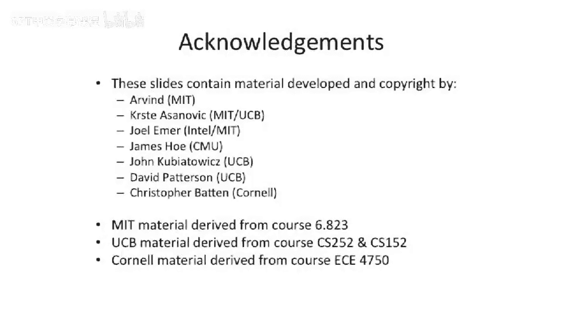

# 009：微码化微架构与流水线基础

在本节课中，我们将学习微码化微处理器的工作原理，并回顾流水线技术的基础知识。我们将探讨如何通过复用数据通路组件来构建更小的处理器，并分析流水线中可能出现的各种冲突。

## 微码化微架构

上一节我们介绍了课程概述，本节中我们来看看微码化微架构。微码化微处理器允许复用组件和数据通路组件，从而构建更小的处理器。

当处理器因规模过大而无法容纳于一个芯片或房间时，时间复用资源成为一种解决方案。其核心思想是：不构建大量物理资源并连接它们，而是构建一个通用资源，然后为一条指令多次使用该资源。这种设计被称为微码化处理器。

微控制单元的工作原理如下：控制线从处理器引出，连接到ALU、多路复用器和寄存器。微码地址被解码后，以只读存储器的方式驱动一系列控制线，并参与计算下一个状态。这实现了一个小型有限状态机。

程序的操作码会输入到此单元。对于程序中的每条指令，可以遍历一个对应的状态机。不同的操作码对应不同的状态机。条件标志（如分支指令是否跳转）也会从处理器输出。结合一个存储状态或地址的触发器，可以逐步遍历状态机，执行多个操作。

微控制单元通常是一个ROM，可以多次循环执行。ROM会指示下一条微码指令的位置，根据实际执行的指令，可能循环多次或仅一次。

以下是微控制单元连接到微码化处理器的示意图：

数据通路位于中央，控制单元引出的多根线对数据通路进行控制。例如，决定执行减法还是加法，并切换数据通路内部的多路复用器以选择实际执行的操作。

需要对比的是微控制单元与存储用户程序的内存。用户程序存储在RAM（随机存取存储器）结构中，而微码指令存储在ROM（只读存储器）结构中。RAM中存放的是实际的ISA指令（如x86或MIPS指令），而ROM中存放的是微码指令。有时人们会编写小程序来控制此处引出的不同线路。

## 构建基于总线的RISC处理器

现在，我们将上述概念整合，看看如何构建一个基于总线的RISC处理器（例如MIPS处理器）。我们将使用一个随时间复用数据通路元素的数据通路。这不是流水线设计，也不是单周期RISC设计，而是一种微码化RISC设计。介绍它是为了与今天要讲的流水线技术进行对比。

请看下图：

我们有一个包含32个通用寄存器的寄存器文件（因为要实现MIPS），程序计数器也存储在此寄存器文件中。该寄存器文件实际上有33个元素，或者可以将程序计数器存储在零寄存器位置（在MIPS中，零寄存器通常硬编码为0）。此外，还有主内存、ALU、指令寄存器，所有部件通过一条总线连接。同一时间只能驱动一个值，但该值可以广播到多个位置。

让我们逐步了解在这种架构上执行指令的过程：

1.  **取程序计数器**：微码控制单元驱动线路，从寄存器文件中读取程序计数器。控制单元设置寄存器选择线，选择程序计数器条目。程序计数器被驱动到总线上，然后需要将其锁存到内存地址寄存器中。这完成了微码控制单元处理器的第一个周期。
2.  **取指令**：下一个周期，从数据内存（指令内存）中取出所需指令。指令被驱动到总线上，然后锁存到指令寄存器中。至此，指令获取完成。
3.  **取操作数1**：第三个周期，从寄存器文件中取出第一个源操作数（RS1），并将其锁存到A操作数寄存器。
4.  **取操作数2**：第四个周期，对第二个源操作数（RS2）执行相同操作。
5.  **执行操作**：假设执行加法指令。让A和B相加，结果需要存储。我们知道要将其存入目标寄存器（RD）。因此，微码控制单元将断言RD作为地址，并对寄存器文件断言“写寄存器”信号。
6.  **更新程序计数器**：最后，需要递增程序计数器以获取下一条指令。我们再次复用（时间复用）ALU。从寄存器文件中取出程序计数器值，放入A寄存器，将其递增4（因为指令长度为4字节）。可以将结果值存回程序计数器。

至此，我们完整执行了一条指令，大约需要5到7个周期。

需要指出的是，根据执行的指令不同，所需时间可能变化。例如，分支指令有所不同，可能不需要简单地将程序计数器加4，而可能需要获取不同值、进行比较，然后根据结果更新程序计数器。跳转指令也是如此，它们可能需要不同数量的周期。另一个例子是单目指令（只有一个输入的操作），例如逻辑取反（翻转一个值的所有位），虽然MIPS可能没有该指令，但这类指令可能需要不同数量的周期。加载指令也需要更多周期，因为需要多次访问内存单元：从内存获取数据，放回寄存器，可能进行一些计算，最后存回通用寄存器文件。

## 流水线基础

上一节我们介绍了微码化架构，本节中我们来看看流水线技术的基础。我们将讨论流水线的基本原理和分析流水线所需的框架。

流水线是一种通过重叠执行多条指令来提高处理器吞吐量的技术。其核心思想是将指令执行过程划分为多个阶段，每个阶段由专门的硬件处理，使得多条指令可以同时处于不同的执行阶段。

## 结构冲突

在流水线中，结构冲突指的是硬件资源在同一时钟周期内被多条指令同时需求的情况。例如，如果处理器只有一个内存端口，而一条指令在取指阶段需要访问内存，同时另一条指令在访存阶段也需要访问内存，就会发生冲突。

解决结构冲突的方法包括：
*   增加硬件资源（例如，分离指令缓存和数据缓存）。
*   插入流水线停顿（气泡），让冲突的指令等待资源可用。

## 数据冲突

数据冲突发生在一条指令依赖于另一条指令的结果，但该结果尚未产生时。根据指令间的相对位置，数据冲突可分为三类：
1.  **写后读冲突**：指令j试图读取一个由指令i写入的寄存器，但指令i尚未完成写回。
2.  **写后写冲突**：两条指令试图写入同一个寄存器，但写入顺序可能出错。
3.  **读后写冲突**：指令j写入一个寄存器，而指令i需要读取该寄存器的旧值，但读取可能发生在写入之后。

解决数据冲突的技术包括：
*   **前递**：将尚未写回但已计算出的结果直接传递给需要它的指令。
*   **流水线停顿**：插入气泡，直到依赖关系解除。
*   **编译器调度**：通过重排指令顺序来避免冲突。

## 控制冲突

控制冲突由改变程序流程的指令（如分支、跳转）引起。当处理器遇到分支指令时，在分支条件计算出来之前，无法确定下一条要执行的指令是哪条。这可能导致流水线取入了错误的指令，从而需要清空部分流水线，造成性能损失。

减少控制冲突影响的方法包括：
*   **分支预测**：预测分支是否跳转，并沿预测路径继续取指。
*   **延迟槽**：在分支指令后安排一条无论分支是否跳转都会执行的指令，以填充流水线气泡。
*   **尽早计算分支条件**：在流水线早期阶段完成分支条件的判断。

本节课中我们一起学习了微码化微架构的基本原理，它通过时间复用资源来构建紧凑的处理器。我们还回顾了流水线技术的基础，包括其工作原理以及可能遇到的结构冲突、数据冲突和控制冲突。理解这些基础概念对于分析更复杂的处理器设计至关重要。