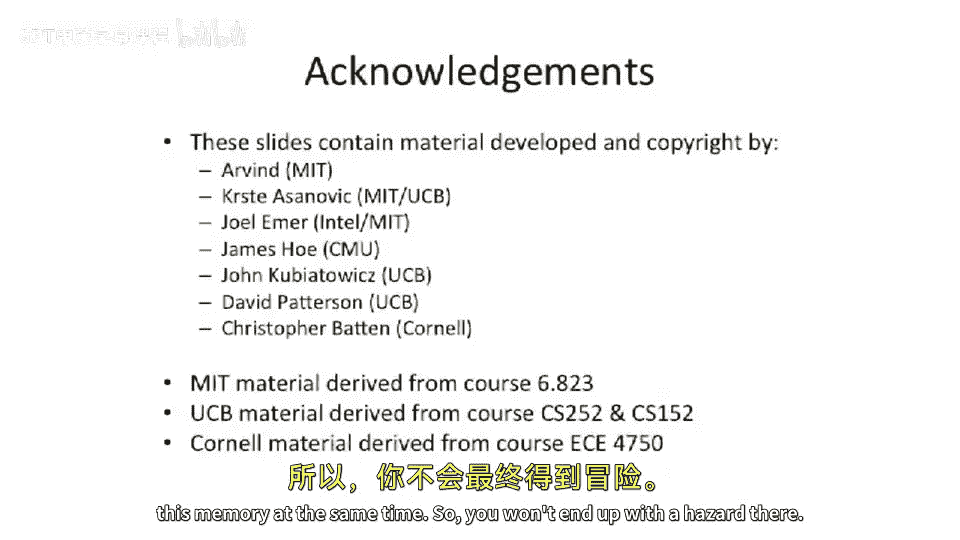

# 011：结构冒险与流水线冲突


在本节课中，我们将学习流水线处理器中的三种主要冒险类型：结构冒险、数据冒险和控制冒险。我们将从结构冒险开始，详细探讨其产生原因和解决方案，并通过具体的流水线图例来加深理解。

## 概述结构冒险

上一节我们介绍了流水线的基础知识，本节中我们来看看结构冒险。结构冒险发生在两条指令需要在同一时间使用同一个硬件资源时。

以下是解决结构冒险的几种主要方法：

*   **避免冲突**：通过程序员或编译器，避免安排会同时使用同一资源的指令进入流水线。
*   **硬件停顿**：由硬件负责处理冲突。当发生资源争用时，可以停顿整个处理器、停顿部分流水线或停顿依赖的指令。通常，较早的指令会获得资源优先权，以避免死锁。
*   **资源复制**：复制硬件资源，或为存储结构增加更多端口。这是MIPS五级流水线等设计中广泛采用的方案。

基本的五级MIPS流水线在设计时就避免了结构冒险，其指令集架构也为此提供了支持。然而，在更复杂的指令集或更深的流水线中，结构冒险仍然可能出现。

## 统一内存架构下的结构冒险

在标准的五级MIPS流水线中，指令内存和数据内存是分开的。现在，假设我们修改设计，将它们合并为一个单端口统一内存。这意味着每个时钟周期只能进行一次内存访问（取指或数据访问）。

让我们通过一个流水线图例来观察执行一条`load`指令时会发生什么。假设指令序列为：`load`, `add`, `add`, `add`。

```
时钟周期: 1   2   3   4   5   6   7   8   9
-------------------------------------------------
load:   F   D   E   M   W
add1:       F   D   E   M   W
add2:           F   D   E   M   W
add3:               F  -stall-  D   E   M   W
```

在周期4，`load`指令处于访存阶段，需要访问统一内存。同时，`add3`指令处于取指阶段，也需要访问同一内存来获取指令。这就产生了**结构冒险**。

解决方案是**停顿**后来的`add3`指令一个周期（图中用`-stall-`表示），让较早的`load`指令先完成访存操作。这导致`add3`及后续所有指令的执行都向后推迟了一个周期。

## 多周期内存访问下的结构冒险

现在考虑另一个例子：假设内存访问需要两个时钟周期（阶段M0和M1），并且仍然是单端口。

观察以下指令序列：`add`, `load`, `load`的流水线图。

```
时钟周期: 1   2   3   4   5   6   7   8   9
-------------------------------------------------
add:    F   D   E  M0  M1   W
load1:      F   D   E  M0  M1   W
load2:          F   D   E  -stall- M0  M1   W
```

在周期6，第一条`load`指令处于访存的第二阶段，而第二条`load`指令在周期6需要开始其访存的第一阶段。两者再次争用同一个内存端口，引发**结构冒险**。

解决方法同样是**停顿**流水线一个周期，让第一条`load`指令先完成其内存访问。停顿被插入在第二条`load`指令的访存阶段之前。

需要注意的是，如果`load`指令后面跟的是`add`指令，则不会发生冒险，因为`add`指令在访存阶段并不需要访问数据内存。

## 总结




本节课中我们一起学习了流水线中的**结构冒险**。我们了解到，当多条指令争用同一硬件资源时就会发生结构冒险。解决策略主要包括：通过软件避免冲突、由硬件实施流水线停顿、以及复制硬件资源。我们通过统一内存和双周期内存两个具体例子，使用流水线图直观地展示了冒险的发生时刻以及通过停顿来解决的过程。理解结构冒险是优化处理器性能和设计高效流水线的基础。