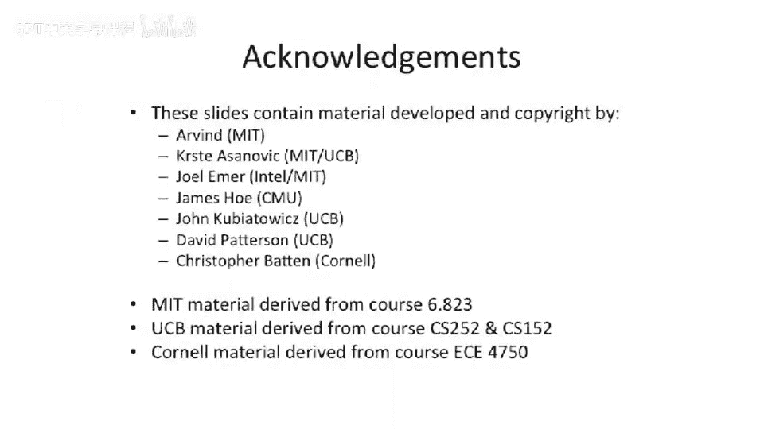

# 012：数据冒险


在本节课中，我们将要学习流水线处理器中的**数据冒险**。数据冒险是指后续指令需要用到前一条指令的计算结果，但该结果尚未写入寄存器文件或可用时发生的情况。我们将探讨检测和解决数据冒险的几种方法，包括调度、停顿、旁路（或称为转发）以及推测。理解这些概念对于设计高效、正确的处理器至关重要。

## 什么是数据冒险？🤔

上一节我们介绍了结构冒险，本节中我们来看看数据冒险。数据冒险发生在一条指令依赖于前一条指令生成的数据值，而该前一条指令仍在流水线中执行时。

## 解决数据冒险的方法 🛠️

以下是几种主要的解决数据冒险的方法。

### 方法一：调度规避

程序员或编译器可以通过在指令序列中插入空操作指令来避免冒险。这要求程序员了解机器的微架构。例如，早期的Intel i860处理器的浮点单元就没有互锁机制，程序员需要手动插入空操作来确保数据正确性。

### 方法二：流水线停顿

硬件可以检测到数据依赖，并暂停后续指令的执行，直到所需的数据值就绪。这被称为**停顿**或**互锁**。需要注意的是，停顿不仅会暂停依赖指令，还需要暂停其之前流水线阶段的所有指令，以防止指令“堆积”。

### 方法三：数据旁路

通过添加额外的硬件路径，可以将一个功能单元的输出直接“转发”给需要它的另一个功能单元的输入，而无需等待该值写回寄存器文件。这可以显著减少因数据依赖而导致的停顿。

### 方法四：推测执行

处理器可以假设数据值可用或猜测其值，并继续执行。如果推测错误，则需要回滚并重新用正确的值执行指令。这通常用于乱序执行处理器中，我们将在后续课程中详细讨论。

## 一个数据冒险的例子 📝

让我们看一个在五级流水线中发生数据冒险的具体例子。

我们有以下两条指令：
```assembly
addi r1, r0, 10   # 将寄存器r0的值（恒为0）加10，结果存入r1
add  r4, r1, 17   # 将寄存器r1的值加17，结果存入r4
```
第二条指令`add r4, r1, 17`依赖于第一条指令`addi`写入`r1`的结果。在流水线中，当第二条指令处于**译码**阶段并需要读取`r1`时，第一条指令的结果可能还在**执行**或**访存**阶段，尚未写回寄存器文件。如果不加处理，第二条指令将读取到`r1`的旧值，导致错误。

## 如何实现停顿？⏸️

为了解决上述冒险，我们需要在硬件中实现停顿机制。核心思想是：当检测到数据冒险时，冻结流水线中冒险点之前的所有阶段（取指、译码），并向冒险点之后的阶段插入**空操作**指令。

以下是实现停顿的关键步骤：
1.  **检测冒险**：比较处于**译码**阶段的指令的源寄存器标识符（`rs`, `rt`）与后续**执行**、**访存**、**写回**阶段指令的目的寄存器标识符（`rd`）。
2.  **生成停顿信号**：如果发现匹配，且后续指令确实会写回寄存器（由写使能信号控制），则生成一个`stall`信号。
3.  **冻结前端**：`stall`信号会阻止程序计数器更新，并阻止取指/译码阶段的流水线寄存器更新。
4.  **插入空操作**：`stall`信号同时控制一个多路选择器，选择将**空操作**指令注入到**执行**阶段，确保已进入流水线的指令能正常执行完毕，同时避免依赖指令错误执行。

停顿的控制逻辑公式可以简化为：
```
stall = ((ID_rs == EX_rd && EX_we && ID_re1) ||
         (ID_rt == EX_rd && EX_we && ID_re2) ||
         ... // 类似地检查 MEM、WB 阶段
        )
```
其中：
*   `ID_rs`, `ID_rt`：译码阶段指令的源寄存器号。
*   `EX_rd`, `MEM_rd`, `WB_rd`：执行、访存、写回阶段指令的目的寄存器号。
*   `EX_we`等：各阶段指令的寄存器写使能信号。
*   `ID_re1`, `ID_re2`：译码阶段指令的源寄存器读使能信号（因为并非所有指令都读取两个源寄存器，如立即数指令）。

## 通过旁路提升性能 🚀

单纯的停顿会降低性能。旁路技术通过添加额外的数据通路，将计算结果提前“转发”给需要它的指令，从而避免不必要的停顿。

例如，对于连续的ALU指令：
```assembly
add r1, r2, r3
sub r4, r1, r5
```
`sub`指令需要`add`指令的结果。在`add`指令的**执行**阶段结束后，其结果就已经计算出来了。通过添加一条从**执行**阶段输出到**执行**阶段输入的多路选择器，`sub`指令可以在其**执行**阶段直接使用这个新计算出的值，而无需等待`add`指令写回寄存器文件。

旁路控制逻辑与停顿检测逻辑类似，但只应用于那些结果能及时就绪的指令类型（如ALU指令）。对于**加载**指令，因为数据要到**访存**阶段结束后才可用，所以依赖加载指令的后续ALU指令通常仍需一个周期的停顿（称为“加载使用冒险”）。

一个具有完整旁路的数据通路，可以从**执行**、**访存**、**写回**等多个阶段将数据转发回**执行**阶段的输入多路选择器。

## 不同类型指令的读写行为 📋

在实现冒险检测和旁路时，必须考虑不同指令的语义。并非所有指令都读写寄存器。

以下是MIPS指令集中部分指令的读写行为总结：
*   **ALU指令（如add, sub）**：读取两个源寄存器，写入一个目的寄存器。
*   **立即数ALU指令（如addi）**：读取一个源寄存器，写入一个目的寄存器。
*   **加载指令（如lw）**：读取一个基址寄存器，写入一个目的寄存器。
*   **存储指令（如sw）**：读取两个源寄存器（基址和数据），不写入寄存器。
*   **分支指令（如beq）**：读取两个源寄存器，不写入寄存器。
*   **跳转与链接指令（如jal）**：不读取源寄存器，隐式写入寄存器`r31`（返回地址）。

因此，在生成写使能（`we`）和读使能（`re1`, `re2`）信号时，需要根据指令的操作码进行精确控制。

## 总结 📚

本节课中我们一起学习了处理器流水线中的**数据冒险**。我们了解到，当指令之间存在数据依赖时，如果处理不当，会导致读取到错误的数据。

我们探讨了四种主要的解决方法：
1.  **调度规避**：由软件在编译或编程时安排指令顺序或插入空操作。
2.  **流水线停顿**：由硬件检测冒险并暂停相关指令的执行，直到数据就绪。
3.  **数据旁路**：添加硬件路径，将结果提前转发给依赖指令，这是提升流水线性能的关键技术。
4.  **推测执行**：基于预测继续执行，出错时进行恢复，常用于高性能乱序处理器。

我们重点分析了**停顿**和**旁路**的硬件实现机制，包括如何检测冒险、生成控制信号以及修改数据通路。我们还注意到，对于**加载**指令，由于其结果产生较晚，即使有旁路，也常常需要引入至少一个周期的停顿。




理解数据冒险及其解决方案，是掌握现代处理器流水线设计原理的基础。下一讲，我们将讨论另一种冒险——**控制冒险**。