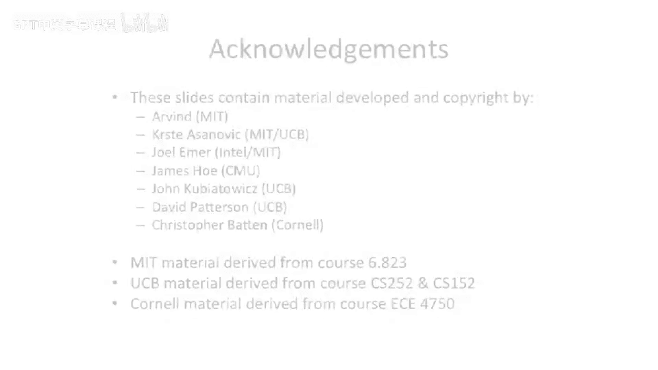

# 016：内存技术与缓存动机 🧠

在本节课中，我们将回顾计算机体系结构中的内存技术，并以此作为引入缓存设计的动机。我们将探讨不同的存储技术，理解为何需要缓存，并初步了解缓存的分类与性能。

---

## 内存技术概览

在深入缓存设计之前，我们需要了解计算机系统中用于存储信息的不同技术。计算机架构师需要在速度、容量和成本之间做出权衡，因此发展出了多种内存技术。

上一节我们介绍了课程的整体安排，本节中我们来看看具体的内存技术。

### 寄存器文件：快速但容量有限

首先，我们从一个非常基础的、基于触发器的寄存器文件开始。这是一种概念模型，现代微处理器中可能不会直接这样构建。

*   **结构**：假设我们有四个32位宽的寄存器。通过一个读地址选择器，我们可以从四个位置中选择一个值读出。写入时，我们将写数据广播到所有寄存器，并通过写地址解码器和时钟信号，控制数据写入特定的寄存器。
*   **局限性**：这种结构在容量增大时会出现问题。例如，一个1000位的寄存器文件会导致选择器变得非常庞大，并且其版图会变得又长又窄，不利于速度和面积优化。长导线会带来传播延迟，影响周期时间。

为了优化面积和速度，实际设计中我们采用**阵列**结构。

### 内存阵列：优化面积与速度

内存阵列将存储单元排列成更接近方形的结构，以最小化导线距离并优化性能。

以下是构建此类阵列的关键组件：

1.  **存储单元**：阵列中的每个小方块是一个存储位单元。
2.  **行解码器**：部分地址输入行解码器，用于激活其中一条**字线**。字线分为读字线和写字线。
3.  **列解码器**：另一部分地址输入列解码器，它本质上是一个多路复用器，用于选择特定的位列进行读写。

这种结构将地址解码工作拆分，使得大规模存储阵列的设计更为高效。

#### 寄存器文件阵列的电路实现

寄存器文件阵列中的存储单元通常由两个交叉耦合的反相器构成，以稳定存储数据。

*   **读操作**：激活读字线，通过一个传输门将存储单元的输出连接到读位线上。
*   **写操作**：激活写字线，将写位线连接到存储单元的Q和Q反两端。通过驱动写位线以强于内部反相器的驱动能力，我们可以覆盖原有值，实现写入。

这是一种非完全互补逻辑的设计，但常用于需要高速和多端口访问的处理器内部寄存器文件。

### SRAM：用于缓存的密集存储

接下来，我们看一种稍大但更密集的存储技术：静态随机存取存储器，常用于构建缓存（如几KB大小）。

SRAM的单元结构与寄存器文件类似，但有两个主要区别：

1.  **双端位线**：SRAM单元同时连接**位线**和**位反线**。
2.  **灵敏放大器**：在列解码端，会使用**灵敏放大器**。它能感知位线和位反线之间微小的电压差，从而快速、可靠地读取数据，即使存储单元驱动能力很弱。

与多端口寄存器文件相比，SRAM通常设计为单端口以追求更高的存储密度，尽管也存在多端口SRAM。

### DRAM：大容量系统内存

最后，我们来看动态随机存取存储器，这是构成计算机系统主存（如内存条）的技术。

DRAM的存储单元与SRAM有根本不同：

*   **结构**：一个DRAM单元仅由一个**晶体管**和一个**电容**构成。
*   **工作原理**：数据以电荷形式存储在电容中。读写时，通过晶体管将电容连接到位线。
*   **制造工艺**：为了在有限面积内容纳巨大容量，DRAM电容通常做成很深的沟槽结构，这需要专用的DRAM制造工艺，与标准逻辑工艺不同。

DRAM的优势在于极高的存储密度（单位面积内容量更大），但存在一个关键问题：**电容会缓慢漏电**。因此，DRAM需要定期**刷新**以保持数据，这是其“动态”名称的由来。

### 技术对比与权衡

计算机架构的核心在于权衡。不同内存技术在速度、容量和成本上各有优劣。

下图直观展示了不同存储技术的相对尺寸：

我们可以总结出以下规律：

*   **速度与容量成反比**：寄存器（最快）→ SRAM → DRAM（容量最大）。
*   **带宽与延迟**：小而快的存储（如寄存器文件）通常具有低延迟和高带宽；大而慢的存储（如DRAM）则延迟较高，带宽相对较低。
*   **工艺优化**：专用存储单元（如图中“定制逻辑单元”）比通用逻辑门搭建的存储结构要紧凑得多，这对于在芯片上集成大量内存至关重要。

---

## 总结

本节课我们一起回顾了计算机体系结构中的关键内存技术。我们从简单的寄存器文件模型出发，探讨了实际应用中的内存阵列设计，并依次介绍了用于高速缓存的SRAM和用于大容量主存的DRAM。理解这些技术之间的**容量、速度与成本**的权衡关系，是接下来我们引入**缓存**概念并理解其必要性的基础。在下一节中，我们将正式定义缓存，并探讨其设计动机。