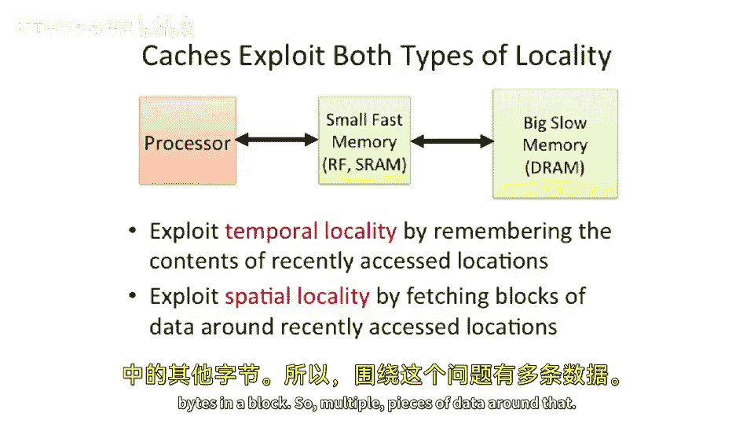
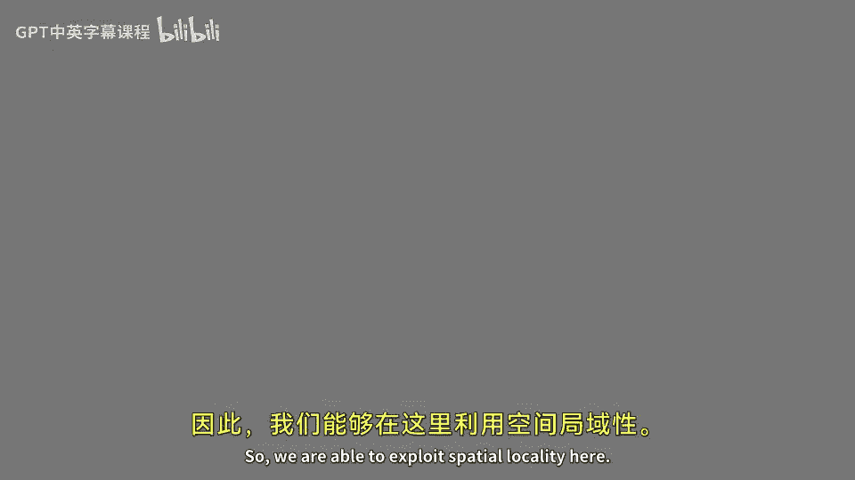

# 017：缓存引入动机 🧠

在本节课中，我们将探讨为什么计算机需要缓存。我们将从基本原理出发，分析处理器与主存之间的性能差距，并介绍两种关键的数据访问模式——时间局部性和空间局部性。理解这些概念是设计高效内存层次结构的基础。

## 处理器与主存的性能鸿沟

上一节我们讨论了不同的内存技术。本节中，我们来看看为什么需要缓存。

在最基础的计算机抽象模型中，处理器连接到一个用于存储数据和指令的主存。访问主存所需的时间（延迟）通常远大于处理器的时钟周期。在现代计算机中，从DRAM中获取第一个字节数据的时间，大约相当于执行上千条指令的时间。

我们定义带宽为单位时间内的访问次数。靠近处理器的内存阵列通常访问更快，带宽也更高。而距离较远的内存（如主存）由于需要通过引脚或总线进行远距离通信，带宽通常较低。带宽延迟积则定义为同时可以在“传输管道”中的数据量。当内存距离更远且带宽更高时，这个乘积会变得很大，意味着可能有成千上万的数据值在传输管道中。

下图展示了DRAM带宽与处理器性能之间的差距。内存技术的提升速度相对缓慢，而处理器性能曾一度飞速增长。虽然单核处理器性能的增长现已趋于平缓，但如果我们考虑多核芯片的聚合性能，其相对于内存性能的增长仍在继续，这使得内存访问的瓶颈问题更加突出。

以一个四发射、2GHz的超标量处理器和100纳秒访问延迟的DRAM为例，在等待一次内存访问完成的时间里，处理器可以执行大约800条指令。如今处理器频率更高，而某些内存系统的延迟可能更长，这个数字可能达到约1000条指令。

## 内存系统的物理限制

那么，在设计内存系统时，首要考虑的因素是什么？答案是**大小很重要**。随着内存系统变得越来越大，访问时间也会变长。这是因为需要驱动的电容更大，物理距离更远。你无法违背光速的物理定律，信号传输一定距离需要时间，距离越远，时间越长。此外，更大的内存系统也意味着更大的扇出。因此，物理尺寸是思考内存系统时的重要考量。

## 引入内存层次结构与缓存

现在，让我们引入缓存的概念，看看它为什么有效。

与之前处理器直接连接整个系统内存的模型不同，我们现在要引入中间层级。在处理器旁边，我们放置**小而快**的内存（如SRAM），希望处理器能更多地访问这些快速内存，而不是去访问又大又慢的DRAM。

以下是典型的内存层次结构容量与延迟对比：
*   **寄存器**：容量最小，延迟最低。
*   **SRAM（缓存）**：容量更大，延迟较高。
*   **DRAM（主存）**：容量最大，延迟最高。

构建内存层次结构时，另一个重要考量是**片内内存带宽通常远高于片外带宽**。在芯片内部，可以布置大量细导线。而一旦需要离开芯片，就必须通过引脚、焊球或焊柱阵列，这些连接点的间距远大于芯片内部的导线间距，因此单位面积内能提供的连接数量有限，带宽也就受到限制。

正因为如此，我们希望将小而快的内存（缓存）放在芯片上靠近处理器的位置。

## 缓存有效性的关键：局部性原理

在这个内存层次结构中，访问数据时会发生什么？如果数据在快速内存（缓存）中，我们称之为“命中”，可以快速获取数据并返回。如果数据不在缓存中（“缺失”），则必须访问远处的DRAM，耗时很长。

**内存层次结构（缓存）要发挥作用，前提是处理器能在快速内存中找到所需的数据。** 如果你建立了一个小而快的内存，但里面从来找不到需要的信息，那么这个结构就是多余的，只会增加额外的工作量和功耗。

因此，缓存设计的核心洞察在于：我们需要**高概率**地在快速内存中找到即将需要的数据。否则，不如每次都直接访问主存。

那么，如何提高数据在缓存中的概率呢？我们需要分析程序的**内存访问模式**，并利用其规律。

## 程序的内存访问模式分析

我们通过一个图表来分析访问模式。横轴是时间，纵轴是内存地址。程序执行时，每访问一次内存，就在对应时间和地址位置画一个点。

以下是几种典型的访问模式：

1.  **指令读取**：程序通常顺序执行指令，地址单调递增，直到遇到分支。在循环中，会反复读取同一段代码的指令。这显示出一种模式：我们会在短时间内反复访问相同或相邻的地址。

2.  **栈访问**：程序使用栈来保存/恢复寄存器、传递参数、存储局部变量。进行子程序调用时，会将多个寄存器的值连续地“压入”栈中（访问连续的地址）。在函数内部，可能会反复访问栈上的某个参数或局部变量。函数返回时，再以相反顺序“弹出”数据。这种模式表现为：在短时间内，集中访问一片连续的地址区域，并可能重复访问其中某些特定地址。

3.  **数据访问（向量/数组）**：例如进行矩阵加法。通常会顺序读取数组的第一个元素、第二个、第三个……地址连续递增。如果访问的是数组中每隔几个的元素（如步长访问），地址间隔会变大，但仍在某个范围内。这同样表现出集中访问一片地址区域的趋势。

4.  **标量访问**：例如，一个循环中，每次迭代都要从内存加载同一个常数（如变量X）与数组元素相加。这会导致在短时间内**反复访问同一个内存地址**。

## 两种关键的局部性

从以上模式中，我们可以抽象出两种关键特性，缓存系统正是为了利用它们而设计：

1.  **时间局部性** 🕐：如果一个内存位置被访问，那么它在不久的将来**很可能再次被访问**。例如，循环中反复使用的标量变量、栈上重复访问的参数，都体现了强时间局部性。

2.  **空间局部性** 📍：如果一个内存位置被访问，那么**其附近的内存位置**在不久的将来也很可能被访问。例如，顺序执行的指令、顺序访问的数组元素、栈上连续压入的数据，都体现了强空间局部性。

许多访问模式同时具备这两种局部性。例如，运行一个循环时，既在短时间内重复执行同一段代码（时间局部性），又按顺序访问相邻的指令（空间局部性）。

## 真实内存访问轨迹

观察一个真实操作系统运行真实程序时的内存访问轨迹图，我们可以清晰地看到上述模式：
*   **空间局部性**：表现为沿纵轴方向（地址）密集出现的点形成的垂直线段，代表程序在短时间内连续访问一片地址区域（如读取数组）。
*   **时间局部性**：表现为沿横轴方向（时间）密集出现的点形成的水平线段，代表程序在较长时间内反复访问相同或极其接近的地址。
*   **混合局部性**：图中一些密集的“块状”区域，显示了程序在短时间内集中访问一片相近的地址，同时这些访问在时间上又高度集中。

## 缓存如何利用局部性

缓存正是为了利用这两种局部性而设计：
*   **利用时间局部性**：当处理器访问一个数据时，缓存会将该数据保留在快速存储中。如果程序展现出时间局部性，短期内再次访问该数据时，就能在缓存中命中，无需访问慢速主存。
*   **利用空间局部性**：缓存不会只读取请求的那个字节。相反，它会将**包含该字节及其周围数据**的一个连续块（称为**缓存行**或**缓存块**）一次性取回。其启发式思想是：如果你访问了某个数据，你很可能会很快访问它旁边的数据。这样，下次访问相邻数据时，很可能已经在缓存中。

## 总结

本节课中，我们一起学习了引入缓存的根本动机。我们认识到处理器与主存之间存在巨大的速度差距，直接访问主存会造成严重的性能瓶颈。为了解决这个问题，我们引入了基于**内存层次结构**的缓存设计。缓存有效的关键在于利用程序的两种访问模式：**时间局部性**和**空间局部性**。通过将近期访问过或附近的数据保存在小而快的缓存中，可以显著提高数据访问的平均速度，从而提升整个系统的性能。下一节，我们将深入探讨缓存的具体组织结构和工作原理。