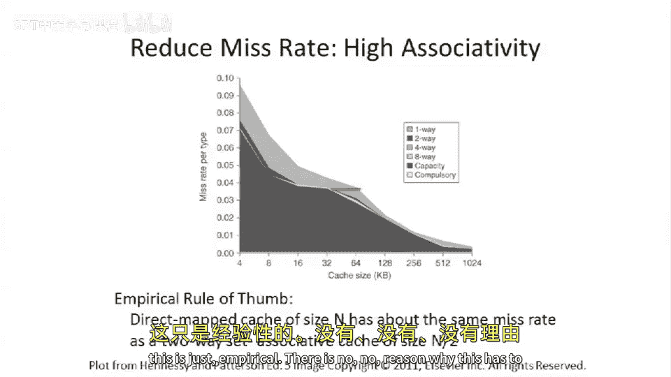

# 019：缓存性能优化 🚀

在本节课中，我们将要学习缓存性能的核心概念。缓存设计的根本目的是降低功耗并提升性能。我们将从性能分析的基本定律出发，探讨影响缓存性能的各类“缺失”及其优化策略。

## 性能与缓存的目标

上一节我们介绍了缓存的基本工作原理，本节中我们来看看缓存如何影响整体性能。根据处理器性能的“铁律”，缓存的目标是减少处理加载（Load）或存储（Store）指令所需的时钟周期数（CPI）。如果没有缓存，每次访问都必须访问主内存，耗时很长。缓存通过将数据保存在更靠近处理器的地方，缩短了访问延迟，从而提升了程序运行速度。

**平均内存访问时间公式**可以描述为：
`平均访问时间 = 命中时间 + 失效率 × 失效代价`

在这个公式中：
*   **命中时间**：在缓存中找到数据所需的时间。
*   **失效率**：访问缓存时发生缺失的概率。
*   **失效代价**：从主内存或其他下级缓存中获取数据所需的额外时间。

因此，优化缓存性能的核心就是降低失效率、减少失效代价，并尽可能缩短命中时间。

## 缓存缺失的分类（三C模型）

为了系统地优化缓存，我们需要理解缓存缺失发生的原因。业界通常使用“三C模型”来对缓存缺失进行分类。

以下是三种主要的缓存缺失类型：

1.  **强制性缺失**
    这是对某个数据块的**第一次访问**时必然发生的缺失。即使缓存容量无限大，首次访问也无法避免，因为数据尚未被载入缓存。预取器（Prefetcher）等技术可以尝试预测并提前加载数据，以减少这类缺失。

2.  **容量缺失**
    当缓存容量不足以容纳程序工作集（频繁访问的数据集）时，就会发生容量缺失。即使数据曾经被加载过，也可能因为空间不足而被替换出去。通常，**增大缓存容量可以有效降低容量缺失率**。

3.  **冲突缺失**
    在组相联或直接映射缓存中，即使缓存总容量足够，如果多个频繁访问的数据块被映射到同一个缓存组（或行），它们会相互竞争，导致有用的数据被提前替换，从而引发缺失。**提高缓存相联度**可以减少这类缺失。

## 优化策略：降低命中时间

上一节我们介绍了缺失的分类，本节中我们来看看具体的优化手段。首先从降低命中时间开始。

**小容量、结构简单的缓存**通常具有更短的访问延迟（命中时间）。在高速处理器中，较短的命中时间意味着访问操作可以在更少的时钟周期内完成，甚至能在一个周期内完成，这对流水线设计非常有利。

下图展示了缓存大小与访问时间的关系，通常缓存越小，访问越快。

## 优化策略：降低失效率

降低命中时间固然重要，但降低失效率往往能带来更大的性能收益。有多种方法可以降低失效率。

### 调整块大小

缓存块（Block）的大小会影响失效率。块大小并非越大越好，需要权衡。

以下是增大块大小的优缺点分析：

*   **优点**：
    *   减少标签（Tag）存储的开销比例。
    *   更有效地利用DRAM的突发传输特性，减少访问内存的启动开销。
    *   更高效地利用片上总线带宽。
*   **缺点**：
    *   可能载入程序不会用到的数据，浪费内存带宽。
    *   在总容量固定的情况下，块增大会导致缓存中总块数减少，可能降低数据的多样性。

下图展示了不同缓存容量下，块大小与失效率的关系。存在一个“最佳点”，通常64字节左右是常见的选择。

### 增大缓存容量

最直接的方法是**构建更大的缓存**。更大的缓存可以容纳更多的工作集数据，从而直接降低容量缺失率。

一个经验法则是**平方根规则**：缓存容量翻倍，失效率大约降至原来的 $\sqrt{1/2}$（约0.7倍）。这是一个有用的估算工具，但在缓存很小、很大或相联度很高时可能不准确。

### 提高相联度

提高缓存相联度是减少冲突缺失的有效方法。例如，将直接映射缓存改为2路组相联缓存。

另一个经验法则是：一个容量为 **N** 的直接映射缓存，其失效率大约与一个容量为 **N/2** 的2路组相联缓存相当。这意味着，**提高相联度有时可以等效于用一半的缓存容量达到相似的失效率**。

然而，提高相联度并非没有代价：

*   **硬件复杂度增加**：需要并行比较多个标签。
*   **可能增加命中时间**：更复杂的比较逻辑和选择逻辑可能导致访问延迟轻微增加。
*   **标签存储开销增大**：需要存储和管理更多路的标签信息。

下图对比了不同容量和相联度下的失效率。

## 总结

本节课中我们一起学习了缓存性能的分析与优化。我们首先从平均内存访问时间的公式入手，明确了优化缓存性能的三个方向：降低命中时间、失效率和失效代价。接着，我们深入探讨了缓存缺失的“三C模型”（强制性缺失、容量缺失、冲突缺失），这为我们选择优化策略提供了理论依据。最后，我们介绍了多种具体的优化技术，包括使用小而快的缓存来降低命中时间，以及通过调整块大小、增大缓存容量和提高相联度来降低失效率。理解这些权衡对于设计高效的存储层次结构至关重要。